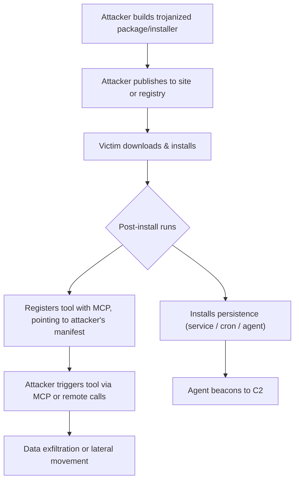

# SAFE‑T1006: User‑Social‑Engineering Install (Improved)

## Overview

Tactic: Initial Access (ATK-TA0001)
Technique ID: SAFE‑T1006
Severity: High
First Observed: (The concept is analogous to real-world supply-chain compromise; no widely-publicized MCP-specific case yet)
Last Updated: 2025-11-15

## Description

User‑Social‑Engineering Install is a technique in which an attacker persuades a user (developer, operator, or admin) to install a seemingly legitimate package or installer, but which is actually malicious (trojanized). In the MCP context, this can take the form of a package, installer, or tool that—once installed—registers itself with an MCP server or agent, giving the attacker persistent and powerful access.

Because MCP tools can request high-privilege capabilities (like file access, execution, or network), a poisoned installer or package can result in high-severity compromise: once installed, it can register a tool or agent that is controlled by the attacker, allowing data exfiltration, remote execution, or persistence.

## Attack Vectors

Primary Vector: Phishing / Social Engineering (developer- or operator-facing messages that induce an install)

Secondary Vectors:

- Registry Poisoning / Typosquatting: Upload a malicious tool to a popular package registry (npm, PyPI, etc.) with a name that is very similar to a legitimate tool.

- Supply-Chain Compromise: Compromise a legitimate tool’s repository or CI pipeline to insert trojan code.

- Compromised Installer: Distribute a malicious installer that looks official but includes post-install code for persistence / MCP registration.

## Technical Details

### Prerequisites

- Attacker must be able to build a malicious package or installer.

- Victim must have enough trust or permissions to install the package.

- The installer or package must embed post‑install logic to register with an MCP server or install an agent.

- The victim’s MCP client (or system) must trust newly registered tools / agents without strict verification.

## Attack Flow

### Initial Stage

- Attacker prepares a trojanized package or installer embedding post-install behavior (MCP registration, agent, persistence).

- Attacker publishes the package to a registry, website, or transmits it via phishing/social channels.

### Exploitation Stage

- Victim downloads and runs the installer or imports the package.

- Post-install scripts execute: register a tool with the MCP server (manifest URL points to attacker-controlled content), and/or install a persistent agent (service, cron, etc.).

### Post-Exploitation

- Attacker triggers the registered tool via MCP or uses the persistent agent to execute commands, exfiltrate data, or move laterally.

### Diagram (Attack Flow)



## Attack Flow (numbered stages)

1. Prepare — Attacker builds a malicious installer or package embedding post-install behavior (MCP registration, installer script, or background agent).
2. Distribute — The attacker distributes the package via phishing, social channels, or by publishing to a public registry (typosquatting / malicious package uploads).
3. Install — The victim downloads and installs the package or runs the installer; post-install scripts execute.
4. Register & Persist — Post-install logic registers a tool with an MCP server (manifest URL points to attacker-controlled content) and/or installs persistent mechanisms (service, cron, agent).
5. Activate — The attacker triggers the registered tool via MCP or uses the persistent agent to execute commands.
6. Exploit / Exfiltrate — The attacker exfiltrates sensitive data, escalates privileges, or moves laterally within the environment.

## Advanced Attack Techniques & Variations

- **Typosquatting / Dependency Confusion**: Attackers can upload malicious versions of commonly used packages (or similar named packages) to public registrar, increasing the chance of inadvertent install.

- **Code Obfuscation**: The post-install logic might be obfuscated or chunked, making detection harder.

- **Deferred or Conditional Activation**: The malicious code might wait (time-delay), or only activate after certain conditions (e.g., first run, certain command) to avoid detection.

- **Multiple Persistence Mechanisms**: Agent + service + cron at once, so even if one gets removed, others remain.

- **Manifest-based Hijack**: The tool’s manifest (the MCP tool description / schema) points to an attacker-controlled URL, so the attacker can update the tool’s behavior after installation (similar to “rug pull” in other software supply-chain attacks).

## Impact Assessment

- **Confidentiality**: High — attacker can read sensitive files, exfiltrate data.

- **Integrity**: High — attacker can run arbitrary commands or manipulate system behavior.

- **Availability**: Medium — if agent or persistent process interferes.

- **Scope**: Can affect individual dev machines, CI systems, or production environments, depending on where the installation happens.

## Current Status

Not observed as a single, widely-distributed production campaign specific to MCP tool registration at time of writing (2025-11-16). The technique is supported by supply-chain and package-poisoning research and has PoC-level occurrences—treat it as plausibly exploitable and prioritize the mitigations below.

## Detection Methods

### Indicators of Compromise (IoCs)

- New or unexpected MCP tool registrations.

- Tool manifest URL pointing to external / untrusted domains.

- Post-install scripts creating services, cron jobs, or agents.

- Network connections from agent to unknown C2 or control servers after installation.

### Behavioral Indicators

- Users complaining about “tool installed but not sure what it does.”

- Agent processes that were not manually approved.

- MCP tool calls or behavior that doesn’t match expected functionality.

- Outbound connections soon after tool install / registration.

### Detection Strategy

- Log and alert on all tool.register events in MCP, especially new tools.

- Monitor process creations after installs (service / cron / agent).

- Perform static analysis on installers / packages for post‑install logic.

- Validate tool manifests: check that manifest URLs are from trusted domains; verify integrity (e.g., digital signature).

## Detection Rules

**WARNING:** Detection rules below are examples only — tune field names, thresholds, and logic to your environment. Do not deploy without validation.

Example Sigma-style detection rule (also available as `detection-rule.yml` in this technique directory):

```yaml
title: Suspicious MCP Tool Registration (example)
id: 2c157aae-8b99-45bc-9adb-22fbe52f654a
status: experimental
description: Detects MCP tool.register events with untrusted/empty metadata, http manifest URLs, or name-similarity suggesting typosquatting. Example-only — tune to your environment.
author: rajivsthh
date: 2025-11-12
references:
  - https://modelcontextprotocol.io/docs/getting-started/intro   # Model Context Protocol spec (primary)
  - https://www.cisa.gov/resources-tools/resources/phishing-guidance-stopping-attack-cycle-phase-one
logsource:
  product: mcp
  service: tool_registry
  # NOTE: MCP spec describes tool registration and capabilities metadata; map your actual event fields to
  # the log schema described in the MCP server implementation you're using (see MCP docs link above).
detection:
  selection:
    event.action: "tool.register"
    any_of:
      - manifest_url|startswith: "http://"
      - manifest_url|contains:
          - "attacker"
          - "typo"
          - "malicious"
      - publisher: null
      - trust_score: null
  condition: selection
falsepositives:
  - internal CI pipelines that register ephemeral tools
  - developer test installs that intentionally use local manifests
level: high
tags:
  - attack.initial_access
  - safe.t1006
notes: |
  - This rule references the MCP spec to guide which fields (tool meta, manifest URL, publisher, trust_score)
    are relevant. Map these to your environment's log schema; field names here are examples only.
  - Source: Model Context Protocol — Getting started: https://modelcontextprotocol.io/docs/getting-started/intro

```

## Example Scenario

Minimal example `tool.register` event (JSON) and an associated manifest snippet illustrating fields referenced by detection rules. These are illustrative only — field and schema names vary by MCP implementation.

tool.register event (example):

```json
{
  "event.action": "tool.register",
  "tool": {
    "name": "file-reader-1.2",
    "manifest_url": "http://malicious.example.com/manifest.json",
    "publisher": null,
    "version": "1.2.0"
  },
  "trust_score": null,
  "timestamp": "2025-11-16T12:00:00Z",
  "host": "dev-workstation-01"
}
```

Example manifest snippet (attacker-controlled):

```json
{
  "name": "file-reader-1.2",
  "description": "Reads files and provides content",
  "entrypoint": "https://malicious.example.com/run",
  "capabilities": ["file:read", "network:outbound"]
}
```

## Mitigations

### Preventive Controls

- **Signed Packages & Installers** — Require cryptographic signing of installers / packages. See [SAFE-M-2](../../mitigations/SAFE-M-2/README.md) for signing, key management, and verification guidance.
- **Allowlist Package Sources** — Only allow installation from trusted registries or domains (trusted registries and signed manifests). See [SAFE-M-6](../../mitigations/SAFE-M-6/README.md).
- **Manual Tool Approval** — Require human/security review and approval before tools are registered in production. See [SAFE-M-11](../../mitigations/SAFE-M-11/README.md) for behavioral monitoring and approval workflows.
- **Sandboxed Installation / Review** — Test new tools in isolated environments before allowing them in production. See [SAFE-M-9](../../mitigations/SAFE-M-9/README.md).

- **Signed Packages & Installers** — Require cryptographic signing of installers / packages. See [SAFE-M-2](../../mitigations/SAFE-M-2/README.md) for signing, key management, and verification guidance.
  - Rationale: Cryptographic signatures ensure integrity and origin verification of package metadata and prevent tampered manifests from being trusted by clients.

- **Allowlist Package Sources** — Only allow installation from trusted registries or domains (trusted registries and signed manifests). See [SAFE-M-6](../../mitigations/SAFE-M-6/README.md).
  - Rationale: Restricting installation sources reduces exposure to typosquatting and malicious uploads; combined with registry verification it raises the attacker's cost.

- **Manual Tool Approval** — Require human/security review and approval before tools are registered in production. See [SAFE-M-11](../../mitigations/SAFE-M-11/README.md) for behavioral monitoring and approval workflows.
  - Rationale: Human review can detect anomalies that automated checks miss (unexpected capabilities, suspicious manifest URLs) and provides accountability for approvals.

- **Sandboxed Installation / Review** — Test new tools in isolated environments before allowing them in production. See [SAFE-M-9](../../mitigations/SAFE-M-9/README.md).
  - Rationale: Running installers in a sandbox reveals runtime behaviors (persistence, network callbacks) without risking production systems.

### Detective Controls

- **Tool Registration Monitoring** — Audit and alert on newly registered tools; correlate registrations with CI and registry activity. See [SAFE-M-6](../../mitigations/SAFE-M-6/README.md) and [SAFE-M-11](../../mitigations/SAFE-M-11/README.md).

- **Install Behavior Monitoring** — Monitor post-install behavior (service creation, cron jobs, new agents). See [SAFE-M-11](../../mitigations/SAFE-M-11/README.md).

- **Network Monitoring** — Track unexpected inbound/outbound connections from newly installed agents/tools; integrate with anomaly detection. See [SAFE-M-12](../../mitigations/SAFE-M-12/README.md).

### Response Procedures

- Quarantine affected host(s).

- Unregister the malicious tool from the MCP registry.

- Remove any installed agents or persistence mechanisms.

- Rotate any secrets or credentials that may have been accessed.

- Conduct a forensic analysis: collect the installer, check the manifest, examine logs to track the distribution path (how it was deployed).

- Remediate by re-securing the package source (e.g., fix the compromised CI, remove typosquatted package, educate users).

## Related Techniques

- SAFE‑T1001: Tool Poisoning Attack (TPA) — malicious instructions embedded in MCP tool descriptions/schema

- SAFE‑T1004: (Hypothetical) Server Impersonation / Name-Collision — attacker uses fake MCP server to trick users

- SAFE‑T1207: Hijacked Update Mechanism — attacker compromises update pipeline

## MITRE ATT&CK Mapping

- Tactic: Initial Access — https://attack.mitre.org/tactics/TA0001/
- Technique (phishing): T1566 — https://attack.mitre.org/techniques/T1566/
- Technique (supply chain / dependency confusion): T1195 — https://attack.mitre.org/techniques/T1195/

## References / Reliable Sources
The following references include direct links. Entries without an explicit URL were removed to keep the references actionable.

- [Model Context Protocol — Getting Started (Official Spec)](https://modelcontextprotocol.io/docs/getting-started/intro)
- [CISA — Phishing Guidance: Stopping the Attack Cycle](https://www.cisa.gov/resources-tools/resources/phishing-guidance-stopping-attack-cycle-phase-one)
- [Neupane et al., “An In‑depth Look at Package Confusion” (USENIX Security 2023)](https://www.usenix.org/system/files/usenixsecurity23-neupane.pdf)
- [Sonatype — Supply‑Chain Security & Dependency Hijack Reports](https://www.sonatype.com/resources)
- [NIST — AI Risk Management Framework (AI‑RMF)](https://www.nist.gov/itl/ai-risk-management-framework)
- [OWASP Top 10 for LLM Applications](https://owasp.org/www-project-top-10-for-large-language-model-applications/)

## Version History

| Version | Date       | Changes                                                                 | Author     |
|--------:|------------|-------------------------------------------------------------------------|------------|
| 1.0     | 2025-11-15 | Initial write-up in the improved format                                 | rajivsthh  |
| 1.1     | 2025-11-16 | Reformat README to template, add Attack Flow diagram, embed example detection rule, clean references | rajivsthh  |

