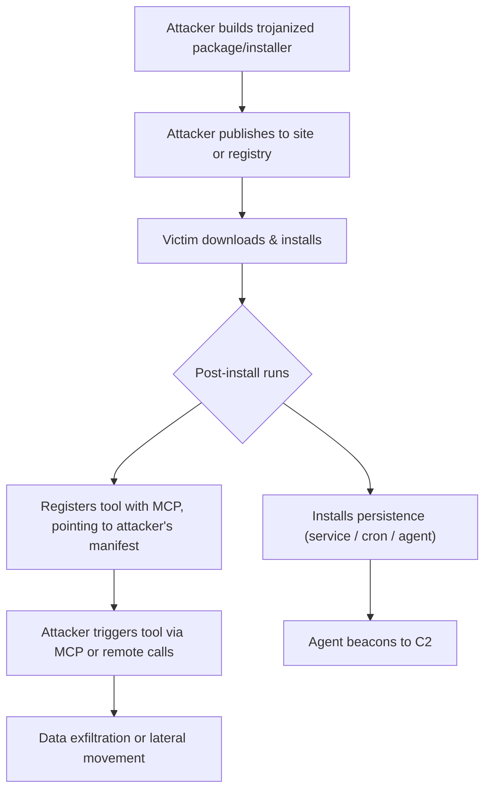

 # SAFE‑T1006: User‑Social‑Engineering Install (Improved)
## Overview

Tactic: Initial Access (ATK-TA0001)
Technique ID: SAFE‑T1006
Severity: High
First Observed: (The concept is analogous to real-world supply-chain compromise; no widely-publicized MCP-specific case yet)
Last Updated: 2025-11-15

## Description

User‑Social‑Engineering Install is a technique in which an attacker persuades a user (developer, operator, or admin) to install a seemingly legitimate package or installer, but which is actually malicious (trojanized). In the MCP context, this can take the form of a package, installer, or tool that—once installed—registers itself with an MCP server or agent, giving the attacker persistent and powerful access.

Because MCP tools can request high-privilege capabilities (like file access, execution, or network), a poisoned installer or package can be extremely dangerous: once installed, it can register a tool or agent that is controlled by the attacker, allowing data exfiltration, remote execution, or persistence.

## Attack Vectors

- Phishing / Social Engineering: Trick a user (developer, admin) into installing a malicious package or binary.

- Registry Poisoning / Typosquatting: Upload a malicious tool to a popular package registry (npm, PyPI, etc.) with a name that is very similar to a legitimate tool.

- Supply-Chain Compromise: Compromise a legitimate tool’s repository or CI pipeline to insert trojan code.

- Compromised Installer: Distribute a malicious installer that looks official but includes post-install code for persistence / MCP registration.

## Technical Details
### Prerequisites

- Attacker must be able to build a malicious package or installer.

- Victim must have enough trust or permissions to install the package.

- The installer or package must embed post‑install logic to register with an MCP server or install an agent.

- The victim’s MCP client (or system) must trust newly registered tools / agents without strict verification.

## Attack Flow

Here’s a Mermaid diagram to illustrate:

## Attack Steps

- **Prepare**: Attacker builds a malicious installer or package embedding the malicious post-install behavior (MCP registration or agent).

- **Distribute**: The package is distributed via phishing emails, social media, or through a public registry via typosquatting.

- **Install**: A user (developer / operator) runs the installer or imports the package, triggering the post-install code.

- **Register & Persist**: The post-install logic registers a malicious tool with an MCP server (with manifest pointing to attacker-controlled server) and/or installs a background agent.

- **Activate**: The attacker triggers the registered tool remotely (via the MCP protocol) or uses a persistent agent to run commands.

- **Exploit / Exfiltrate**: Sensitive data (tokens, files, credentials) is exfiltrated, or further persistence is established.

## Advanced Techniques & Variations

- **Typosquatting / Dependency Confusion**: Attackers can upload malicious versions of commonly used packages (or similar named packages) to public registrar, increasing the chance of inadvertent install.

- **Code Obfuscation**: The post-install logic might be obfuscated or chunked, making detection harder.

- **Deferred or Conditional Activation**: The malicious code might wait (time-delay), or only activate after certain conditions (e.g., first run, certain command) to avoid detection.

- **Multiple Persistence Mechanisms**: Agent + service + cron at once, so even if one gets removed, others remain.

- **Manifest-based Hijack**: The tool’s manifest (the MCP tool description / schema) points to an attacker-controlled URL, so the attacker can update the tool’s behavior after installation (similar to “rug pull” in other software supply-chain attacks).

## Impact Assessment

- **Confidentiality**: High — attacker can read sensitive files, exfiltrate data.

- **Integrity**: High — attacker can run arbitrary commands or manipulate system behavior.

- **Availability**: Medium — if agent or persistent process interferes.

- **Scope**: Can affect individual dev machines, CI systems, or production environments, depending on where the installation happens.

## Detection Methods

### Indicators of Compromise (IoCs)

- New or unexpected MCP tool registrations.

- Tool manifest URL pointing to external / untrusted domains.

- Post-install scripts creating services, cron jobs, or agents.

- Network connections from agent to unknown C2 or control servers after installation.

### Behavioral Indicators

- Users complaining about “tool installed but not sure what it does.”

- Agent processes that were not manually approved.

- MCP tool calls or behavior that doesn’t match expected functionality.

- Outbound connections soon after tool install / registration.

### Detection Strategy

- Log and alert on all tool.register events in MCP, especially new tools.

- Monitor process creations after installs (service / cron / agent).

- Perform static analysis on installers / packages for post‑install logic.

- Validate tool manifests: check that manifest URLs are from trusted domains; verify integrity (e.g., digital signature).

## Mitigation Strategies

### Preventive Controls

- **Signed Packages & Installers** — Require cryptographic signing of installers / packages.

- **Allowlist Package Sources** — Only allow installation from trusted registries or domains.

- **Manual Tool Approval** — Require human / security review before tools are registered with MCP in production.

- **Sandboxed Installation / Review** — Test new tools in isolated environments before allowing them in production.

### Detective Controls

- **Tool Registration Monitoring** — Audit and alert on newly registered tools.

- **Install Behavior Monitoring** — Monitor post-install behavior: services, cron jobs, agents.

- **Network Monitoring** — Track unexpected inbound/outbound connections from newly installed agents / tools.

### Response Procedures

- Quarantine affected host(s).

- Unregister the malicious tool from the MCP registry.

- Remove any installed agents or persistence mechanisms.

- Rotate any secrets or credentials that may have been accessed.

- Conduct a forensic analysis: collect the installer, check the manifest, examine logs to track the distribution path (how it was deployed).

- Remediate by re-securing the package source (e.g., fix the compromised CI, remove typosquatted package, educate users).
## Related Techniques

- SAFE‑T1001: Tool Poisoning Attack (TPA) — malicious instructions embedded in MCP tool descriptions/schema

- SAFE‑T1004: (Hypothetical) Server Impersonation / Name-Collision — attacker uses fake MCP server to trick users

- SAFE‑T1207: Hijacked Update Mechanism — attacker compromises update pipeline

## References / Reliable Sources
The following references include direct links. Entries without an explicit URL were removed to keep the references actionable.

- [Model Context Protocol — Getting Started (Official Spec)](https://modelcontextprotocol.io/docs/getting-started/intro)
- [CISA — Phishing Guidance: Stopping the Attack Cycle](https://www.cisa.gov/resources-tools/resources/phishing-guidance-stopping-attack-cycle-phase-one)
- [Neupane et al., “An In‑depth Look at Package Confusion” (USENIX Security 2023)](https://www.usenix.org/system/files/usenixsecurity23-neupane.pdf)
- [Sonatype — Supply‑Chain Security & Dependency Hijack Reports](https://www.sonatype.com/resources)
- [NIST — AI Risk Management Framework (AI‑RMF)](https://www.nist.gov/itl/ai-risk-management-framework)
- [OWASP Top 10 for LLM Applications](https://owasp.org/www-project-top-10-for-large-language-model-applications/)

## Version History
| Version | Date       | Changes                                                                 | Author     |
|--------:|------------|-------------------------------------------------------------------------|------------|
| 1.0     | 2025-11-15 | Initial write-up in the improved format                                 | rajivsthh  |
| 1.1     | 2025-11-16 | Reformat README to template, add Attack Flow diagram, embed example detection rule, clean references | rajivsthh  |

