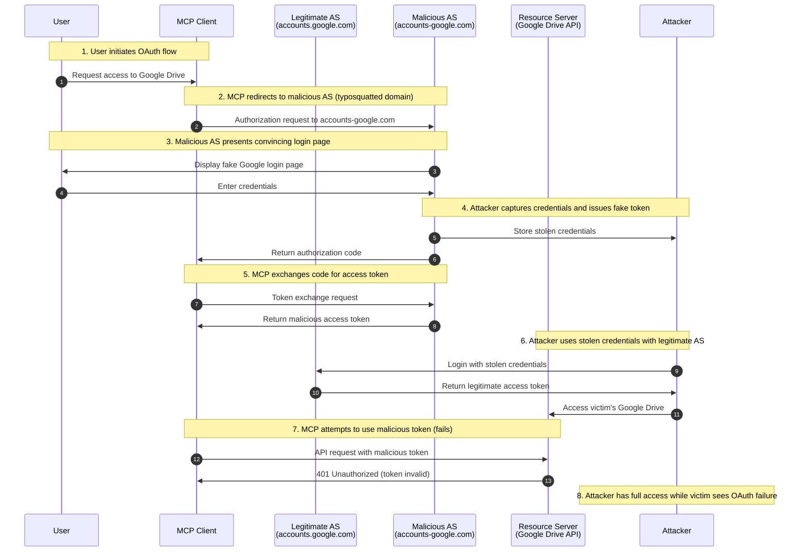

# SAFE-T1009: Authorization Server Mix-up

## Overview

**Tactic**: Initial Access (ATK-TA0001)  
**Technique ID**: SAFE-T1009  
**Severity**: Critical  
**First Observed**: 2016 (Academic research by Mainka et al.)  
**Last Updated**: 2025-11-23

## Description

Authorization Server Mix-up is a sophisticated attack technique where adversaries exploit OAuth 2.0 clients by redirecting them to lookalike or attacker-controlled Authorization Server (AS) domains. The attack leverages domain confusion techniques including typosquatting, homograph attacks, and subdomain manipulation to trick users and MCP clients into authenticating with malicious authorization servers.

When a client follows a redirect to a lookalike AS domain (e.g., `accounts-google.com` instead of `accounts.google.com`), the authorization code or access token is leaked to the attacker-controlled server. This attack is particularly dangerous in MCP environments where multiple OAuth-protected services are integrated, as a single compromised authorization flow can grant attackers access to numerous connected services including cloud storage, code repositories, email, and AI model APIs.

## Attack Vectors

- **Primary Vector**: Typosquatted or homograph domains mimicking legitimate Authorization Servers
- **Secondary Vectors**:
  - Malicious MCP server configurations redirecting to attacker-controlled AS
  - Compromised OAuth discovery metadata pointing to rogue AS endpoints
  - Man-in-the-middle attacks manipulating authorization redirects
  - Social engineering to install MCP servers with pre-configured malicious AS URLs
  - DNS hijacking or DNS cache poisoning targeting OAuth endpoints
  - International Domain Name (IDN) homograph attacks using Unicode confusables

## Technical Details

### Prerequisites

- User has MCP client configured with OAuth-enabled services
- Attacker registers lookalike domain or compromises legitimate domain
- Client does not validate Authorization Server issuer (missing RFC 9207 implementation)
- User must initiate OAuth flow through compromised pathway

### Attack Flow



#### Detailed Attack Steps

1. **Reconnaissance**: Attacker identifies target OAuth Authorization Servers used by MCP deployments
2. **Domain Registration**: Attacker registers lookalike domain using typosquatting or homograph techniques
3. **Infrastructure Setup**: Attacker deploys OAuth authorization server on malicious domain
4. **Compromise Vector**: Attacker distributes malicious MCP server or manipulates client configuration
5. **OAuth Initiation**: Victim initiates OAuth flow through MCP client
6. **Redirect Manipulation**: Client redirects to lookalike AS domain instead of legitimate one
7. **User Authentication**: User authenticates on lookalike domain (appears legitimate)
8. **Code/Token Capture**: Authorization code or access token sent to attacker's callback URL
9. **Token Exchange**: Attacker exchanges authorization code for access/refresh tokens
10. **Post-Exploitation**: Attacker uses stolen tokens to access victim's services

### Example Scenario

**Legitimate OAuth Flow**:

```json
{
  "authorization_endpoint": "https://accounts.google.com/o/oauth2/v2/auth",
  "token_endpoint": "https://oauth2.googleapis.com/token",
  "issuer": "https://accounts.google.com",
  "client_id": "123456789.apps.googleusercontent.com",
  "redirect_uri": "https://mcp-client.example.com/callback"
}
```

**Malicious OAuth Flow (Mix-up Attack)**:

```json
{
  "authorization_endpoint": "https://accounts-google.com/o/oauth2/v2/auth",
  "token_endpoint": "https://accounts-google.com/token",
  "issuer": "https://accounts-google.com",
  "client_id": "attacker-client-id",
  "redirect_uri": "https://attacker-controlled.com/steal-tokens"
}
```

Note the subtle difference: `accounts.google.com` (legitimate) vs `accounts-google.com` (attacker's typosquatted domain).

### Advanced Attack Techniques (2016-2024 Research)

According to research from [Mainka et al. (USENIX Security 2016)](https://www.usenix.org/conference/usenixsecurity16/technical-sessions/presentation/mainka), OAuth 2.0 Mix-up attacks exploit fundamental weaknesses in how clients bind authorization and token requests:

1. **Classic Mix-Up Attack**: Client confuses which AS issued an authorization code, sending it to wrong token endpoint. Attacker AS returns valid-looking tokens that are actually issued by attacker.

2. **Malicious Endpoint Attack** ([Fett et al., 2016](https://arxiv.org/abs/1601.01229)): Attacker manipulates client to send authorization code to attacker's token endpoint, directly stealing credentials.

3. **IDN Homograph Attacks**: Using International Domain Names with Unicode characters that visually resemble legitimate domains:

   - `аccounts.google.com` (Cyrillic 'а' U+0430 instead of Latin 'a')
   - `micrοsoft.com` (Greek omicron 'ο' U+03BF instead of Latin 'o')
   - `gοοgle.com` (Greek omicrons)

4. **Subdomain Confusion** ([OAuth Security Best Current Practice](https://datatracker.ietf.org/doc/html/draft-ietf-oauth-security-topics)): Exploiting wildcard DNS or subdomain takeover:

   - `auth.compromised-subdomain.example.com`
   - `accounts.google.com.attacker.com` (valid subdomain of attacker.com)

5. **TLD Substitution**: Using alternative top-level domains:
   - `.co` instead of `.com`
   - `.io`, `.ai`, `.com.br` for regional confusion
   - New gTLDs like `.cloud`, `.services`

### MCP-Specific Considerations

In Model Context Protocol environments, this attack is particularly effective because:

- **Multiple OAuth Integrations**: MCP servers commonly integrate with Google Drive, GitHub, Slack, AWS, Azure, and other OAuth-protected services
- **Dynamic Discovery**: Some MCP clients use dynamic OAuth discovery, making configuration manipulation easier
- **User Trust**: Users trust MCP servers they've installed, may not scrutinize OAuth URLs carefully
- **Token Aggregation**: Single MCP server often holds tokens for multiple services, amplifying impact
- **Long-Lived Tokens**: Refresh tokens may be valid for extended periods, providing persistent access

## Impact Assessment

- **Confidentiality**: Critical - Complete access to all OAuth-protected services (Google Workspace, GitHub repos, AWS infrastructure, etc.)
- **Integrity**: High - Attacker can modify data, commit code, alter configurations as the victim
- **Availability**: Medium - Account lockouts possible if attacker changes credentials or exhausts rate limits
- **Scope**: Network-wide - Affects all services where stolen tokens are valid, potential for lateral movement across integrated platforms

### Current Status (2025)

The OAuth community has developed mitigations:

- **RFC 9207** ([OAuth 2.0 Authorization Server Issuer Identification](https://datatracker.ietf.org/doc/html/rfc9207)) published March 2022 introduces mandatory "iss" parameter in authorization responses, allowing clients to validate the issuer before using authorization codes
- **OAuth 2.0 Security Best Current Practice** ([IETF Draft](https://datatracker.ietf.org/doc/html/draft-ietf-oauth-security-topics)) recommends strict redirect URI validation and AS endpoint verification
- Major OAuth providers (Google, Microsoft, GitHub) have implemented RFC 9207 support
- However, many legacy systems and custom OAuth implementations remain vulnerable
- According to [PortSwigger Research](https://portswigger.net/research/hidden-oauth-attack-vectors), Mix-up attacks continue to be discovered in modern OAuth deployments

## Detection Methods

**Note**: Pattern-based detection has limitations. Attackers continuously develop new typosquatting and homograph techniques. Organizations should implement multi-layered detection combining pattern matching, machine learning for domain similarity, behavioral analysis, and certificate validation.

### Indicators of Compromise (IoCs)

- Authorization requests to domains with Levenshtein distance < 3 from known legitimate AS
- OAuth flows to domains containing hyphens in brand names (e.g., `accounts-google.com`)
- Authorization endpoints using IDN/Punycode encoding
- TLS certificates issued by unusual Certificate Authorities or recently issued certificates
- Authorization responses missing "iss" parameter (RFC 9207 violation)
- Mismatched issuer identifiers between configuration and authorization response
- OAuth endpoints with unexpected geographic locations (based on IP geolocation)
- Multiple AS configurations for single service (e.g., two "Google" configurations)
- Sudden changes in AS endpoint URLs in MCP server configurations

### Detection Rules

**Important**: The following rules are written in Sigma format and contain example patterns only. Attackers continuously develop new typosquatting and homograph techniques. Organizations should:

- Implement domain similarity algorithms (Levenshtein distance, Jaro-Winkler)
- Use Unicode confusables detection libraries
- Maintain dynamic allowlists of verified AS domains
- Deploy behavioral analytics to detect anomalous OAuth patterns
- Integrate Certificate Transparency monitoring
- Leverage threat intelligence feeds for known malicious OAuth domains

```yaml
# EXAMPLE SIGMA RULE - Not comprehensive
title: OAuth Authorization Server Domain Typosquatting Detection
id: a7f8e3d1-9c2b-4a6e-8d5f-1b7c9e4a3f2d
status: experimental
description: Detects potential Authorization Server Mix-up through domain typosquatting patterns
author: Raju Kumar Yadav
date: 2025-11-23
references:
  - https://github.com/SAFE-MCP/safe-mcp/techniques/SAFE-T1009
  - https://datatracker.ietf.org/doc/html/rfc9207
  - https://www.usenix.org/conference/usenixsecurity16/technical-sessions/presentation/mainka
logsource:
  product: mcp
  service: oauth
detection:
  selection_typosquatting:
    oauth.authorization_endpoint|contains:
      - "accounts-google"
      - "login-microsoft"
      - "auth-github"
      - "oauth-aws"
      - "signin-apple"
    oauth.authorization_endpoint|not|contains:
      - "accounts.google.com"
      - "login.microsoftonline.com"
      - "github.com"
      - "signin.aws.amazon.com"
  condition: selection_typosquatting
falsepositives:
  - Legitimate subdomains with hyphens
  - Internal development/testing environments
level: critical
tags:
  - attack.initial_access
  - attack.t1566.002 # Phishing: Spearphishing Link
  - safe.t1009
```

```yaml
---
title: OAuth Authorization Response Missing Issuer Identification
id: b8e9f4c2-0d3a-5b7e-9f6a-2c8d0e5b4a3f
status: experimental
description: Detects OAuth authorization responses missing mandatory issuer (iss) parameter per RFC 9207
author: Raju Kumar Yadav
date: 2025-11-23
references:
  - https://datatracker.ietf.org/doc/html/rfc9207
  - https://github.com/SAFE-MCP/safe-mcp/techniques/SAFE-T1009
logsource:
  product: mcp
  service: oauth
detection:
  selection:
    event.action: "oauth.authorization.response"
    oauth.iss: null
  condition: selection
falsepositives:
  - Legacy OAuth 2.0 servers not yet upgraded to RFC 9207
  - Custom OAuth implementations
level: high
tags:
  - attack.initial_access
  - attack.t1566.002
  - safe.t1009
```

```yaml
---
title: OAuth Issuer Identifier Mismatch
id: c9f0a5d3-1e4b-6c8f-0a7b-3d9e1f6c5b4a
status: experimental
description: Detects mismatch between expected and actual issuer in OAuth authorization response
author: Raju Kumar Yadav
date: 2025-11-23
references:
  - https://datatracker.ietf.org/doc/html/rfc9207
  - https://github.com/SAFE-MCP/safe-mcp/techniques/SAFE-T1009
logsource:
  product: mcp
  service: oauth
detection:
  selection:
    event.action: "oauth.authorization.response"
    oauth.iss|not|equals: oauth.expected_issuer
  condition: selection
falsepositives:
  - Issuer URL changes during AS migration
  - Configuration updates not yet propagated
level: critical
tags:
  - attack.initial_access
  - attack.t1566.002
  - safe.t1009
```

```yaml
---
title: OAuth IDN Homograph Domain Detection
id: d0a1b6e4-2f5c-7d9a-1b8c-4e0f2a7d6c5b
status: experimental
description: Detects International Domain Name (IDN) homograph attacks in OAuth endpoints
author: Raju Kumar Yadav
date: 2025-11-23
references:
  - https://github.com/SAFE-MCP/safe-mcp/techniques/SAFE-T1009
  - https://www.unicode.org/reports/tr39/
logsource:
  product: mcp
  service: oauth
detection:
  selection_punycode:
    oauth.authorization_endpoint|contains: 'xn--'
  selection_mixed_scripts:
    oauth.authorization_endpoint|re: '.*[\u0400-\u04FF].*'  # Cyrillic
    oauth.authorization_endpoint|re: '.*[\u0370-\u03FF].*'  # Greek
  condition: 1 of selection_*
falsepositives:
  - Legitimate internationalized domain names
  - Regional OAuth providers
level: high
tags:
  - attack.initial_access
  - attack.t1566.002
  - safe.t1009
```

```yaml
---
title: Suspicious OAuth AS Certificate Characteristics
id: e1b2c7f5-3a6d-8e0b-2c9d-5f1a3b8e7d6c
status: experimental
description: Detects suspicious TLS certificate characteristics for OAuth Authorization Servers
author: Raju Kumar Yadav
date: 2025-11-23
references:
  - https://github.com/SAFE-MCP/safe-mcp/techniques/SAFE-T1009
logsource:
  product: mcp
  service: tls
detection:
  selection_recent_cert:
    event.action: "tls.certificate.validation"
    tls.certificate.not_before: last 7d
    tls.server.domain|contains:
      - "google"
      - "microsoft"
      - "github"
      - "amazon"
  selection_dv_cert:
    tls.certificate.validation_type: "DV"
    tls.server.domain|contains: "google|microsoft|github|amazon"
  condition: 1 of selection_*
falsepositives:
  - Legitimate certificate renewals
  - New regional OAuth endpoints
level: medium
tags:
  - attack.initial_access
  - attack.t1566.002
  - safe.t1009
```

### Behavioral Indicators

- User receives unexpected OAuth consent prompts for already-authorized services
- OAuth flows complete but integrated services remain inaccessible
- Multiple authentication attempts for same service in short timeframe
- OAuth redirects to unfamiliar domains reported by security-conscious users
- Anomalous geographic locations for OAuth authorization endpoints (e.g., AS claiming to be Google but IP resolves to different country)
- OAuth tokens with unexpected scopes or audiences
- Cross-origin OAuth flows (authorization initiated from different domain than MCP client)

## Mitigation Strategies

### Preventive Controls

1. **[SAFE-M-13: OAuth Flow Verification](../../mitigations/SAFE-M-13/README.md)**: Implement RFC 9207 Authorization Server Issuer Identification by validating "iss" parameter in all authorization responses against expected issuer before processing authorization codes
2. **[SAFE-M-14: Server Allowlisting](../../mitigations/SAFE-M-14/README.md)**: Maintain strict allowlist of verified Authorization Server domains; reject OAuth flows to non-allowlisted domains regardless of configuration
3. **Static AS Configuration**: Configure OAuth endpoints statically rather than via dynamic discovery; require manual approval for AS configuration changes to prevent dynamic endpoint manipulation
4. **Certificate Pinning**: Pin TLS certificates or public keys for critical Authorization Servers; alert on certificate changes to detect potential domain takeover or MitM attacks
5. **PKCE Enforcement**: Mandate Proof Key for Code Exchange (PKCE, RFC 7636) for all OAuth flows to prevent authorization code interception attacks
6. **Redirect URI Validation**: Enforce strict redirect URI matching; reject wildcards and open redirects that could be exploited for token theft
7. **[SAFE-M-15: User Warning Systems](../../mitigations/SAFE-M-15/README.md)**: Display clear warnings when OAuth flows target unfamiliar domains; show full URL with visual indicators for security-critical characters
8. **DNS Security**: Implement DNSSEC validation and DNS-based filtering to block known typosquatting domains

### Detective Controls

1. **[SAFE-M-18: OAuth Flow Monitoring](../../mitigations/SAFE-M-18/README.md)**: Log all OAuth authorization attempts including full URLs, issuer parameters, and certificate details
2. **Domain Similarity Detection**: Implement algorithmic detection of typosquatted and homograph domains using Levenshtein distance and Unicode confusables libraries to identify potential AS impersonation
3. **[SAFE-M-20: Anomaly Detection](../../mitigations/SAFE-M-20/README.md)**: Deploy behavioral analytics to detect unusual OAuth patterns such as first-seen domains, geographic anomalies, or multiple AS configurations
4. **Certificate Transparency Monitoring**: Monitor Certificate Transparency logs for certificates issued for lookalike domains of trusted Authorization Servers to detect potential impersonation infrastructure
5. **[SAFE-M-19: Token Usage Tracking](../../mitigations/SAFE-M-19/README.md)**: Track OAuth token usage patterns to identify potentially compromised tokens

### Response Procedures

1. **Immediate Actions**:
   - Revoke all OAuth tokens issued through suspected malicious AS
   - Block attacker domains at DNS and firewall levels
   - Alert affected users via all available channels
   - Preserve logs and evidence for forensic analysis
   - Activate incident response team
2. **Investigation Steps**:
   - Identify all users who completed OAuth flows to suspicious domains
   - Audit OAuth token usage logs for unauthorized access
   - Trace attack vector (malicious MCP server, compromised config, MitM)
   - Determine scope of data exposure across integrated services
   - Check for lateral movement to other systems
3. **Remediation**:
   - Force token revocation for all affected users
   - Require re-authentication with verified Authorization Servers
   - Update AS allowlists to exclude attacker domains
   - Patch MCP client configurations to enforce RFC 9207
   - Implement additional preventive controls identified during investigation
   - Notify third-party services of potential token compromise
   - Reset user credentials if accounts may have been accessed

## Related Techniques

- [SAFE-T1007](../SAFE-T1007/README.md): OAuth Authorization Phishing - Malicious MCP servers exploiting OAuth flows for token theft
- [SAFE-T1004](../SAFE-T1004/README.md): Server Impersonation / Name-Collision - Related domain impersonation tactics
- [SAFE-T1006](../SAFE-T1006/README.md): User-Social-Engineering Install - Social engineering to install malicious MCP servers
- [SAFE-T1306](../SAFE-T1306/README.md): Rogue Authorization Server - Attacker operates malicious AS ignoring audience/PoP
- [SAFE-T1307](../SAFE-T1307/README.md): Confused Deputy Attack - Token forwarding and AS confusion issues
- [SAFE-T1308](../SAFE-T1308/README.md): Token Scope Substitution - Post-compromise token manipulation
- [SAFE-T1408](../SAFE-T1408/README.md): OAuth Protocol Downgrade - Forcing less secure OAuth flows
- [SAFE-T1202](../SAFE-T1202/README.md): OAuth Token Persistence - Post-compromise persistence via token reuse
- [SAFE-T1506](../SAFE-T1506/README.md): Infrastructure Token Theft - Stealing tokens from logs/proxies
- [SAFE-T1507](../SAFE-T1507/README.md): Authorization Code Interception - Man-in-the-browser code theft

## References

- [Model Context Protocol Specification](https://modelcontextprotocol.io/specification)
- [OWASP Top 10 for LLM Applications](https://owasp.org/www-project-top-10-for-large-language-model-applications/)
- [On the Security of Modern Single Sign-On Protocols: Second-Order Vulnerabilities in OpenID Connect - Mainka, Mladenov, Schwenk, USENIX Security 2016](https://www.usenix.org/conference/usenixsecurity16/technical-sessions/presentation/mainka)
- [A Comprehensive Formal Security Analysis of OAuth 2.0 - Fett, Küsters, Schmitz, ACM CCS 2016](https://arxiv.org/abs/1601.01229)
- [RFC 6749 - The OAuth 2.0 Authorization Framework](https://datatracker.ietf.org/doc/html/rfc6749)
- [RFC 6819 - OAuth 2.0 Threat Model and Security Considerations](https://datatracker.ietf.org/doc/html/rfc6819)
- [RFC 8252 - OAuth 2.0 for Native Apps](https://datatracker.ietf.org/doc/html/rfc8252)
- [RFC 9207 - OAuth 2.0 Authorization Server Issuer Identification](https://datatracker.ietf.org/doc/html/rfc9207)
- [RFC 7636 - Proof Key for Code Exchange (PKCE)](https://datatracker.ietf.org/doc/html/rfc7636)
- [OAuth 2.0 Security Best Current Practice - IETF Draft](https://datatracker.ietf.org/doc/html/draft-ietf-oauth-security-topics)
- [Hidden OAuth Attack Vectors - PortSwigger Research](https://portswigger.net/research/hidden-oauth-attack-vectors)
- [Unicode Security Considerations - Unicode Technical Report #39](https://www.unicode.org/reports/tr39/)
- [OWASP OAuth 2.0 Cheat Sheet](https://cheatsheetseries.owasp.org/cheatsheets/OAuth2_Cheat_Sheet.html)

## MITRE ATT&CK Mapping

- [T1566.002 - Phishing: Spearphishing Link](https://attack.mitre.org/techniques/T1566/002/)
- [T1539 - Steal Web Session Cookie](https://attack.mitre.org/techniques/T1539/) (conceptually similar for OAuth tokens)
- [T1190 - Exploit Public-Facing Application](https://attack.mitre.org/techniques/T1190/) (if MCP server OAuth implementation is vulnerable)

## Version History

| Version | Date       | Changes                                                                                                                                                 | Author           |
| ------- | ---------- | ------------------------------------------------------------------------------------------------------------------------------------------------------- | ---------------- |
| 1.0     | 2025-11-23 | Initial documentation of Authorization Server Mix-up technique with RFC 9207 mitigations, comprehensive detection rules, and real-world attack patterns | Raju Kumar Yadav |
