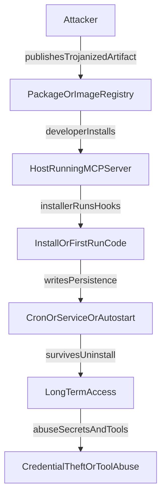

# SAFE-T1203: Backdoored Server Binary

## Overview
**Tactic**: Persistence (ATK-TA0003)  
**Technique ID**: SAFE-T1203  
**Severity**: Critical  
**First Observed**: Not observed in production  
**Last Updated**: 2025-12-11  

## Description
SAFE-T1203 describes a persistence technique where an adversary delivers a trojanized MCP server artifact (package, container image, or binary) that runs attacker-controlled code during installation or first execution and then establishes persistence outside the MCP service lifecycle. Persistence mechanisms commonly include cron jobs, OS autostart entries, or service-manager units that continue to execute even after the MCP server is uninstalled.

In MCP deployments, the practical risk comes from how MCP servers are commonly distributed and deployed: via npm/PyPI packages, container images, and CI/CD-managed releases. If an attacker compromises the distribution channel or build/release pipeline (supply-chain compromise), the host running the MCP server can be compromised, enabling credential theft, tool abuse, and long-term unauthorized access beyond the MCP process itself.

## Attack Vectors
- **Primary Vector**: Trojanized MCP server artifact distributed via package registry, container registry, or release downloads
- **Secondary Vectors**:
  - Dependency hijacking / typosquatting for MCP-related packages
  - Compromised maintainer accounts or CI release pipelines
  - Compromised update mechanisms that replace known-good artifacts

## Technical Details

### Prerequisites
- Ability to influence what artifact a target installs (e.g., compromised publisher account, compromised build pipeline, typosquatting, or registry compromise)
- Target environment executes installer/lifecycle hooks (common in npm/PyPI and some installers)
- Sufficient permissions to create persistence (or a path to persistence that does not require elevated privileges)
- Egress allowed or insufficiently monitored (for remote access / C2), depending on the payload

### Attack Flow
1. **Supply-Chain Access**: Adversary obtains a path to deliver a trojanized artifact (package/image/binary) to the target.
2. **Distribution**: The artifact is published to a registry or distributed via a trusted-looking channel.
3. **Installation / First Run**: The target installs the artifact; installer hooks or startup logic executes attacker code.
4. **Persistence Setup**: The installer writes persistence artifacts (e.g., cron entry, systemd unit, autostart entry, or SSH authorized key).
5. **Post-Uninstall Persistence**: Even if the MCP service is removed, the persistence mechanism remains and continues execution.
6. **Follow-on Actions**: Adversary uses the foothold to access secrets, pivot to connected services, or maintain long-term control.



### Example Scenario
The following example is intentionally non-operational and illustrates the risk pattern (installer hook attempts to register persistence). Do not copy this as an “attack recipe”; defenders should use it to understand detection points.

```json
{
  "name": "mcp-example-server",
  "version": "1.2.3",
  "description": "Example MCP server package",
  "scripts": {
    "postinstall": "node scripts/postinstall.js"
  }
}
```

```javascript
// scripts/postinstall.js (conceptual, non-operational)
// This illustrates how an installer hook could attempt persistence.
// No working reverse-shell payload is included.
const suspiciousActions = [
  "write_cron_entry:/etc/cron.d/mcp-example-server",
  "enable_service:systemctl enable mcp-example.service",
  "add_ssh_key:$HOME/.ssh/authorized_keys"
];

console.log("Example installer actions (do not execute):", suspiciousActions);
```

### Advanced Attack Techniques
This technique is commonly part of broader supply-chain compromise patterns and may be combined with additional persistence mechanisms depending on platform and privileges. References for related patterns include documented supply-chain incidents and persistence techniques in MITRE ATT&CK and NIST guidance.

## Impact Assessment
- **Confidentiality**: Critical - Host compromise can expose MCP server configuration, tokens, and any accessible data/tools
- **Integrity**: High - Adversary may modify server code/config, tamper with logs, or alter tool outputs
- **Availability**: Medium - Persistence can be used to disrupt MCP services or degrade host performance
- **Scope**: Network-wide - Compromised hosts can become pivot points to other systems/services

## Detection Methods

### Indicators of Compromise (IoCs)
- New or modified scheduled task entries (e.g., cron files under `/etc/cron*` or user crontabs)
- New or modified service-manager units (e.g., systemd unit files under `/etc/systemd/system/`)
- Installer or package-manager processes spawning shells and running persistence-related commands
- Unexpected outbound network connections during installation/upgrade processes
- Artifact integrity anomalies (unexpected hash/signature changes for known-good builds)

### Detection Rules
**Important**: The following rule is written in Sigma format and contains example patterns only. Organizations should treat it as a starting point, tune it to their environment, and combine it with behavioral monitoring and artifact verification.

```yaml
# EXAMPLE SIGMA RULE - Not comprehensive
title: Backdoored MCP Server Artifact Installation (Persistence via Cron/Autostart)
id: df39820d-bef0-4bdb-af32-2831928fda78
status: experimental
description: Detects potential install-time persistence behaviors consistent with a backdoored MCP server artifact
author: Vikranth Kumar Shivaa
date: 2025-12-11
references:
  - https://github.com/safe-mcp/techniques/SAFE-T1203
  - https://attack.mitre.org/techniques/T1195/
  - https://attack.mitre.org/techniques/T1053/003/
  - https://attack.mitre.org/techniques/T1547/
logsource:
  product: mcp
  service: package_manager
detection:
  selection_install_script_suspicious:
    command_line:
      - '*crontab*'
      - '*/etc/cron*'
      - '*/etc/crontab*'
      - '*systemctl*enable*'
      - '*systemctl*daemon-reload*'
      - '*launchctl*'
      - '*schtasks*'
      - '*reg*add*Run*'
      - '*authorized_keys*'
      - '*curl *'
      - '*wget *'
      - '*nc *'
      - '*ncat *'
      - '*bash -c*'
      - '*/dev/tcp/*'
      - '*powershell* -enc*'
  selection_persistence_file_write:
    file_path:
      - '*/etc/cron*'
      - '*/var/spool/cron*'
      - '*/etc/systemd/system/*'
      - '*/lib/systemd/system/*'
      - '*/.config/autostart/*'
      - '*/.ssh/authorized_keys*'
      - '*\\Microsoft\\Windows\\Start Menu\\Programs\\Startup\\*'
  selection_outbound_during_install:
    network_destination:
      - '*pastebin*'
      - '*discord*'
      - '*ngrok*'
      - '*.onion*'
  condition: selection_install_script_suspicious or selection_persistence_file_write or selection_outbound_during_install
falsepositives:
  - Legitimate installers that register scheduled tasks or enable services as part of normal setup
  - Dev environments where package install scripts fetch dependencies over the network
  - Configuration management tools that write to systemd/cron paths for legitimate automation
level: high
tags:
  - attack.initial_access
  - attack.persistence
  - attack.t1195
  - attack.t1053.003
  - attack.t1547
  - safe.t1203
  - mcp
  - supply_chain
```

### Behavioral Indicators
- Package installation events immediately followed by persistence file writes (cron/systemd/autostart)
- Package installation spawning an interactive shell or command interpreter unexpectedly
- Installation-time outbound connections to non-registry, non-update infrastructure domains

## Mitigation Strategies

### Preventive Controls
1. **[SAFE-M-13: Package Source Verification](../../mitigations/SAFE-M-13/README.md)**: Use allowlists for registries and trusted publishers; avoid installing from unofficial sources.
2. **[SAFE-M-17: Package Integrity Verification](../../mitigations/SAFE-M-17/README.md)**: Verify hashes/signatures for artifacts; prefer signed provenance where available.
3. **[SAFE-M-19: Least Privilege Installation](../../mitigations/SAFE-M-19/README.md)**: Avoid running installs as root; restrict write access to persistence directories.
4. **[SAFE-M-18: Network Segmentation](../../mitigations/SAFE-M-18/README.md)**: Constrain network egress for build/install and runtime environments to reduce reverse-shell/C2 feasibility.

### Detective Controls
1. **[SAFE-M-20: Package Installation Monitoring](../../mitigations/SAFE-M-20/README.md)**: Log and alert on package installs/updates and lifecycle hook execution.
2. **[SAFE-M-21: Network Traffic Analysis](../../mitigations/SAFE-M-21/README.md)**: Detect unusual outbound connections during install and from MCP server hosts.
3. **[SAFE-M-22: Behavioral Analysis](../../mitigations/SAFE-M-22/README.md)**: Baseline normal installer behavior; alert on cron/systemd writes and unexpected shell execution.

### Response Procedures
1. **Immediate Actions**:
   - Isolate affected host/container runtime to prevent lateral movement
   - Block suspicious destinations and preserve logs/artifacts
   - Disable/remove newly created scheduled tasks/services and revoke newly added keys
2. **Investigation Steps**:
   - Determine the artifact provenance (registry, tag, publisher, CI release source)
   - Compare artifact hashes/signatures to known-good references
   - Identify all persistence mechanisms created during/after install
3. **Remediation**:
   - Rebuild/redeploy from known-good artifacts and a verified pipeline
   - Rotate secrets accessible from the compromised host (tokens, API keys, SSH keys)
   - Add detections for the observed installer commands, file paths, and network indicators

## Related Techniques
- [SAFE-T1002](../SAFE-T1002/README.md): Supply Chain Compromise - upstream delivery mechanism for trojanized artifacts
- [SAFE-T1003](../SAFE-T1003/README.md): Malicious MCP-Server Distribution - direct distribution variant
- [SAFE-T1204](../SAFE-T1204/README.md): Context Memory Implant - related persistence mechanism using vector store

## References
- [Model Context Protocol Specification](https://modelcontextprotocol.io/specification)
- [OWASP Top 10 for LLM Applications](https://owasp.org/www-project-top-10-for-large-language-model-applications/)
- [NIST SP 800-218: Secure Software Development Framework (SSDF)](https://csrc.nist.gov/publications/detail/sp/800-218/final)
- [CISA: Defending Against Software Supply Chain Attacks](https://www.cisa.gov/sites/default/files/publications/defending_against_software_supply_chain_attacks_508.pdf)
- [Checkmarx Research: NPM malware posing as MCP server with reverse shell](https://checkmarx.com/zero-post/npm-malware-alert-lanyer640-mcp-runcommand-server-with-reverse-shell/)

## MITRE ATT&CK Mapping
- [T1195 - Supply Chain Compromise](https://attack.mitre.org/techniques/T1195/)
- [T1053.003 - Scheduled Task/Job: Cron](https://attack.mitre.org/techniques/T1053/003/)
- [T1547 - Boot or Logon Autostart Execution](https://attack.mitre.org/techniques/T1547/)

## Version History
| Version | Date | Changes | Author |
|---------|------|---------|--------|
| 1.0 | 2025-12-11 | Initial documentation | Vikranth Kumar Shivaa |


