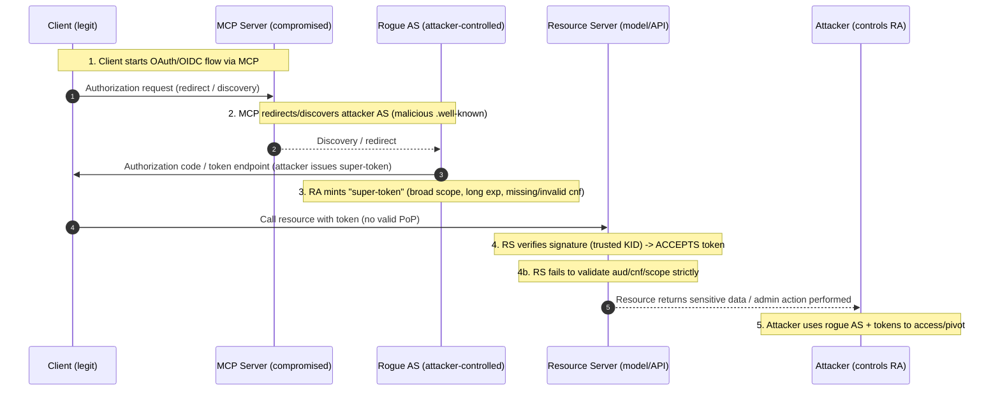
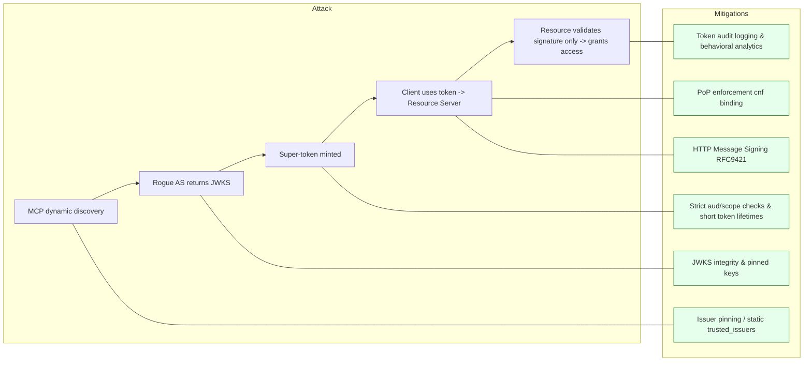

# SAFE-T1306 Rogue Authentication Server

---

## Overview

**Tactic**: **Credential Access, Defense Evasion**  
**Technique ID**: **SAFE-T1306**  
**Severity**: **Critical**  
**First Observed**: **2025-03** (red team simulation of MCP integrated LLM infrastructure)  
**Last Updated**: **2025-11-08**

---

## Description

A **Rogue Authentication Server** attack occurs when a malicious or compromised **Model Context Protocol** server redirects OAuth or OpenID Connect flows to an attacker‑controlled Authorization Server. The rogue AS issues tokens that **ignore audience restrictions** and **bypass Proof‑of‑Possession** enforcement, producing overly permissive bearer tokens or **super‑tokens** with expanded scopes and extended lifetimes.

The attack exploits weak trust boundaries and dynamic discovery in federated identity setups. By poisoning discovery metadata or substituting JWKS keys, an attacker can introduce a shadow issuer whose tokens appear valid to resource servers that rely on signature presence alone and fail to validate `iss`, `aud`, `cnf`, or key origin.

---

## Technical Details

**Root Cause**: Overtrust in federated discovery and insufficient PoP enforcement.
**Primary Violations**:

* **Least Privilege** (excessive scopes)
* **Fail Safe Defaults** (trusting unknown issuers)
* **Complete Mediation** (incomplete claim validation)

### Key Takeaways

- **PoP proves key possession not legitimacy**. PoP confirms the client holds a key but does not guarantee the issuer authorized the token claims.
- **MCP is a trust root**. If an MCP server is rogue or misconfigured, PoP and other protections can be undermined.  
- **Every hop must validate tokens**. Resource servers must validate issuer, audience, PoP binding, scope, and key origin.  
- **Treat tokens as untrusted until validated**. Implement strict claim checks and pinned trust anchors.

### Attack Vectors

- **Primary Vector**: OAuth or OIDC redirection to attacker‑controlled AS via manipulated discovery metadata or compromised MCP.  
- **Secondary Vectors**: poisoned JWKS endpoints, compromised MCP injecting altered `iss`/`aud`/`scope`/`cnf`, open redirect or discovery poisoning in clients.

### Prerequisites

- MCP or client allows dynamic discovery or accepts unvalidated issuer metadata.  
- Resource servers do not strictly validate `aud` or PoP (`cnf`) claims.  
- Attacker can host or influence an AS or JWKS endpoint reachable by clients or MCP.

### Attack Flow

#### Sequence Diagram




1. **Reconnaissance** — Attacker identifies MCPs and services that perform dynamic discovery or accept external issuer metadata.  
2. **Compromise or Discovery Poisoning** — Attacker compromises MCP or injects malicious discovery metadata pointing to rogue AS and JWKS.  
3. **Token Issuance** — Rogue AS issues tokens with expanded scopes, extended `exp`, or missing/invalid PoP binding.  
4. **Acceptance by Resources** — Resource servers validate signature against attacker JWKS or accept tokens without strict `aud`/`cnf` checks.  
5. **Post Exploitation** — Attacker uses tokens for lateral access, data exfiltration, impersonation, or persistence until trust anchors are rotated.

### Synthetic Example Token for Defensive Analysis

```json
{
  "iss": "https://rogue-as.attacker.example",
  "aud": "https://mcp.api.service",
  "scope": "read:all write:all admin",
  "cnf": { "jkt": null },
  "exp": 1700000000
}
```

**Note**: This example is synthetic and redacted for defensive analysis only. `cnf.jkt` set to `null` illustrates missing PoP binding.

---

## Advanced Techniques and Current Status

**Advanced variations** include key substitution where a rogue JWKS returns attacker keys, PoP null binding where `cnf` is omitted or falsified, and discovery poisoning that redirects clients to malicious metadata. Industry mitigations emphasize issuer pinning, static JWKS trust lists, PoP enforcement with hardware‑backed keys, and strict audience validation. OAuth security best practices recommend minimizing dynamic trust and enforcing sender‑constrained tokens.

---

## Impact Assessment

- **Confidentiality**: **High** — unauthorized access to LLM contexts, datasets, and secrets.  
- **Integrity**: **High** — attacker can impersonate users or services and manipulate AI outputs.  
- **Availability**: **Medium** — abuse can cause throttling, resource exhaustion, or service disruption.  
- **Scope**: **Network wide** — affects any service trusting the compromised token issuance chain.

---

## Detection Methods

### Indicators of Compromise

- Tokens issued by unknown or unexpected `iss` values.  
- JWKS `kid` values not matching registered keys.  
- Tokens missing or containing null `cnf` claims where PoP is expected.  
- Tokens with unusually broad scopes such as `admin` or wildcard scopes.  
- Sudden token issuance spikes from nonstandard AS endpoints.

### Detection Rule Example

```yaml
title: SAFE-T1306 Rogue Authentication Server Detection Pack
id: 8b4db9e8-9a8d-4cf0-9f0d-5b7c6c91a2b2
description: >
  Comprehensive detection coverage for malicious MCP servers or rogue authorization servers 
  minting overly-permissive tokens or bypassing Proof of Possession (PoP). 
  Detects discovery poisoning, key substitution, super-token issuance, and PoP bypass.

status: experimental
author: ryjen (RJ)
date: 2025/11/08
references:
  - https://portswigger.net/research/hidden-oauth-attack-vectors
  - https://learn.microsoft.com/en-us/entra/msal/dotnet/advanced/proof-of-possession-tokens
  - https://www.usenix.org/system/files/conference/usenixsecurity25/sec24winter-prepub-332-luo.pdf
  - https://modelcontextprotocol.io/specification
  - https://github.com/modelcontextprotocol/modelcontextprotocol/issues/1415
  - https://www.usenix.org/conference/usenixsecurity15/technical-sessions/presentation/mladenov
  - https://lirias.kuleuven.be/server/api/core/bitstreams/6a50c462-5fbe-4481-bf85-0873cc430c61/content

logsource:
  category: authentication
  product: mcp
  service: oauth2

tags:
  - attack.defense-evasion
  - attack.credential-access
  - safe.t1306
  - owasp.a02.2023-cryptographic-failures

---
title: Suspicious OAuth Issuer or Discovery Endpoint Change
id: 930b6b7d-1de4-49b8-b857-1b2eac1b2383
description: Detects when MCP or OAuth client interacts with a new or unexpected issuer/discovery URL.
logsource:
  product: mcp
  service: discovery
detection:
  selection:
    event.action: [ "discovery.fetch", "openid.configuration", "jwks.fetch" ]
    issuer.url:
      - not_in: trusted_issuer_list
  condition: selection
level: high
falsepositives:
  - Legitimate onboarding of new AS
  - Development environment
fields:
  - issuer.url
  - kid
  - jwks_uri

---
title: New JWKS Key ID Detected
id: 62f91ac7-4d5d-4a56-9b2f-0a94e7fbe89f
description: Detects use of new or unknown Key ID (kid) in token verification, which may indicate key substitution.
logsource:
  product: resource_server
  service: oauth2
detection:
  selection:
    event.action: "token.signature.valid"
    token.kid:
      - not_in: trusted_kid_list
  condition: selection
level: high
fields:
  - kid
  - iss
  - aud

---
title: Token Missing Proof of Possession (PoP)
id: 55b3c14e-2f1e-4d8e-87a8-4b8d1b73e332
description: Detects tokens missing cnf/jkt binding when PoP is required.
logsource:
  product: resource_server
detection:
  selection:
    event.action: "token.validated"
    token.cnf.jkt: [ null, "", "undefined" ]
  filter:
    config.pop_required: true
  condition: selection and filter
level: high
falsepositives:
  - Non-interactive service accounts using bearer-only tokens
fields:
  - iss
  - aud
  - cnf
  - kid

---
title: Super-Token Issued With Overly Broad Scope
id: 4a94c222-bb76-4f8a-9874-43182c449b4c
description: Detects tokens issued with excessive or wildcard scopes that may indicate rogue AS or privilege escalation.
logsource:
  product: authorization_server
detection:
  selection:
    event.action: "token.issued"
    token.scope|contains:
      - "admin"
      - "*:*"
      - "system.*"
      - "root"
  condition: selection
level: high
falsepositives:
  - Maintenance or break-glass accounts
fields:
  - client_id
  - scope
  - iss
  - aud

---
title: Abnormal Audience or Scope Combination
id: b2eae722-662d-4dc9-9df1-824aaf6a8b24
description: Detects tokens where audience or scope do not match expected client configuration.
logsource:
  product: resource_server
detection:
  selection:
    event.action: "token.validated"
    aud: 
      - not_in: expected_audiences
    token.scope|contains: "admin"
  condition: selection
level: medium

---
title: Token Replay Without PoP Binding
id: 1e1e8a13-dc2d-41c1-8ec2-2ce0f51c8240
description: Detects reuse of same token `jti` or signature hash from multiple source IPs or devices without valid PoP.
logsource:
  category: authentication
  product: resource_server
detection:
  selection:
    event.action: "token.used"
    token.jti|count_distinct_src_ip: ">1"
  filter:
    token.cnf.jkt: [ null, "", "undefined" ]
  condition: selection and filter
level: critical
fields:
  - jti
  - cnf
  - src_ip
  - device_id

---
title: Unusual Token Lifetime or Expiry
id: 7c8d88a5-9bfa-4f61-bf2d-d46874a598df
description: Detects tokens issued with unusually long expiration times.
logsource:
  product: authorization_server
detection:
  selection:
    event.action: "token.issued"
    token.exp - token.iat: ">3600" # > 1 hour
  condition: selection
level: medium

---
title: Sudden Surge in Discovery or JWKS Requests
id: 0f21a145-9441-4db2-9b70-22d91f85b1a9
description: May indicate automated scanning or rogue MCP performing discovery enumeration.
logsource:
  product: mcp
  service: discovery
detection:
  selection:
    event.action: [ "openid.configuration", "jwks.fetch" ]
    count_per_minute: ">50"
  condition: selection
level: medium
falsepositives:
  - Cluster restart or cache warm-up
---
```

### SIEM Query Examples and Thresholds

#### Splunk SPL

```spl
index=auth_logs jwt.iss=* OR jwt.cnf.jkt=* 
| stats count by jwt.iss, jwt.kid, jwt.scope 
| where jwt.iss NOT IN ("https://trusted-issuer.example") OR count > 5
```

#### Elastic KQL

```kql
event.dataset:auth and (jwt.iss : "*" or jwt.cnf.jkt : "*") 
| group by jwt.iss, jwt.kid, jwt.scope 
| filter count > 5
```

**Alert Threshold**: more than 5 tokens from unknown `iss` within 10 minutes triggers high severity alert.

### Behavioral Indicators

- Cross service reuse of the same token without corresponding consent or re authentication.  
- New or foreign AS domains appearing in auth logs.  
- Rapid privilege escalation events tied to recently issued tokens.

---

## Mitigation Strategies

Apply *Defense in Depth* by combining cryptographic binding (PoP), static trust anchors, attestation, and layered validation.

### Flowchart



### Preventive Controls

- **HTTP Message Signing - MCP Client Authentication** - require that all MCP clients authenticate each request using HTTP Message Signatures per RFC 9421 (as proposed in MCP SEP-1415). This adds strong cryptographic binding of client identity, prevents replay of stolen bearer tokens, and requires possession of a client private key for request submission.
- **Strict Token Claim Validation** - Validate iss, aud, exp, nbf, scope, and cnf on every request (Complete Mediation). Reject tokens not matching expected audience or missing PoP binding.
- **Issuer Pinning / Static Trust Anchors** — Accept tokens only from statically configured `iss` values.  Reject dynamic/discovery redirection unless issuer is pre-approved. Prevents initial spoof.
- **JWKS Integrity Validation** — Cache and validate JWKS metadata; prefer signed metadata or pinned keys.  
- **PoP Enforcement** — Require PoP tokens (RFC 7800 / DPoP patterns) for sensitive APIs. Mitigates token re-use and forces possession of client private key
- **Authorization Code with PKCE** — Use authorization code flow with PKCE for public clients and avoid implicit flows.  
- **Least Privilege Scopes** — Issue minimal scopes and enforce scope checks at resource APIs.  
- **Attestation and Signed Metadata** — Operate MCP servers under attestation or secure enclave guarantees and use signed metadata.  
- **Rotation and Revocation** — Support key rotation and token revocation to mitigate damage if an MCP server or signing key is compromised.

### Detective Controls

- **Token Audit Logging** — Record issuer, audience, scope, `kid`, and `cnf` for all tokens.  
- **Behavioral Analytics** — Use ML based monitoring to detect anomalous issuer usage, scope inflation, or cross service token reuse.  
- **JWKS Monitoring** — Alert on unexpected key rotations or JWKS endpoint changes.
- **Key Transparency & Auditing** — Maintain a trusted public key registry or audited JWKS for valid MCP issuers.

### Response Procedures

#### Immediate Actions

- Revoke tokens issued by the rogue AS and block the rogue AS domain.  
- Rotate signing keys and clear JWKS caches.

#### Investigation Steps

- Correlate auth logs to identify affected principals and services.  
- Trace token issuance and usage patterns to scope impact.

#### Remediation

- Implement issuer pinning and disable dynamic discovery where possible.  
- Harden MCP configurations to prevent discovery poisoning and enforce strict redirect URI whitelisting.

---

## Operational Guidance

### Proof of Possession Operational Checklist

- **Expected `cnf` formats**: `cnf` may include `jkt` (JWK thumbprint), `x5t#S256` (certificate thumbprint), or `kid` referencing a known key.  
- **Verification steps**: verify `cnf` presence, validate `jkt` or `x5t#S256` against stored public key, require request signature or mTLS channel binding, reject tokens missing PoP when policy requires it.  
- **Key storage**: store PoP private keys in hardware backed stores such as TPM or HSM, avoid exporting private keys.  
- **Failure modes**: missing `cnf`, mismatched thumbprint, expired PoP key, or signature verification failure must result in token rejection and logging.

### HTTP Message Signing

- Improves proof of possession (PoP) of a key by requiring each HTTP request from the client to be signed with the client’s private key (and the public key is previously shared).

- It strengthens session binding: the signed request ties the request to an authenticated client session (timestamp, session id etc) so that the attacker cannot simply replay a bearer token.

- It adds request integrity and tamper protection: the body, method, target URI and other headers form part of the signature base string. That means a rogue issuer cannot easily forge legitimate signed requests without the client’s private key.

- It raises the bar for token misuse: even if a “super-token” is issued, the resource server (or MCP server) can require signed requests by the client instance in order to act. That way issuance alone isn’t sufficient.

- It **does not** prevent the initial issuance of an overly-permissive token by a rogue authorization server, or the need for validation on token permissions

### JWKS Hardening

- **Pin keys** for critical issuers and maintain a signed registry for key updates.  
- **Cache JWKS** and apply short TTLs with validation on rotation events.  
- **Validate `kid`** against pinned keys and alert on unexpected `kid` values.  
- **Require signed metadata** for discovery where possible.

### Test Cases and Acceptance Criteria

- **Test 1**: Token from unpinned issuer must be rejected with 401 and log `jwt.iss` mismatch.  
- **Test 2**: Token missing `cnf` when PoP required must be rejected and logged.  
- **Test 3**: JWKS rotation from unknown `kid` must trigger alert and require manual approval before acceptance.  
- **Test 4**: Redirect URI wildcard attempts must be rejected and logged.  
- **Acceptance Criteria**: All tests must pass in staging before deployment to production.

### Incident Playbook Skeleton

1. **Detect** — Trigger alert for unknown `iss` or missing `cnf`.  
2. **Contain** — Block rogue AS domain and disable affected MCP endpoints.  
3. **Collect** — Preserve auth logs, JWKS responses, and token samples.  
4. **Eradicate** — Revoke tokens, rotate keys, and remove rogue discovery metadata.  
5. **Recover** — Reissue tokens, restore pinned trust anchors, and validate service access.  
6. **Review** — Conduct post incident review, update detection rules, and apply configuration hardening.

### Integration with Lifecycle Phases

| Phase              | Application                                                                |
| ------------------ | -------------------------------------------------------------------------- |
| **Requirements**   | Define token trust boundaries and issuer policies explicitly.              |
| **Design**         | Architect PoP enforcement and JWKS validation layers.                      |
| **Implementation** | Harden libraries (avoid auto-discovery, validate claims fully).            |
| **Testing**        | Include unit and integration tests for token validation and issuer checks. |
| **Deployment**     | Configure key rotation and issuer lists via secure CI/CD.                  |
| **Maintenance**    | Continuously monitor for new token substitution exploits.                  |

---

## Related Techniques

- **SAFE-T1307** JWKS Key Substitution Attack — key substitution and signing key abuse.  
- **SAFE-T1308** Proof of Possession Null Binding — PoP omission or falsification.  
- **SAFE-T1204** Open Redirect Exploitation — redirect abuse enabling flow manipulation.

---

## References

- [Model Context Protocol Specification](https://modelcontextprotocol.io/specification)  
- [OWASP Top 10 for Large Language Model Applications](https://owasp.org/www-project-top-10-for-large-language-model-applications/)  
- [OAuth 2.0 Security Best Current Practice RFC 9126](https://datatracker.ietf.org/doc/html/rfc9126)  
- [On the Security of Modern SSO Protocols Second Order Vulnerabilities](https://arxiv.org/abs/1508.04324)  
- [Exploiting and Securing OAuth 2.0 in Integration Platforms USENIX Security preprint](https://www.usenix.org/system/files/conference/usenixsecurity25/sec24winter-prepub-332-luo.pdf)
- [HTTP Message Signatures](https://datatracker.ietf.org/doc/rfc9421/)
- [HTTP Message Signatures for MCP](https://github.com/modelcontextprotocol/modelcontextprotocol/issues/1415)
- [Auth0 Blog Critical Vulnerabilities in JSON Web Token Libraries](https://auth0.com/blog/critical-vulnerabilities-in-json-web-token-libraries/)  
- [Auth0 Blog Five Myths About JWTs Debunked](https://auth0.com/blog/five-myths-about-jwts-debunked/)  
- [Proof of Possession tokens Microsoft Authentication](https://learn.microsoft.com/en-us/entra/msal/dotnet/advanced/proof-of-possession-tokens)  
- [Signing key rollover Microsoft Identity Platform](https://learn.microsoft.com/en-us/entra/identity-platform/signing-key-rollover)  
- [Access tokens Microsoft Identity Platform](https://learn.microsoft.com/en-us/entra/identity-platform/access-tokens)  
- [Hidden OAuth attack vectors PortSwigger Research](https://portswigger.net/research/hidden-oauth-attack-vectors)

---

## MITRE ATT&CK Mapping

- [T1078 Valid Accounts](https://attack.mitre.org/techniques/T1078/)  
- [T1556.006 Modify Authentication Process Federated Authentication](https://attack.mitre.org/techniques/T1556/006/)  
- [T1552.001 Unsecured Credentials Tokens](https://attack.mitre.org/techniques/T1552/001/)

---

## Version History

| Version | Date | Changes | Author |
| ------- | ---- | ------- | ------ |
| 1.0 | 2025-11-08 | Consolidated document, validated references, added PoP operational guidance, SIEM queries, test cases, and incident playbook | Ryan Jennings |
