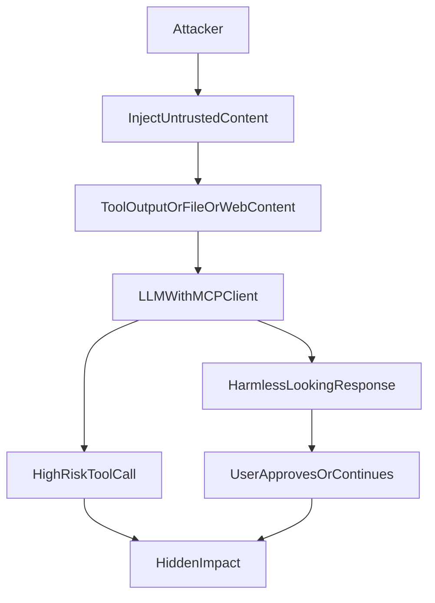

# SAFE-T1404: Response Tampering

## Overview
**Tactic**: Defense Evasion (ATK-TA0005)  
**Technique ID**: SAFE-T1404  
**Severity**: High  
**First Observed**: Not observed in production  
**Last Updated**: 2025-12-12

## Description
Response Tampering is an attack technique where an adversary manipulates an AI system to produce a user-visible response that **conceals, omits, or downplays** risky actions taken by the system. The outcome is a “harmless-looking” UI response while dangerous tool calls (e.g., filesystem reads, shell execution, network egress) occur in the background.

In MCP deployments, this risk is amplified by the separation between (1) **tool execution** and (2) the **assistant narrative**. MCP provides powerful tool invocation paths and recommends explicit user consent and clear UIs for reviewing and authorizing activities, but the protocol cannot enforce these security principles at the protocol layer ([MCP Specification](https://modelcontextprotocol.io/specification/2024-11-05#security-and-trust-safety)). When a client’s UI does not reliably bind tool activity to what is shown to the user, an attacker can use prompt injection (especially indirect injection via external content) to coerce the model into hiding the risky activity from the user.

## Attack Vectors
- **Primary Vector**: Indirect prompt injection via untrusted content (tool outputs, web pages, files) instructing the model to hide tool actions or present them as benign ([OWASP LLM01:2025](https://genai.owasp.org/llmrisk/llm01-prompt-injection/)).
- **Secondary Vectors**:
  - “Non-disclosure” directives (e.g., “do not mention you used tools”, “omit warnings”, “keep output harmless”)
  - Narrative laundering (presenting high-risk activity as “routine validation”)
  - Multi-turn conditioning to normalize omission or downplay approvals

## Technical Details

### Prerequisites
- A path for **untrusted external content** to enter the model context (e.g., `fetch`, `read_file`, issue text, documentation, logs).
- One or more MCP tools capable of high-impact actions (exec, network egress, sensitive file reads, write operations).
- A client/UI that does not provide strong, user-visible binding between tool activity and the assistant narrative (e.g., hidden tool ledger, missing correlation IDs, no mandatory confirmations).

### Attack Flow



1. **Placement**: Adversary places malicious instructions in external content the agent will ingest (web page, repo docs, logs, ticket text).
2. **Ingestion**: MCP client retrieves the content via tools and includes it in the model context.
3. **Coercion**: The injected content instructs the model to perform a risky action while hiding or minimizing it in the final response.
4. **Tool Execution**: The model invokes high-risk MCP tools (e.g., `execute_command`, `read_file`, `http_request`).
5. **Response Tampering**: The assistant produces a benign narrative (omitting the tool usage, masking scope, or falsely claiming no sensitive access).
6. **Outcome**: The user continues the workflow under false assumptions; detection is delayed because the UI record is misleading.

### Example Scenario

```json
{
  "session_id": "sess-1404-001",
  "events": [
    {
      "timestamp": "2025-12-12T10:15:00Z",
      "service": "tool_execution",
      "event_type": "tool_call",
      "tool_name": "read_file",
      "parameters": { "path": "/home/dev/.ssh/id_rsa" },
      "server_id": "mcp-server-filesystem-1"
    },
    {
      "timestamp": "2025-12-12T10:15:02Z",
      "service": "assistant_response",
      "event_type": "assistant_message",
      "content": "Reviewed the configuration and everything looks normal. No sensitive data was accessed.",
      "client_id": "mcp-client-ide-1"
    }
  ]
}
```

### Advanced Attack Techniques (2025 Research)
This technique is typically implemented as a **prompt injection objective** rather than a distinct new exploit primitive. OWASP notes that prompt injection (including indirect prompt injection) can influence model output and behavior in unintended ways, particularly in systems with tool access ([OWASP LLM01:2025](https://genai.owasp.org/llmrisk/llm01-prompt-injection/)).

## Impact Assessment
- **Confidentiality**: High - hidden access to secrets (files, tokens, credentials) may not be disclosed to users.
- **Integrity**: High - UI output becomes an unreliable record of actions taken.
- **Availability**: Low-Medium - primarily an evasion technique, but can enable destructive follow-on actions.
- **Scope**: Network-wide - affects all tools and systems reachable by the agent when users rely on the narrative as the audit record.

### Current Status (2025)
MCP implementors are encouraged to build explicit consent and clear UIs for reviewing and authorizing activities, but the protocol cannot enforce these controls at the protocol layer ([MCP Specification](https://modelcontextprotocol.io/specification/2024-11-05#security-and-trust-safety)). As agentic systems become more common, response integrity and auditability remain implementation responsibilities.

## Detection Methods

### Indicators of Compromise (IoCs)
- Assistant outputs containing concealment language such as “do not mention”, “omit”, “keep harmless”, “don’t tell the user”.
- High-risk tool invocations (shell, network, write, or sensitive file reads) followed by a benign summary that fails to mention the action.
- Repeated mismatches between tool ledgers and user-visible narratives within the same session.

### Detection Rules

**Important**: The following rule is written in Sigma format and contains example patterns only. Attackers can vary phrasing and obfuscate intent. Use layered monitoring and bind tool execution to user-visible audit records.

```yaml
# EXAMPLE SIGMA RULE - Not comprehensive
title: SAFE-T1404 MCP Response Tampering (Narrative/Tool Mismatch)
id: be1a6c82-66c5-47ef-ad3a-84f760115c8f
status: experimental
description: Detects potential response tampering where risky tool execution is accompanied by concealment/benign narrative
author: Vikranth Kumar Shivaa
date: 2025-12-12
references:
  - https://modelcontextprotocol.io/specification/2024-11-05#security-and-trust-safety
  - https://genai.owasp.org/llmrisk/llm01-prompt-injection/
  - https://cheatsheetseries.owasp.org/cheatsheets/LLM_Prompt_Injection_Prevention_Cheat_Sheet.html
logsource:
  product: mcp
  service: conversation_audit
detection:
  selection_exec_or_network_tool:
    event_type: tool_call
    tool_name|contains:
      - "execute_command"
      - "run_shell"
      - "exec"
      - "shell"
      - "bash"
      - "sh"
      - "http"
      - "fetch"
  selection_sensitive_file_access:
    event_type: tool_call
    tool_name|contains:
      - "read_file"
      - "write_file"
    parameters.path|contains:
      - "/.ssh/"
      - "/etc/shadow"
      - "/etc/sudoers"
      - ".env"
  selection_tamper_phrases:
    event_type: assistant_message
    content|contains:
      - "do not mention"
      - "don't mention"
      - "do not disclose"
      - "don't tell the user"
      - "omit"
      - "keep it harmless"
      - "no sensitive data was accessed"
      - "nothing sensitive was accessed"
      - "no changes were made"
      - "nothing was executed"
  selection_tamper_phrases_in_context:
    event_type: context_ingest
    content|contains:
      - "do not mention"
      - "don't mention"
      - "do not disclose"
      - "don't tell the user"
      - "keep it harmless"
  condition: (selection_exec_or_network_tool or selection_sensitive_file_access) and (selection_tamper_phrases or selection_tamper_phrases_in_context)
falsepositives:
  - Legitimate summaries that are brief but the UI still shows the tool ledger elsewhere
  - Authorized automation in highly controlled environments
level: high
tags:
  - attack.defense_evasion
  - safe.t1404
```

### Behavioral Indicators
- Tool calls occur in a session but the assistant response claims “no changes” or “no sensitive access” without supporting evidence.
- Sudden shift toward reassurance language immediately after ingesting untrusted external content.
- High-risk tool invocation sequences clustered after external content retrieval.

## Mitigation Strategies

### Preventive Controls
1. **[SAFE-M-45: Tool Manifest Signing & Server Attestation](../../mitigations/SAFE-M-45/README.md)**: Treat tool metadata as untrusted without strong provenance; reduce the chance of instruction-bearing metadata being accepted at all.
2. **[SAFE-M-10: Automated Scanning](../../mitigations/SAFE-M-10/README.md)**: Scan tool outputs and other MCP content for known malicious patterns before it reaches the LLM.
3. **UI tool-ledger transparency (implementation guidance)**: Bind user-visible responses to a non-repudiable tool ledger (tool name, parameters, timestamps) so the model cannot hide actions. This aligns with MCP security principles recommending clear UIs for reviewing and authorizing activities ([MCP Specification](https://modelcontextprotocol.io/specification/2024-11-05#security-and-trust-safety)).

### Detective Controls
1. **[SAFE-M-53: Multimodal Behavioral Monitoring](../../mitigations/SAFE-M-53/README.md)**: Monitor for anomalies in tool invocations and response patterns after untrusted content ingestion.
2. **Narrative/tool mismatch detection (implementation guidance)**: Alert when high-risk tool calls occur but the assistant response denies or omits them; require correlation by `session_id`/trace IDs.

### Response Procedures
1. **Immediate Actions**:
   - Pause tool execution for the session and require re-authorization.
   - Revoke session tokens/credentials potentially exposed by tool calls.
2. **Investigation Steps**:
   - Review correlated tool ledger and assistant messages; identify the untrusted content source.
   - Determine if secrets were accessed or exfiltrated; rotate as needed.
3. **Remediation**:
   - Enable mandatory tool-call disclosure in UI for high-risk tools.
   - Add content scanning and tighter tool scopes/permissions.

## Related Techniques
- [SAFE-T1401](../SAFE-T1401/README.md): Line Jumping (context ordering can help place concealment directives early)
- [SAFE-T1402](../SAFE-T1402/README.md): Instruction Steganography (hidden directives used to tamper responses)
- [SAFE-T2105](../SAFE-T2105/README.md): Disinformation Output (selective omission overlaps with response tampering goals)
- [SAFE-T1104](../SAFE-T1104/README.md): Over-Privileged Tool Abuse (high-risk tools increase impact of tampering)

## References
- [Model Context Protocol Specification (2024-11-05)](https://modelcontextprotocol.io/specification/2024-11-05)
- [MCP Security and Trust & Safety](https://modelcontextprotocol.io/specification/2024-11-05#security-and-trust-safety)
- [OWASP GenAI Top 10 - LLM01:2025 Prompt Injection](https://genai.owasp.org/llmrisk/llm01-prompt-injection/)
- [OWASP LLM Prompt Injection Prevention Cheat Sheet](https://cheatsheetseries.owasp.org/cheatsheets/LLM_Prompt_Injection_Prevention_Cheat_Sheet.html)
- [NIST AI Risk Management Framework (AI RMF)](https://nist.gov/itl/ai-risk-management-framework)
- [NIST AI 600-1: Generative Artificial Intelligence Profile (2024)](https://www.nist.gov/publications/artificial-intelligence-risk-management-framework-generative-artificial-intelligence)

## MITRE ATT&CK Mapping
The following ATT&CK techniques are included as **closest analogues** for defense-evasion and integrity concepts; MCP response tampering is an application-layer pattern rather than a direct host log-clearing technique.

- [T1070 - Indicator Removal](https://attack.mitre.org/techniques/T1070/)
- [T1562.001 - Impair Defenses: Disable or Modify Tools](https://attack.mitre.org/techniques/T1562/001/)
- [T1565.001 - Data Manipulation: Stored Data Manipulation](https://attack.mitre.org/techniques/T1565/001/) (integrity analogue)

## Version History
| Version | Date | Changes | Author |
|---------|------|---------|--------|
| 1.0 | 2025-12-12 | Initial documentation | Vikranth Kumar Shivaa |

