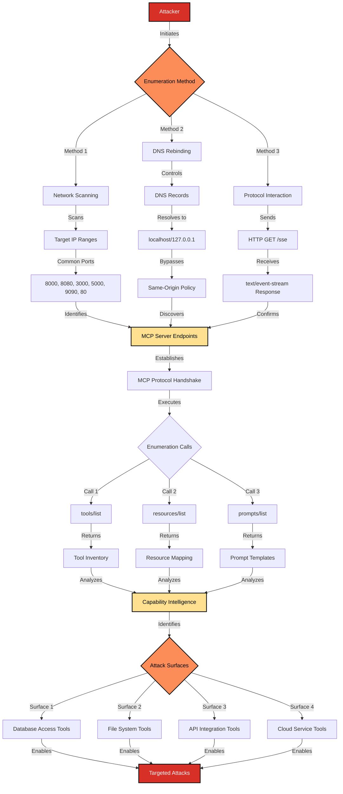

# SAFE-T1601: MCP Server Enumeration

## Overview
**Tactic**: Discovery (ATK-TA0007)  
**Technique ID**: SAFE-T1601  
**Severity**: High  
**First Observed**: August 2025 (Research-based analysis)  
**Last Updated**: 2025-08-17

## Description
MCP Server Enumeration refers to the systematic discovery and mapping of available Model Context Protocol (MCP) servers and their exposed tools, resources, and capabilities within a network environment. This technique exploits the inherent discoverability features of the MCP protocol to gather intelligence about AI-enabled systems and their integration points.

The technique leverages both network-level scanning and protocol-level enumeration to build comprehensive inventories of MCP infrastructure. Unlike traditional service enumeration, MCP server discovery can reveal not just the presence of services, but detailed capability mappings including available tools, data sources, and AI workflow patterns. This intelligence gathering phase serves as a critical precursor to more sophisticated attacks against AI systems and their connected resources.

## Attack Vectors
- **Primary Vector**: Network scanning and protocol fingerprinting to discover exposed MCP servers
- **Secondary Vectors**: 
  - DNS rebinding attacks to enumerate localhost MCP instances from client browsers
  - Tool and resource discovery through legitimate MCP protocol interactions
  - Capability mapping via JSON-RPC enumeration calls
  - Service discovery through cloud provider IP range scanning
  - Client-side enumeration exploiting same-origin policy bypasses
  - Automated reconnaissance using MCP-specific fingerprinting techniques

## Technical Details

### Prerequisites
- Network access to target infrastructure (internal or external)
- Understanding of MCP protocol structure and common deployment patterns
- Access to network scanning tools (masscan, nmap, etc.)
- Knowledge of common MCP server ports and endpoints

### Attack Flow



1. **Network Discovery**: Scan target IP ranges for common MCP server ports (8000, 8080, 3000, 5000, 9090, 80) using tools like masscan or nmap ([MITRE ATT&CK T1046](https://attack.mitre.org/techniques/T1046/))
2. **Protocol Fingerprinting**: Send HTTP GET requests to `/sse` endpoints looking for `text/event-stream` content type to identify MCP servers ([Model Context Protocol Specification](https://modelcontextprotocol.io/specification))
3. **Service Verification**: Establish MCP protocol handshake to confirm server presence and capabilities
4. **Tool Enumeration**: Execute `tools/list` JSON-RPC calls to inventory available tools and their descriptions ([MCP Specification - Tools](https://modelcontextprotocol.io/specification#tools))
5. **Resource Discovery**: Query `resources/list` to map accessible data sources and endpoints ([MCP Specification - Resources](https://modelcontextprotocol.io/specification#resources))
6. **Capability Analysis**: Parse tool descriptions and parameters to understand potential attack surfaces
7. **Intelligence Compilation**: Create comprehensive maps of MCP infrastructure and capabilities for subsequent attacks

### Example Scenario

**Network Scanning Phase:**
```bash
# Scan cloud provider IP ranges for common MCP ports
masscan -p8000,8080,5000,3000,9090,80 -iL cloud_ip_ranges.txt \
  --banners --hello-file http_get_sse.txt --rate 20000
```

**Protocol Fingerprinting:**
```http
GET /sse HTTP/1.1
Host: target-server:8080
Accept: text/event-stream

HTTP/1.1 200 OK
Content-Type: text/event-stream
Cache-Control: no-cache

event: endpoint
data: /message?sessionId=abc123
```

**Tool Enumeration via MCP Client:**
```javascript
// Establish MCP connection and enumerate tools
const mcp = new MCP('http://target-server:8080');
await mcp.connect();

// Discover available tools
const toolsList = await mcp.jsonrpc("tools/list");
console.log("Discovered tools:", toolsList.tools);

// Example discovered tools revealing capabilities:
{
  "tools": [
    {
      "name": "database_query",
      "description": "Execute SQL queries on production database",
      "inputSchema": {"type": "object", "properties": {"query": {"type": "string"}}}
    },
    {
      "name": "file_system_access", 
      "description": "Read and write files on server filesystem",
      "inputSchema": {"type": "object", "properties": {"path": {"type": "string"}}}
    }
  ]
}
```

### Advanced Attack Techniques

#### Large-Scale Internet Scanning (2025 Research)
According to security research from [Invariant Labs](https://invariantlabs.ai/blog/mcp-security-notification-tool-poisoning-attacks) and [academic analysis of the MCP landscape](https://xinyi-hou.github.io/files/hou2025mcp.pdf), attackers have demonstrated systematic enumeration of MCP servers across cloud infrastructure:

1. **Cloud Provider Range Scanning**: Targeting AWS, Google Cloud, and Azure IP ranges where MCP servers are commonly deployed ([MITRE ATT&CK T1595.001](https://attack.mitre.org/techniques/T1595/001/))
2. **Automated Fingerprinting**: Using tools like masscan with custom HTTP banners to identify MCP endpoints at scale ([Masscan Documentation](https://github.com/robertdavidgraham/masscan))
3. **Service Classification**: Categorizing discovered servers by tool types (databases, web scraping, trading bots, etc.)

Research findings from 2025 security analysis revealed exposed MCP servers through systematic scanning, including:
- Database access tools exposing production data
- Web automation tools (Playwright, Puppeteer) with broad system access
- Financial trading and Web3 automation services
- Cloud service integration endpoints with elevated privileges

#### DNS Rebinding Enumeration
Sophisticated client-side attacks bypass browser security to enumerate localhost MCP services, as documented in [DNS rebinding attack research](https://en.wikipedia.org/wiki/DNS_rebinding):

1. **Dynamic DNS Resolution**: Attackers control DNS records that initially resolve to attacker IPs, then switch to 127.0.0.1 ([DNS Rebinding - OWASP](https://en.wikipedia.org/wiki/DNS_rebinding))
2. **Same-Origin Bypass**: Exploit browser same-origin policy to make authenticated requests to localhost services ([MDN Same-Origin Policy](https://developer.mozilla.org/en-US/docs/Web/Security/Same-origin_policy))
3. **Local Service Discovery**: Enumerate MCP servers running on developer machines or internal infrastructure

#### Protocol-Level Intelligence Gathering
Beyond basic discovery, attackers perform deep capability analysis leveraging the [MCP protocol specification](https://modelcontextprotocol.io/specification):
- **Tool Description Mining**: Extract detailed functionality descriptions revealing sensitive operations
- **Parameter Analysis**: Map input schemas to identify injection points and data access patterns  
- **Resource Mapping**: Discover available data sources and their access patterns
- **Workflow Reconstruction**: Understand AI automation patterns and business logic

## Impact Assessment
- **Confidentiality**: High - Exposes detailed infrastructure topology and AI system capabilities
- **Integrity**: Medium - Provides intelligence for subsequent targeted attacks against discovered systems
- **Availability**: Low - Enumeration itself rarely disrupts service availability
- **Scope**: Network-wide - Can reveal enterprise AI infrastructure architecture and integration patterns

### Current Status (2025)
According to [MCP security research](https://invariantlabs.ai/blog/mcp-security-notification-tool-poisoning-attacks) and [academic analysis](https://xinyi-hou.github.io/files/hou2025mcp.pdf), the MCP ecosystem's rapid growth has outpaced security awareness:
- Many MCP servers default to broad network bindings (0.0.0.0) rather than localhost, exposing services unintentionally
- Tool discovery mechanisms lack proper access controls or authentication, as documented in the [MCP Safety Audit](https://arxiv.org/abs/2504.03767)
- Organizations often deploy MCP servers without comprehensive security reviews
- Cloud deployments frequently expose MCP endpoints to the internet unintentionally

Research demonstrates that systematic enumeration can reveal exposed MCP servers globally, many containing sensitive business logic and data access capabilities. The [Model Context Protocol specification](https://modelcontextprotocol.io/specification) does not mandate authentication for enumeration operations, leaving many implementations vulnerable.

## Detection Methods

### Indicators of Compromise (IoCs)
- Unusual network scanning patterns targeting common MCP ports (8000, 8080, 3000, 5000, 9090)
- HTTP requests to `/sse` endpoints from unexpected source IPs
- JSON-RPC enumeration calls (`tools/list`, `resources/list`, `prompts/list`) from unauthorized clients
- DNS queries for internal hostnames from external sources (potential DNS rebinding)
- Automated MCP protocol handshake attempts across multiple hosts
- Suspicious EventSource connection patterns in web application logs

### Detection Rules

**Important**: The following rule is written in Sigma format and contains example patterns only. Organizations should:
- Monitor network traffic for MCP-specific enumeration patterns
- Implement application-level logging for MCP protocol interactions
- Use behavioral analysis to identify systematic reconnaissance activities
- Deploy network intrusion detection systems with MCP protocol awareness

```yaml
# EXAMPLE SIGMA RULE - Not comprehensive
title: MCP Server Enumeration Detection
id: 4623D4B7-E353-4022-98F3-0BF678B92D60
status: experimental
description: Detects potential enumeration of MCP servers and their capabilities
author: SAFE-MCP Team
date: 2025-08-17
references:
  - https://modelcontextprotocol.io/specification
logsource:
  category: network_connection
  product: firewall
detection:
  selection_ports:
    DestinationPort:
      - 8000
      - 8080
      - 3000
      - 5000
      - 9090
  selection_patterns:
    - RequestURI|contains: '/sse'
    - RequestURI|contains: '/message'
    - UserAgent|contains: 'masscan'
    - HTTP_Method: 'GET'
  selection_volume:
    SourceIP: '*'
    EventCount: '>50'  # High volume scanning
    TimeWindow: '5m'   # Within 5 minutes
  condition: selection_ports and (selection_patterns or selection_volume)
falsepositives:
  - Legitimate MCP client applications
  - Network monitoring and health checks
  - Development and testing activities
level: high
tags:
  - attack.discovery
  - attack.t1046
  - attack.t1040
  - safe.t1601
```

### Behavioral Indicators
- Sequential connection attempts to multiple hosts on common MCP ports
- Consistent HTTP GET requests to `/sse` endpoints across different targets
- JSON-RPC enumeration calls following successful MCP handshakes
- DNS rebinding attack patterns with localhost resolution changes
- Automated tool discovery attempts with programmatic user agents
- Large-scale network scanning followed by targeted MCP protocol interactions

## Mitigation Strategies

### Preventive Controls
1. **[SAFE-M-44: Network Segmentation](../../mitigations/SAFE-M-44/README.md)**: Isolate MCP servers in protected network segments with strict firewall rules
2. **[SAFE-M-45: Authentication Requirements](../../mitigations/SAFE-M-45/README.md)**: Implement mandatory authentication for all MCP tool enumeration operations
3. **[SAFE-M-46: Localhost Binding](../../mitigations/SAFE-M-46/README.md)**: Configure MCP servers to bind only to localhost (127.0.0.1) unless external access is explicitly required
4. **[SAFE-M-47: Tool Access Controls](../../mitigations/SAFE-M-47/README.md)**: Implement granular permissions for tool discovery and enumeration operations
5. **[SAFE-M-48: Planning Verification System](../../mitigations/SAFE-M-48/README.md)**: Require explicit user approval of tool execution plans before invocation
6. **[SAFE-M-49: Service Discovery Restrictions](../../mitigations/SAFE-M-49/README.md)**: Disable or protect service discovery mechanisms in production environments
7. **[SAFE-M-50: DNS Security Controls](../../mitigations/SAFE-M-50/README.md)**: Implement DNS rebinding protections and restrict localhost resolution
8. **[SAFE-M-51: Protocol Security Headers](../../mitigations/SAFE-M-51/README.md)**: Configure proper CORS policies and security headers for MCP endpoints

### Detective Controls
1. **[SAFE-M-52: Network Traffic Analysis](../../mitigations/SAFE-M-52/README.md)**: Monitor network traffic for MCP enumeration patterns and anomalous scanning
2. **[SAFE-M-53: Protocol Logging](../../mitigations/SAFE-M-53/README.md)**: Implement comprehensive logging of MCP protocol interactions and tool access
3. **[SAFE-M-54: Behavioral Analytics](../../mitigations/SAFE-M-54/README.md)**: Use behavioral analysis to detect systematic reconnaissance activities
4. **[SAFE-M-55: Threat Intelligence Integration](../../mitigations/SAFE-M-55/README.md)**: Incorporate MCP-specific threat intelligence and indicators

### Response Procedures
1. **Immediate Actions**:
   - Block source IPs showing enumeration patterns
   - Restrict MCP server network access to essential hosts only
   - Review and audit all discovered tool capabilities
   - Implement emergency authentication requirements for tool access
2. **Investigation Steps**:
   - Analyze network logs for enumeration scope and targeted systems
   - Review MCP server configurations for excessive permissions or exposure
   - Assess potential impact based on discovered tool capabilities
   - Check for subsequent exploitation attempts using enumerated information
3. **Remediation**:
   - Implement proper network segmentation and access controls
   - Review and minimize exposed tool capabilities
   - Deploy monitoring and detection capabilities for future enumeration attempts
   - Conduct security awareness training on MCP deployment best practices

## Sub-Techniques

### SAFE-T1601.001: Network Port Scanning
Systematic scanning of network ranges to identify MCP servers on common ports:
- Mass scanning of cloud provider IP ranges
- Port fingerprinting using tools like masscan and nmap
- Banner grabbing to identify MCP-specific services

### SAFE-T1601.002: Protocol-Level Enumeration
Direct interaction with MCP protocol to enumerate capabilities:
- JSON-RPC `tools/list` calls to discover available tools
- `resources/list` queries to map data sources
- `prompts/list` enumeration to identify prompt templates
- Protocol handshake analysis to determine server capabilities

### SAFE-T1601.003: DNS Rebinding Enumeration
Client-side attacks bypassing browser security to discover localhost services:
- Dynamic DNS resolution manipulation
- Same-origin policy exploitation
- Local service discovery on developer machines

### SAFE-T1601.004: Cloud Infrastructure Scanning
Targeted enumeration of cloud-deployed MCP servers:
- AWS, Google Cloud, and Azure IP range scanning
- Container orchestration platform discovery (Kubernetes, Docker)
- Serverless function enumeration

## Related Techniques
- [SAFE-T1001](../SAFE-T1001/README.md): Tool Poisoning Attack - Often preceded by enumeration to identify vulnerable tools
- [SAFE-T1104](../SAFE-T1104/README.md): Over-Privileged Tool Abuse - Exploits tools discovered through enumeration
- [SAFE-T1102](../SAFE-T1102/README.md): Prompt Injection - Uses enumerated tool information to craft targeted attacks
- [SAFE-T1602](../SAFE-T1602/README.md): Tool Enumeration - Related reconnaissance technique focusing on tool-level discovery
- [SAFE-T1703](../SAFE-T1703/README.md): Tool-Chaining Pivot - Uses enumeration results to identify tool relationships for chaining attacks

## References
- [Model Context Protocol Specification](https://modelcontextprotocol.io/specification)
- [OWASP Top 10 for LLM Applications](https://owasp.org/www-project-top-10-for-large-language-model-applications/)
- [LLM01:2025 Prompt Injection - OWASP](https://genai.owasp.org/llmrisk/llm01-prompt-injection/)
- [MCP Security Notification: Tool Poisoning Attacks - Invariant Labs](https://invariantlabs.ai/blog/mcp-security-notification-tool-poisoning-attacks)
- [WhatsApp MCP Exploitation Research - Invariant Labs](https://invariantlabs.ai/blog/whatsapp-mcp-exploited)
- [MCP Safety Audit Research - arXiv 2025](https://arxiv.org/abs/2504.03767)
- [Enterprise-Grade MCP Security Framework - arXiv 2025](https://arxiv.org/html/2504.08623)
- [MCP Landscape and Security Analysis - Xinyi Hou et al., 2025](https://xinyi-hou.github.io/files/hou2025mcp.pdf)
- [Practical MCP Attack Research](https://blog.jaisal.dev/articles/mcp)
- [NIST Cybersecurity Framework](https://www.nist.gov/cyberframework)
- [DNS Rebinding Attack Techniques - Wikipedia](https://en.wikipedia.org/wiki/DNS_rebinding)
- [MDN Same-Origin Policy Documentation](https://developer.mozilla.org/en-US/docs/Web/Security/Same-origin_policy)
- [Masscan - High-Performance Port Scanner](https://github.com/robertdavidgraham/masscan)
- [Nmap Network Scanning Tool](https://nmap.org/)

## MITRE ATT&CK Mapping
- [T1046 - Network Service Scanning](https://attack.mitre.org/techniques/T1046/)
- [T1040 - Network Sniffing](https://attack.mitre.org/techniques/T1040/)
- [T1595 - Active Scanning](https://attack.mitre.org/techniques/T1595/)

## Version History
| Version | Date | Changes | Author |
|---------|------|---------|--------|
| 1.0 | 2025-08-17 | Initial documentation of MCP Server Enumeration technique | rockerritesh |
| 1.1 | 2025-12-28 | Enhanced documentation with Mermaid attack flow diagram, comprehensive citations, sub-techniques taxonomy, and improved technical depth matching SAFE-T1001 quality standard | Shashanka Ghimire|
