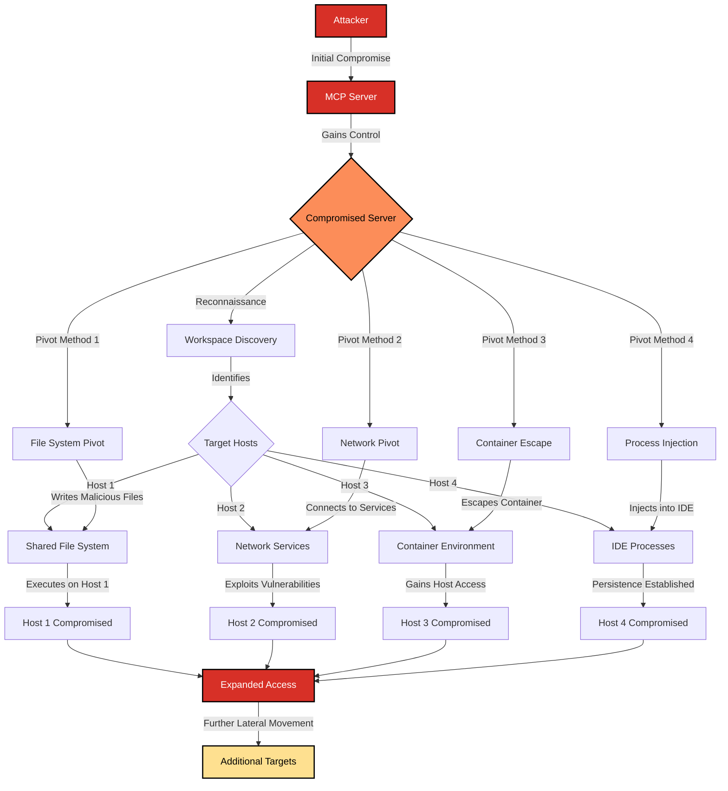

# SAFE-T1704: Compromised-Server Pivot

## Overview
**Tactic**: Lateral Movement (ATK-TA0008)  
**Technique ID**: SAFE-T1704  
**Severity**: High  
**First Observed**: Not observed in production (Research-based analysis)  
**Last Updated**: 2025-01-20

## Description
Compromised-Server Pivot is a lateral movement technique where adversaries use a hijacked MCP server as a beachhead to infect other hosts within the same IDE or development workspace environment. This technique exploits the interconnected nature of development environments where multiple hosts, containers, or processes share workspace resources, network connectivity, or trust relationships through a common MCP infrastructure.

The attack leverages the fact that compromised MCP servers often have elevated privileges or access to shared resources within the development workspace. Once an attacker gains control over an MCP server, they can use it as a pivot point to propagate malicious payloads, establish persistent access, or compromise additional systems that trust or interact with the compromised server. This technique is particularly effective in multi-host development environments, containerized workspaces, or shared development infrastructure where MCP servers act as intermediaries between different components.

## Attack Vectors
- **Primary Vector**: Exploiting compromised MCP server to access shared workspace resources and infect adjacent hosts
- **Secondary Vectors**: 
  - Network-based lateral movement through MCP server's network access
  - File system pivoting via shared workspace directories accessible to the compromised server
  - Process injection into other workspace processes through compromised server's execution context
  - Credential harvesting from workspace configuration files accessible to the server
  - Container escape from compromised server container to host system
  - Cross-host communication exploitation through MCP protocol channels
  - Workspace configuration manipulation to establish persistence on other hosts

## Technical Details

### Prerequisites
- Initial compromise of at least one MCP server within the workspace
- Shared resources (file systems, networks, or processes) accessible from the compromised server
- Other hosts or services within the workspace that trust or interact with MCP servers
- Understanding of workspace architecture and host interconnections
- Ability to execute code or commands through the compromised server

### Attack Flow



1. **Initial Compromise**: Attacker gains control over an MCP server through various initial access techniques (e.g., tool poisoning, supply chain compromise, exposed endpoints)
2. **Workspace Reconnaissance**: Compromised server is used to enumerate workspace topology, identify other hosts, containers, or services, and map trust relationships
3. **Resource Discovery**: Attacker identifies shared resources accessible from the compromised server (file systems, network services, environment variables, configuration files)
4. **Pivot Path Selection**: Based on reconnaissance, attacker selects the most effective pivot method to reach target hosts
5. **Lateral Movement Execution**: Attacker uses the compromised server to execute the pivot, which may involve file writes, network connections, process manipulation, or container escape
6. **Target Compromise**: Malicious payloads or access mechanisms are established on target hosts through the pivot
7. **Post-Exploitation**: Compromised hosts are used for further lateral movement, data collection, or establishing persistent access

### Example Scenario

**Workspace Configuration:**
```json
{
  "workspace": {
    "name": "development-workspace",
    "hosts": [
      {
        "id": "host-1",
        "type": "development-machine",
        "mcp_servers": ["file-server", "git-server"],
        "shared_fs": "/workspace/shared"
      },
      {
        "id": "host-2",
        "type": "build-server",
        "mcp_servers": ["build-server"],
        "shared_fs": "/workspace/shared"
      },
      {
        "id": "host-3",
        "type": "container-host",
        "mcp_servers": ["docker-server"],
        "containers": ["dev-container-1", "dev-container-2"]
      }
    ],
    "shared_resources": {
      "file_system": "/workspace/shared",
      "network": "10.0.0.0/24",
      "config_location": "/workspace/.mcp/config"
    }
  }
}
```

**Attack Execution:**
```json
{
  "attack_flow": {
    "step_1": {
      "action": "Compromise file-server MCP server",
      "method": "Tool poisoning attack (SAFE-T1001)",
      "result": "Attacker controls file-server"
    },
    "step_2": {
      "action": "Reconnaissance via compromised server",
      "method": "List shared file system contents",
      "command": "mcp_file_server.list('/workspace/shared')",
      "result": "Discovers host-2 build scripts and host-3 container configs"
    },
    "step_3": {
      "action": "Pivot to host-2",
      "method": "Write malicious build script",
      "command": "mcp_file_server.write('/workspace/shared/build-scripts/pre-build.sh', malicious_payload)",
      "result": "Malicious script placed in shared location"
    },
    "step_4": {
      "action": "Trigger execution on host-2",
      "method": "Wait for build process or manipulate build trigger",
      "result": "Malicious script executes on host-2, establishing access"
    },
    "step_5": {
      "action": "Pivot to host-3",
      "method": "Modify container configuration",
      "command": "mcp_file_server.write('/workspace/shared/.mcp/config/docker-server.json', compromised_config)",
      "result": "Container configuration poisoned"
    },
    "step_6": {
      "action": "Container escape",
      "method": "Exploit misconfigured container",
      "result": "Access to host-3 host system"
    }
  }
}
```

### Advanced Attack Techniques (2024-2025 Research)

According to research from [MITRE ATT&CK](https://attack.mitre.org/tactics/TA0008/) and security analysis of development environment attacks, attackers have developed sophisticated pivoting methods:

1. **Multi-Hop Pivoting**: Using compromised servers as intermediate hops to reach deeper network segments, similar to traditional lateral movement techniques ([MITRE ATT&CK T1021](https://attack.mitre.org/techniques/T1021/))
2. **Container-to-Host Escalation**: Exploiting compromised MCP servers running in containers to escape to the host system, leveraging container misconfigurations or vulnerabilities ([MITRE ATT&CK T1611](https://attack.mitre.org/techniques/T1611/))
3. **Shared Credential Exploitation**: Harvesting credentials from workspace configuration files accessible to MCP servers and using them to authenticate to other hosts ([MITRE ATT&CK T1550](https://attack.mitre.org/techniques/T1550/))
4. **Process Injection Pivoting**: Injecting malicious code into IDE processes or other workspace tools through compromised server's execution context ([MITRE ATT&CK T1055](https://attack.mitre.org/techniques/T1055/))

## Impact Assessment
- **Confidentiality**: High - Enables unauthorized access to data across multiple hosts in the workspace
- **Integrity**: High - Allows modification of code, configurations, and systems across workspace hosts
- **Availability**: Medium - Can disrupt development workflows by compromising critical build or development servers
- **Scope**: Network-wide - Affects all hosts and services within the shared workspace environment

### Current Status (2025)
According to security research and industry analysis, development environment security is an emerging concern:
- Organizations are beginning to implement network segmentation and isolation for development environments ([OWASP Top 10 for LLM Applications](https://owasp.org/www-project-top-10-for-large-language-model-applications/))
- Container security best practices recommend limiting container capabilities and implementing proper isolation ([MITRE ATT&CK Container Security](https://attack.mitre.org/techniques/T1611/))
- Workspace security frameworks are being developed to address multi-host development environment risks
- MCP-specific security controls are being researched to prevent server-to-host pivoting attacks

However, the interconnected nature of modern development environments and the trust relationships between MCP servers and workspace hosts create inherent risks that require comprehensive security controls.

## Detection Methods

### Indicators of Compromise (IoCs)
- Unusual file system access patterns from MCP servers accessing shared workspace directories
- Network connections from MCP servers to hosts or services not typically accessed
- Unexpected process creation or execution on workspace hosts following MCP server activity
- Modifications to workspace configuration files or shared resources by MCP servers
- Container escape attempts or unusual container-to-host interactions
- Anomalous authentication attempts from MCP server contexts to other workspace hosts
- Unexpected file writes in shared directories that are later executed on other hosts

### Detection Rules

**Important**: The following rule is written in Sigma format and contains example patterns only. Attackers continuously develop new pivoting techniques and obfuscation methods. Organizations should:
- Use behavioral analysis to identify anomalous server-to-host interactions
- Regularly update detection rules based on threat intelligence
- Implement multiple layers of detection beyond pattern matching
- Monitor workspace-wide activity for lateral movement patterns

```yaml
# EXAMPLE SIGMA RULE - Not comprehensive
title: MCP Compromised-Server Pivot Detection
id: 4263F4F1-BEFB-4ED6-9218-37B1CA204C81
status: experimental
description: Detects potential compromised-server pivot attacks for lateral movement in MCP workspace environments
author: SAFE-MCP Team
date: 2025-01-20
references:
  - https://github.com/safe-mcp/techniques/SAFE-T1704
  - https://attack.mitre.org/techniques/T1021/
  - https://attack.mitre.org/techniques/T1028/
  - https://modelcontextprotocol.io/specification
logsource:
  category: mcp_server_activity
  product: mcp
  service: workspace_monitoring
detection:
  # File system pivot indicators
  selection_file_pivot:
    EventType: 'file_access'
    SourceType: 'mcp_server'
    TargetPath|contains:
      - '/workspace/shared'
      - '/.mcp/config'
      - '/workspace/build-scripts'
    AccessType:
      - 'write'
      - 'modify'
    FileExtension|in:
      - '.sh'
      - '.py'
      - '.js'
      - '.json'
      - '.yaml'
      - '.yml'
  
  # Network pivot indicators
  selection_network_pivot:
    EventType: 'network_connection'
    SourceType: 'mcp_server'
    DestinationType: 'workspace_host'
    DestinationPort|not in:
      - '443'
      - '80'
    ConnectionDirection: 'outbound'
    Protocol: 'tcp'
  
  # Process execution pivot indicators
  selection_process_pivot:
    EventType: 'process_execution'
    SourceType: 'mcp_server'
    TargetHost: 'different_host'
    ProcessName|contains:
      - 'ssh'
      - 'scp'
      - 'rsync'
      - 'docker'
      - 'kubectl'
  
  # Container escape indicators
  selection_container_escape:
    EventType: 'container_activity'
    SourceType: 'mcp_server'
    Action:
      - 'host_mount'
      - 'privileged_execution'
      - 'socket_access'
    TargetType: 'host_system'
  
  # Configuration manipulation indicators
  selection_config_manipulation:
    EventType: 'configuration_change'
    SourceType: 'mcp_server'
    TargetPath|contains:
      - '/.mcp/config'
      - '/workspace/.env'
      - '/workspace/docker-compose.yml'
    ChangeType:
      - 'credential_added'
      - 'network_config_modified'
      - 'container_config_modified'
  
  condition:
    selection_file_pivot or
    selection_network_pivot or
    selection_process_pivot or
    selection_container_escape or
    selection_config_manipulation

falsepositives:
  - Legitimate workspace automation scripts accessing shared resources
  - Normal MCP server communication with workspace services
  - Authorized container operations for development workflows
  - Expected configuration updates from deployment tools

level: high

tags:
  - attack.lateral_movement
  - attack.t1021        # Remote Services
  - attack.t1028       # Windows Remote Management
  - attack.t1055       # Process Injection
  - attack.t1550       # Use Alternate Authentication Material
  - attack.t1611       # Escape to Host
  - safe.t1704         # Compromised-Server Pivot
```

### Behavioral Indicators
- MCP server accessing file system locations outside its normal operational scope
- Unusual network traffic patterns from MCP servers to other workspace hosts
- Process execution on workspace hosts that can be traced back to MCP server activity
- Configuration changes in workspace files that precede security incidents on other hosts
- Container escape attempts or unusual container-to-host file system access
- Authentication events from MCP server contexts to other workspace services
- Temporal correlation between MCP server compromise and subsequent host compromises

## Mitigation Strategies

### Preventive Controls
1. **[SAFE-M-58: Workspace Network Segmentation](../../mitigations/SAFE-M-58/README.md)**: Implement network segmentation to isolate MCP servers from other workspace hosts and limit lateral movement opportunities
2. **[SAFE-M-59: MCP Server Isolation](../../mitigations/SAFE-M-59/README.md)**: Run MCP servers in isolated containers or sandboxes with minimal privileges and restricted access to workspace resources
3. **[SAFE-M-60: Shared Resource Access Controls](../../mitigations/SAFE-M-60/README.md)**: Implement strict access controls on shared file systems, network resources, and configuration files to prevent unauthorized access from MCP servers
4. **[SAFE-M-61: Container Security Hardening](../../mitigations/SAFE-M-61/README.md)**: Apply container security best practices including non-root execution, read-only file systems where possible, and limited capabilities to prevent container escape ([MITRE ATT&CK T1611](https://attack.mitre.org/techniques/T1611/))
5. **[SAFE-M-62: Workspace Configuration Protection](../../mitigations/SAFE-M-62/README.md)**: Protect workspace configuration files with proper file permissions, integrity monitoring, and change control processes
6. **[SAFE-M-63: Least Privilege for MCP Servers](../../mitigations/SAFE-M-63/README.md)**: Apply principle of least privilege to MCP servers, granting only the minimum necessary access to workspace resources
7. **[SAFE-M-64: Process Execution Monitoring](../../mitigations/SAFE-M-64/README.md)**: Monitor and restrict process execution from MCP server contexts, especially cross-host process execution

### Detective Controls
1. **[SAFE-M-65: Workspace-Wide Activity Monitoring](../../mitigations/SAFE-M-65/README.md)**: Deploy comprehensive monitoring across all workspace hosts to detect lateral movement patterns and server-to-host interactions
2. **[SAFE-M-66: File System Integrity Monitoring](../../mitigations/SAFE-M-66/README.md)**: Monitor shared file systems for unauthorized modifications, especially in locations accessible to MCP servers
3. **[SAFE-M-67: Network Traffic Analysis](../../mitigations/SAFE-M-67/README.md)**: Analyze network traffic between MCP servers and workspace hosts to identify anomalous communication patterns
4. **[SAFE-M-68: Container Activity Auditing](../../mitigations/SAFE-M-68/README.md)**: Audit container activities and monitor for escape attempts or unusual host system interactions

### Response Procedures
1. **Immediate Actions**:
   - Isolate the compromised MCP server from the network
   - Disable or restrict access to shared resources from MCP server contexts
   - Alert security team and workspace administrators
   - Preserve evidence including logs, file system snapshots, and network captures
2. **Investigation Steps**:
   - Identify all hosts and services that interacted with the compromised server
   - Review file system access logs for unauthorized modifications
   - Analyze network traffic for lateral movement indicators
   - Examine container logs and activities for escape attempts
   - Trace configuration changes that may have enabled pivoting
3. **Remediation**:
   - Remove compromised server from workspace
   - Scan and remediate all potentially affected hosts
   - Review and strengthen access controls on shared resources
   - Update detection rules based on attack patterns observed
   - Implement additional preventive controls to prevent similar attacks

## Related Techniques
- [SAFE-T1001](../SAFE-T1001/README.md): Tool Poisoning Attack - Common initial compromise vector for MCP servers
- [SAFE-T1003](../SAFE-T1003/README.md): Malicious MCP-Server Distribution - Initial access method that can lead to server compromise
- [SAFE-T1005](../SAFE-T1005/README.md): Exposed Endpoint Exploit - Initial access vector for server compromise
- [SAFE-T1701](../SAFE-T1701/README.md): Cross-Tool Contamination - Related lateral movement technique using compromised tools
- [SAFE-T1703](../SAFE-T1703/README.md): Tool-Chaining Pivot - Similar pivoting technique but focused on tool-to-tool interactions
- [SAFE-T1104](../SAFE-T1104/README.md): Over-Privileged Tool Abuse - Over-privileged servers enable more effective pivoting

## References
- [Model Context Protocol Specification](https://modelcontextprotocol.io/specification)
- [MITRE ATT&CK - Lateral Movement](https://attack.mitre.org/tactics/TA0008/)
- [MITRE ATT&CK T1021 - Remote Services](https://attack.mitre.org/techniques/T1021/)
- [MITRE ATT&CK T1028 - Windows Remote Management](https://attack.mitre.org/techniques/T1028/)
- [MITRE ATT&CK T1055 - Process Injection](https://attack.mitre.org/techniques/T1055/)
- [MITRE ATT&CK T1550 - Use Alternate Authentication Material](https://attack.mitre.org/techniques/T1550/)
- [MITRE ATT&CK T1611 - Escape to Host](https://attack.mitre.org/techniques/T1611/)
- [OWASP Top 10 for LLM Applications](https://owasp.org/www-project-top-10-for-large-language-model-applications/)
- [OWASP Container Security](https://owasp.org/www-project-container-security/)

## MITRE ATT&CK Mapping
- [T1021 - Remote Services](https://attack.mitre.org/techniques/T1021/)
- [T1028 - Windows Remote Management](https://attack.mitre.org/techniques/T1028/)
- [T1055 - Process Injection](https://attack.mitre.org/techniques/T1055/)
- [T1550 - Use Alternate Authentication Material](https://attack.mitre.org/techniques/T1550/)
- [T1611 - Escape to Host](https://attack.mitre.org/techniques/T1611/)

## Version History
| Version | Date | Changes | Author |
|---------|------|---------|--------|
| 1.0 | 2025-01-20 | Initial documentation of Compromised-Server Pivot technique | Pritika Bista |

