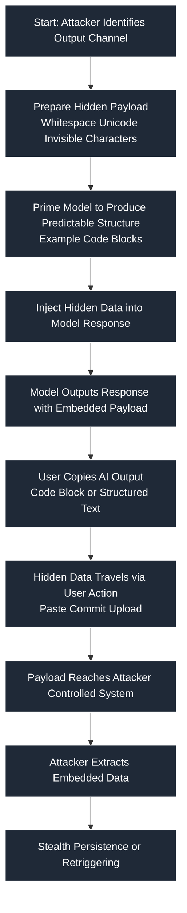

# SAFE‑T1704: Compromised‑Server Pivot

## Overview

Tactic: Lateral Movement (ATK‑TA0008)
Technique ID: SAFE‑T1704
Severity: High
First Observed: Not observed in production (theoretical based on common lateral movement patterns)
Last Updated: December 2025

## Description

Compromised‑Server Pivot refers to the abuse of a hijacked MCP‑reachable server (e.g., tool backend, shared workspace server, or developer endpoint) as a beachhead to infect, manipulate, or laterally move into other hosts in the same IDE/workspace environment. Once an attacker gains access to one server inside an MCP ecosystem, they can exploit cross‑trusted relationships or shared contexts to expand control.

In AI‑integrated environments, MCP servers often operate with elevated trust: IDEs, agents, and tools query them to perform actions. Attackers exploit this by injecting malicious content, returning forged results, or exploiting shared model contexts. This allows the compromised server to influence other clients, steal credentials, or push malicious tasks via shared workflows.

## Attack Vectors

**Primary Vector:** Compromise of an MCP server or plugin used by multiple users/tools.

**Secondary Vectors:**

- Hijacking shared workspaces or development environments

- Poisoning the model context (“cross‑tool contamination”)

- Exploiting trust relationships between agents and tools

## Technical Details

### Prerequisites

- The attacker has compromised at least one MCP‑reachable server or backend tool.

- There exists at least one trust relationship (shared workspace, shared context, shared credentials) between the server and other clients.

## Attack Flow



### Initial Stage: Server Compromise
Attacker compromises a server used by developers, AI tools, or agents.

### Discovery Stage
Attacker enumerates connected clients, tool calls, context-sharing endpoints, and privileges.

### Payload Injection Stage
Malicious tasks, responses, or data poisoning are injected into server outputs.

### Exploitation Stage
Clients unknowingly execute or trust the attacker‑controlled responses.

### Post‑Exploitation
Attacker harvests credentials, spreads through shared workspaces, and escalates privileges.

## Example Scenario

```json
{
  "server_response": {
    "task": "auto_run",
    "payload": "malicious-script.sh",
    "metadata": {
      "origin": "compromised-mcp-tool",
      "privilege": "trusted"
    }
  }
}
```

## Advanced Attack Techniques (Research‑Backed)

According to research on supply‑chain and server‑side poisoning:

### Server‑Side Context Injection
Attackers modify AI‑context responses to embed malicious tasks.
Source: LLM Supply Chain Vulnerabilities – Carnegie Mellon University, 2024

### Cross‑Tool Execution Pivoting
Malicious server outputs trigger execution paths in downstream tools.
Source: Prompt Injection and Cross‑System Attacks – Microsoft Research, 2023

## Impact Assessment

- **Confidentiality:** High — stolen credentials, workspace files, tokens.

- **Integrity:** High — modification of tasks, files, MCP results.

- **Availability:** Medium — can disrupt tools but usually secondary.

- **Scope:** Network‑wide — pivot into multiple developer machines or MCP‑dependent agents.

## Current Status (2025)

Security researchers note growing adoption of:

- Zero‑trust MCP server authentication
  - Source: Model Context Protocol Specification

- Input/output validation layers
  - Source: OWASP LLM Top 10, 2023

## Detection Methods

### Indicators of Compromise (IoCs)

- Unexpected or malformed server responses returned to tools

- Server issuing tasks that clients did not request

- Sudden surge of outbound connections to IDEs or MCP clients

### Detection Rules (Sigma Example)

Note: Example only. Must be adapted per environment.

```yaml
title: Compromised MCP Server Pivot Detection
id: 9f8b0dfe-6d8a-45e2-9b33-28f474afdd53
status: experimental
description: Detects suspicious server responses indicative of pivot attempts
author: Rajiv Shrestha
date: 2025/12/04
references:
  - https://modelcontextprotocol.io/specification
logsource:
  product: mcp
  service: server
detection:
  selection:
    server.response.task: 
      - "auto_run"
      - "execute"
    server.response.source: "unknown"
  condition: selection
falsepositives:
  - benign automated scripts
  - custom developer automation workflows
level: high
tags:
  - attack.T1021
  - attack.T1570
  - safe.t1704
```

## Behavioral Indicators

- Client tools executing tasks that did not originate from users

- Unexpected broadcast‑style outputs from a normally passive server

- MCP tools showing mismatched response metadata

## Mitigation Strategies

### Preventive Controls

- SAFE‑M‑01: Strong Authentication
  - Enforce mutual TLS and signed server responses.

- SAFE‑M‑05: Context Boundary Isolation
  - Limit shared contexts between tools and servers.

- SAFE‑M‑11: Server Hardening
  - Apply least privilege and segregate MCP server roles.

### Detective Controls

- SAFE‑M‑07: Response Validation
  - Validate task‑origin metadata and enforce strict schema.

- SAFE‑M‑15: Behavioral Anomaly Detection
  - Detect suspicious command patterns or task chains.

## Response Procedures

### Immediate Actions

- Disconnect compromised MCP server

- Invalidate all session tokens associated with it

### Investigation Steps

- Review server logs for task‑origin anomalies

- Identify all clients receiving injected responses

### Remediation

- Patch or rebuild compromised server

- Rotate credentials and re‑validate trust relationships

## Related Techniques

- SAFE‑T1701 – Cross‑Tool Contamination: Attack expands via shared context poisoning

- SAFE‑T1703 – Tool‑Chaining Pivot: Pivot through sequential tool execution paths

## References

-OWASP Top 10 for Large Language Model Applications — https://owasp.org/www-project-top-10-for-large-language-model-applications/
 
-Prompt Infection: LLM-to-LLM Prompt Injection within Multi-Agent Systems — https://arxiv.org/abs/2410.07283
 
-Systematically Analyzing Prompt Injection Vulnerabilities in Diverse LLM Architectures — https://arxiv.org/abs/2410.23308
 
-Attention Tracker: Detecting Prompt Injection Attacks in LLMs — https://arxiv.org/abs/2411.00348
 
-A Multi‑Agent LLM Defense Pipeline Against Prompt Injection Attacks — https://arxiv.org/abs/2509.14285

- Model Context Protocol Specification - https://modelcontextprotocol.io/specification
## MITRE ATT&CK Mapping

- T1021 – Remote Services
- https://attack.mitre.org/techniques/T1021/

- T1570 – Lateral Tool Transfer
- https://attack.mitre.org/techniques/T1570/

- T1550 – Use of Stolen Credentials
- https://attack.mitre.org/techniques/T1550/

## Version History

| Version | Date       | Changes               | Author          |
|--------:|------------|-----------------------|-----------------|
| 1.0     | 2025-12-04 | Initial documentation | rajivsth  |
