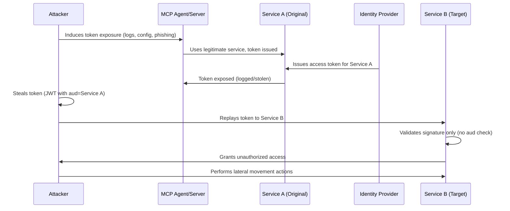

# SAFE-T1706: OAuth Token Pivot Replay

## Overview
**Tactic**: Lateral Movement (ATK-TA0008)  
**Technique ID**: SAFE-T1706  
**Severity**: High  
**First Observed**: Cross-service relay attacks against JWT/OAuth were documented in security blogs and OWASP MAS materials by at least 2019-2021; SAFE-T1706 adapts this pattern to MCP  
**Last Updated**: 2025-11-28

## Description
OAuth Token Pivot Replay is the SAFE-MCP adaptation of **cross-service relay attacks** against JWT/OAuth tokens. In these attacks, an adversary obtains a valid access token issued by a shared authorization server for one application and **replays it at a different service** that trusts the same issuer but either omits or mis-enforces checks on the token's audience (`aud`), scope, or other claims. If the second service accepts the token, the attacker gains unauthorized access in that service under the victim's identity.

The SAFE-MCP TTP table defines SAFE-T1706 as an OAuth token pivot where an attacker reuses tokens across different services by exploiting shared authorization-server trust or resource servers that fail to validate `aud` claims, enabling cross-service access (e.g., a token issued for one SaaS incorrectly being accepted by another).

From an OAuth perspective, this behavior directly violates best-practice guidance. The OAuth 2.0 Security Best Current Practice (BCP) draft recommends that **access tokens be restricted to specific resource servers (audience restriction), preferably a single resource server**, and that each resource server **verifies, for every request**, that the access token's audience matches that server, refusing requests otherwise. Similarly, Ping Identity's guidance on access tokens for multiple APIs stresses enforcing `aud` restrictions and **avoiding a single global audience or no audience at all**, to prevent unintended token reuse across services.

JWT-focused attack write-ups describe **cross-service relay** as a specific class of vulnerability: if tokens for multiple services are minted by a central auth service and either lack an `aud` claim or use a generic audience, an attacker can sign up to one service, steal or intercept that token, and replay it to another service that trusts the same issuer, resulting in privilege escalation. OWASP's Mobile Application Security Testing Guide and MASVS-AUTH best-practice materials explicitly mention cross-service relay attacks and recommend using the `aud` (audience) claim to ensure each token is tied to a specific application.

In MCP deployments, servers and tools often use OAuth 2.0 / OIDC to authenticate to external APIs and internal services. WorkOS's guidance on **MCP security** explicitly recommends using short-lived JWTs, validating the `aud` claim and other token attributes, and avoiding token leakage in logs to secure MCP servers and clients. If those recommendations are not followed, a stolen token issued for one MCP-connected tool (or external SaaS) may be **accepted by another MCP server or API**, enabling lateral movement without obtaining new credentials.

## Attack Vectors
- **Primary Vector**: Token acquisition through infrastructure token theft, OAuth token persistence abuse, or compromised OAuth flows, followed by replay to different services sharing the same authorization server
- **Secondary Vectors**:
  - No `aud` claim or overly broad audience in tokens
  - Resource servers that do not validate audience claims
  - Overly broad scopes with weak claim enforcement
  - Lack of sender-constrained or audience-restricted tokens

## Technical Details

### Prerequisites
- Access to one or more valid OAuth access or refresh tokens
- Multiple services sharing an authorization server that fail to enforce `aud` and scope correctly
- Knowledge of services that trust the same issuer

### Attack Flow



1. **Token Acquisition**: Attacker obtains valid OAuth access or refresh tokens through:
   - Infrastructure Token Theft (SAFE-T1506) - stealing tokens from logs, TLS termination proxies, or infrastructure components
   - OAuth Token Persistence Abuse (SAFE-T1202) - theft and reuse of tokens for persistent access
   - Compromised OAuth Flows (SAFE-T1007 / SAFE-T1009) - phishing for OAuth consent or authorization-server mix-up
   - Generic JWT theft via XSS, misconfigured storage, or transport interception

2. **Service Enumeration**: Attacker identifies other MCP tools and services that:
   - Use the same identity provider / authorization server domain
   - Accept access tokens in similar format (e.g., JWT signed by the same keys)
   - Are reachable via the same API gateway or network

3. **Token Replay**: Attacker crafts API request to a different MCP-connected service, attaching the stolen access token originally issued for the first service. If the target service trusts the same authorization server and does not enforce `aud` or mis-configures its allowed audiences, it may accept the token.

4. **Lateral Movement**: Once the target service accepts the token, attacker gains permissions in that service, potentially:
   - Reading or modifying data in different SaaS systems
   - Retrieving additional secrets for further pivoting
   - Affecting MCP configuration indirectly

5. **Evasion**: Attacker continues reusing the token until expiry, uses newly accessed services to mint additional tokens, or blends in with normal-looking operations.

### Example Scenario

**Scenario A – Shared IdP Across Multiple MCP Tools**

An organization uses a single enterprise IdP to issue JWT access tokens for several internal APIs, each represented as an MCP tool (e.g., projects-api, billing-api, secrets-api).

Tokens include an `aud` claim, but:
- `aud` is set to a generic value such as `https://api.internal.example.com/`, and
- Resource servers do not enforce that `aud` matches their specific service.

A token issued when the agent uses the projects-api tool is logged accidentally (SAFE-T1506). An attacker reuses that token directly against billing-api. Since billing-api only verifies the token signature but not the service-specific audience, it accepts the token and grants access to billing operations—classic cross-service relay behavior.

**Scenario B – MCP Server Accepts Any Token from a Trusted IdP**

An MCP server is configured to trust an IdP but only validates token signatures. It does not verify `aud` or restrict which OAuth client IDs may call it. An attacker steals an access token issued for some other OAuth client app that uses the same IdP. If the MCP server accepts the token purely based on signature, the attacker can call MCP-exposed tools directly, impersonating the victim and pivoting into new services without any separate login in the MCP context.

### Advanced Attack Techniques

- **Multi-Service Token Chaining**: Using tokens obtained from one service to access another, then using that access to obtain tokens for additional services
- **Scope Escalation**: Exploiting overly broad scopes to access resources beyond intended permissions
- **Refresh Token Abuse**: Using stolen refresh tokens to obtain new access tokens for multiple services

## Impact Assessment
- **Confidentiality**: High - Unauthorized access to multiple services and data exposure across organization's SaaS and internal tools
- **Integrity**: High - Ability to modify data and configuration across multiple services
- **Availability**: Medium - Potential to disrupt services through unauthorized configuration changes
- **Scope**: Network-wide - Affects all services sharing the same authorization server with weak `aud` enforcement

## Detection Methods

### Indicators of Compromise (IoCs)
- Same token ID (`jti`) used across multiple unrelated services
- Audience (`aud`) claim mismatch between token and accessed service
- Token usage from geographically distant locations within short time windows
- Unusual scope/resource combinations (token with scopes for one application accessing different application's API)
- MCP agent using one tool to obtain tokens, then rapidly invoking different, higher-impact tools

### Detection Rules

**Note**: Detection of OAuth Token Pivot Replay is challenging because it uses valid tokens. Effective detection requires centralized logging, token identifiers, and cross-service correlation.

```yaml
title: OAuth Token Cross-Service Replay Detection
id: 00000000-0000-0000-0000-000000000000
status: experimental
description: Detects potential OAuth token pivot replay when same token is used across multiple services
author: SAFE-MCP Team
date: 2025-11-28
references:
  - https://github.com/safe-mcp/techniques/SAFE-T1706
logsource:
  product: api_gateway
  service: authentication
detection:
  selection_token_reuse:
    token_id|count by token_id: > 1
    service_name|count distinct: > 1
  selection_aud_mismatch:
    jwt.aud: '*'
    service.name: '*'
    condition: jwt.aud != service.name
  condition: selection_token_reuse or selection_aud_mismatch
falsepositives:
  - Legitimate multi-audience tokens designed for gateway-wide use
  - Service meshes forwarding tokens to multiple downstream services
level: high
tags:
  - attack.lateral_movement
  - attack.t1078
  - safe.t1706
```

### Behavioral Indicators
- Same token identifier appearing in logs for multiple unrelated services
- Token usage patterns showing "impossible travel" (same token used from distant locations)
- Rapid escalation from low-privilege to high-privilege services using the same token
- Unusual API access patterns where token scopes don't match accessed resources

## Mitigation Strategies

### Preventive Controls
1. **Enforce Audience Restriction and Claim Validation**
   - Implement audience-restricted access tokens, preferably restricted to a single resource server
   - At every MCP-connected resource server, verify signature, `iss`, `aud`, `exp`, and scopes for every request
   - Reject tokens whose `aud` does not match the service or whose scopes do not authorize the requested operation

2. **Use Per-Service Tokens and Resource Indicators**
   - Configure each MCP server/tool to request its own access tokens with an audience specific to that tool's backend
   - Avoid designs where a single token obtained by one MCP tool is re-used internally to call other services
   - Follow IdP guidance (e.g., Auth0 and OAuth resource indicators) to obtain distinct access tokens per API/resource server

3. **Sender-Constrained Tokens and Token Binding**
   - Implement sender-constrained access tokens (e.g., mTLS, DPoP, token binding) so a token is bound to a particular client or TLS key
   - Prevent token replay from another client or environment

4. **Minimal Scopes, Short Lifetimes, and Rotation**
   - Restrict scopes to the minimum necessary for each MCP tool's function
   - Avoid broad scopes that span multiple application domains
   - Use short-lived access tokens and adopt refresh-token rotation where possible

5. **Secure Storage and Non-Logging of Tokens**
   - Never log raw access tokens, refresh tokens, or Authorization headers
   - Strip or redact tokens before logging
   - Follow JWT and MASVS guidance on secure token storage

6. **Centralized Observability and Revocation**
   - Implement centralized logging of token issuance and usage across all MCP servers and connected APIs
   - Enable cross-service correlation by `jti`/token IDs
   - Build playbooks to revoke all active tokens for an affected subject or client when cross-service relay is detected

### Detective Controls
1. **Token Usage Monitoring**: Track token usage patterns across services and alert on anomalies
2. **Cross-Service Correlation**: Monitor for same token IDs used across multiple services
3. **Audience Validation Logging**: Log all cases where tokens are rejected due to audience mismatch

### Response Procedures
1. **Immediate Actions**:
   - Revoke all active tokens for affected subjects or clients
   - Disable affected OAuth clients if necessary
   - Alert affected users and services
2. **Investigation Steps**:
   - Analyze token usage logs to identify all services accessed
   - Review token issuance logs to understand scope of compromise
   - Trace token distribution and identify source of theft
3. **Remediation**:
   - Implement proper audience validation at all resource servers
   - Update OAuth client configurations to use per-service tokens
   - Enhance monitoring and detection capabilities

## Related Techniques
- [SAFE-T1202](../SAFE-T1202/README.md): OAuth Token Persistence - Focuses on long-term reuse of tokens for the same service, while SAFE-T1706 uses tokens to pivot into different services
- [SAFE-T1506](../SAFE-T1506/README.md): Infrastructure Token Theft - Covers how tokens are stolen, while SAFE-T1706 describes replay at other services
- [SAFE-T1707](../SAFE-T1707/README.md): CSRF Token Relay - Focuses on cross-resource attacks within the same resource server, while SAFE-T1706 targets cross-service pivoting
- [SAFE-T1701](../SAFE-T1701/README.md): Cross-Tool Contamination - Involves moving data between MCP tools via shared context, while SAFE-T1706 uses tokens as pivot artifacts

## References
- [SAFE-MCP: Security Analysis Framework for Evaluation of Model Context Protocol](https://github.com/SAFE-MCP/safe-mcp)
- [MITRE ATT&CK – TA0008 Lateral Movement](https://attack.mitre.org/tactics/TA0008/)
- [MITRE ATT&CK – T1078 Valid Accounts](https://attack.mitre.org/techniques/T1078/)
- [MITRE ATT&CK – T1134 Access Token Manipulation](https://attack.mitre.org/techniques/T1134/)
- [OAuth 2.0 Security Best Current Practice (draft-ietf-oauth-security-topics)](https://www.ietf.org/archive/id/draft-ietf-oauth-security-topics-16.html)
- [OAuth2 Access Token Usage Strategies for Multiple Resources (APIs): Part 3 - Ping Identity](https://www.pingidentity.com/en/resources/blog/post/oauth-2-access-token-usage-strategies-multiple-resources-apis-pt-3.html)
- [Defending OAuth: Common attacks and how to prevent them - WorkOS](https://workos.com/blog/oauth-common-attacks-and-how-to-prevent-them)
- [The Complete Guide to MCP Security: Best Practices for MCP Servers and Clients - WorkOS](https://workos.com/blog/mcp-security-risks-best-practices)
- [OWASP Mobile Application Security Testing Guide – Testing Authentication and Session Management](https://mas.owasp.org/MASTG/0x04e-Testing-Authentication-and-Session-Management/)
- [Mobile App Authentication Best Practices: MASVS-AUTH - Appknox](https://www.appknox.com/blog/masvs-auth-mobile-app-authentication-security)
- [Your Guide To JWT Attacks - Omar Whadidi](https://medium.com/@omarwhadidi9/your-guide-to-jwt-attacks-ce44b55dd3f)
- [JWTs Under the Microscope: How Attackers Exploit Authentication and Authorization Weaknesses - Traceable AI](https://www.traceable.ai/blog-post/jwts-under-the-microscope-how-attackers-exploit-authentication-and-authorization-weaknesses)
- [JWT Pentest Checklist – JWT Security Testing / Penetration Testing Checklist](https://chintangurjar.com/files/jwt-pentest.pdf)
- [jwt_tool – Known Exploits and Attacks (includes Cross-service Relay Attacks)](https://github.com/ticarpi/jwt_tool/wiki/Known-Exploits-and-Attacks)
- [Understanding how the "audience" concept actually works - Auth0 Community](https://community.auth0.com/t/understanding-how-the-audience-concept-actually-works/34011)

## MITRE ATT&CK Mapping
- [T1078 - Valid Accounts](https://attack.mitre.org/techniques/T1078/) - Using stolen but valid tokens as credentials for additional services
- [T1134 - Access Token Manipulation](https://attack.mitre.org/techniques/T1134/) - Conceptually similar, involving abusing token-based identities to operate under different security contexts

## Version History
| Version | Date | Changes | Author |
|---------|------|---------|--------|
| 0.1 | 2025-11-28 | Initial draft of SAFE-T1706 – OAuth Token Pivot Replay README | Arjun Subedi (Astha.ai) |
