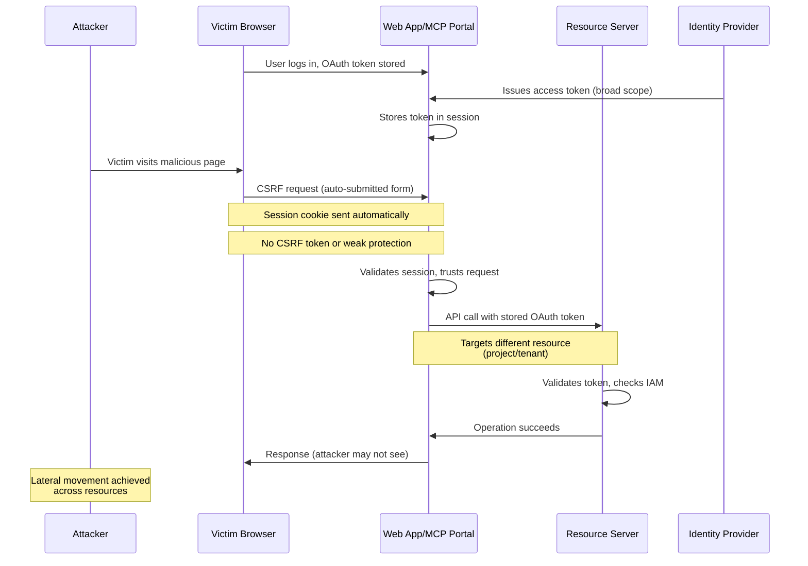

# SAFE-T1707: CSRF Token Relay

## Overview
**Tactic**: Lateral Movement (ATK-TA0008)  
**Technique ID**: SAFE-T1707  
**Severity**: High  
**First Observed**: CSRF vulnerabilities in OAuth deployments documented in security research by at least 2015; SAFE-T1707 adapts this pattern to MCP multi-resource scenarios  
**Last Updated**: 2025-11-29

## Description
CSRF Token Relay is an MCP-specific attack pattern where an attacker exploits Cross-Site Request Forgery (CSRF) vulnerabilities to cause a web application or MCP portal to use a stored OAuth access token to perform unintended, state-changing operations on different resources (projects, tenants, folders) within the same resource server.

Traditional CSRF relies on browsers automatically attaching credentials (like cookies) to cross-site requests. In many OAuth-backed applications, the backend stores an access token associated with the user's session and uses it to call APIs on the user's behalf (e.g., cloud APIs, SaaS APIs). SAFE-T1707 focuses on cases where:

- The same resource server exposes multiple logical resources (projects, tenants, spaces, etc.) behind a single API base. For example, Google Cloud Platform uses scopes such as `https://www.googleapis.com/auth/cloud-platform` to allow applications to call any enabled Google Cloud API, with the effective permissions constrained by IAM roles rather than separate scopes for each project.
- A web app or MCP-connected portal uses a single access token with broad scope to manage multiple resources, chosen via request parameters (e.g., `project=foo`, `project=bar`).
- One or more sensitive endpoints (like "switch active project", "set IAM policy", "connect MCP agent to resource X") are vulnerable to CSRF (missing anti-CSRF tokens, weak `SameSite` settings, or relying solely on cookies).

In this situation, an attacker can use CSRF to cause the app to call the resource server with the victim's stored OAuth token, but target a different resource (for example, a project or dataset the victim has access to but did not intend to modify). This is lateral movement at the application/resource level: instead of moving between different services (as in cross-service token replay attacks), the attacker pivots between resources within the same service by relaying a token through CSRF-vulnerable endpoints and APIs.

The OAuth 2.0 authorization framework explicitly calls out CSRF as a threat: the spec notes that an attacker can cause the user-agent to follow a malicious URI to a trusting server using a valid session or authorization context. CSRF risks in OAuth deployments and real-world OpenID Connect implementations have been studied in depth and shown to be common when state and related protections are not properly implemented.

## Attack Vectors
- **Primary Vector**: CSRF-vulnerable endpoints in web applications or MCP portals that use stored OAuth tokens to perform state-changing operations on multi-tenant resource servers
- **Secondary Vectors**:
  - Missing or weak CSRF protection (no per-request CSRF tokens, lax `SameSite` cookie settings)
  - Missing Origin/Referer validation on sensitive endpoints
  - Overly broad OAuth scopes that allow access to multiple resources
  - Single access token reused across multiple resources without proper isolation

## Technical Details

### Prerequisites
- Victim logged into a web application or MCP portal that stores OAuth 2.0 access tokens
- At least one sensitive endpoint is CSRF-vulnerable (no anti-CSRF token, weak `SameSite` settings, or missing Origin/Referer validation)
- OAuth token has broad enough scope to act on more than one resource (e.g., project-wide or platform-wide scope)
- Multi-tenant resource server (e.g., cloud projects, tenants) accessible via the same API base

### Attack Flow



1. **Token Presence & Configuration**: The app obtains an access token using standard OAuth flows and stores it (server-side or in a secure cookie) associated with the user's session. The app exposes features such as "Configure agent for project `<project_id>`" that send POST requests to sensitive endpoints and use the stored token to call the resource server's API.

2. **CSRF Vulnerability**: The sensitive endpoint lacks proper CSRF protection (no per-request CSRF token, no strict `SameSite` cookie policies, missing Origin/Referer validation).

3. **Attacker Prepares CSRF Payload**: Attacker hosts a malicious page with a hidden form or JavaScript that auto-submits a POST request to the victim app, targeting a different resource (project/tenant) than the user intended.

4. **Backend Relays OAuth Token**: The app receives the CSRF request, trusts it as user-initiated, and uses the stored OAuth access token to call the resource server's API for the attacker's target resource. Because the token typically has project- or organization-wide permissions (e.g., via IAM roles and broad scopes), the request succeeds if the victim's identity has the necessary privileges.

5. **Lateral Movement Across Resources**: The attacker has caused the victim's app to execute privileged operations against a different resource than the user intended, using the same token. This enables actions like enabling MCP access on another project, granting roles to attacker-controlled service accounts, or modifying configuration in a different tenant.

6. **No Direct Response Needed**: As with classic CSRF, the attacker may not need to see the response; they only need the side effect (role change, configuration, etc.).

### Example Scenario

**Scenario A – MCP Console Managing Multiple GCP Projects (Hypothetical)**

An MCP console uses a service account or user token with `https://www.googleapis.com/auth/cloud-platform` scope, which allows access to all Google Cloud APIs, with actual permissions controlled via IAM roles. The console lets users configure MCP agents per project by calling Google Cloud Resource Manager and other APIs for the selected project. The endpoint `POST /mcp/project/configure` is missing CSRF protections. An attacker crafts a CSRF page that submits a form to configure the agent for `PROJECT_B` (where the victim also has IAM privileges), potentially adding attacker-controlled roles or keys there. When the victim visits the malicious page, the console uses the same broad-scope token to call Google's APIs for `PROJECT_B`, giving the attacker a foothold in another project.

**Scenario B – OAuth Login / SSO Portal with Multi-Tenant Admin Actions**

In an MCP-like admin portal, CSRF vulnerabilities on endpoints that link external resources, promote agents to new tenants, or modify cross-tenant policies can allow an attacker to cause cross-tenant actions via the stored OAuth token.

### Advanced Attack Techniques

- **Chained CSRF Attacks**: Multiple CSRF requests in sequence to escalate privileges across multiple resources
- **Blind CSRF**: Exploiting CSRF where attacker cannot see responses but relies on side effects
- **CSRF via MCP Tool Invocation**: Using CSRF to trigger MCP tool calls that perform unintended resource operations

## Impact Assessment
- **Confidentiality**: High - Unauthorized access to resources (projects, tenants) the victim has access to but did not intend to modify
- **Integrity**: High - Ability to modify configuration, grant roles, or perform state-changing operations on unintended resources
- **Availability**: Medium - Potential to disrupt services through unauthorized configuration changes
- **Scope**: Application-wide - Affects all users of CSRF-vulnerable endpoints in web applications or MCP portals

## Detection Methods

### Indicators of Compromise (IoCs)
- State-changing requests (POST/PUT/DELETE) to sensitive endpoints lacking valid CSRF tokens
- Requests with suspicious or missing Origin/Referer headers from untrusted domains
- Same session/user triggering state-changing operations on multiple resources in a short time window
- Resource switches without corresponding UI navigation events
- MCP tool invocations targeting unexpected resources via webhook or cross-origin requests

### Detection Rules

**Note**: Detection of CSRF Token Relay requires visibility into both application-level and token-level behaviors, including CSRF validation outcomes and resource targeting patterns.

```yaml
title: CSRF Token Relay Detection (SAFE-T1707)
id: b8c9d0e1-f2a3-4b5c-9d0e-1f2a3b4c5d6e
status: experimental
description: Detects potential CSRF Token Relay attacks on sensitive endpoints that trigger OAuth-backed multi-resource operations
author: SAFE-MCP Team
date: 2025-11-29
references:
  - https://github.com/safe-mcp/techniques/SAFE-T1707
logsource:
  product: webapp
  service: mcp_portal
  category: application
detection:
  selection_state_changing:
    http.request.method:
      - POST
      - PUT
      - PATCH
      - DELETE
    http.request.path|contains:
      - "/mcp/project/"
      - "/mcp/tenant/"
      - "/configureAgent"
      - "/connectResource"
      - "/setIamPolicy"
  selection_missing_csrf:
    csrf.valid: false
  selection_suspicious_origin:
    http.request.headers.origin|startswith: "http"
    http.request.headers.origin|endswith: ".evil.example"
  condition: selection_state_changing and (selection_missing_csrf or selection_suspicious_origin)
falsepositives:
  - Legitimate bulk administrative operations via same session
  - Environments with network segmentation compensating for missing CSRF protection
  - Legitimate cross-origin integrations with proper CSRF protections
level: high
tags:
  - attack.lateral_movement
  - attack.t1550.001
  - attack.t1528
  - safe.t1707
  - csrf
  - oauth
```

### Behavioral Indicators
- Burst of state-changing requests across multiple resources from the same session within a short time window
- Requests to sensitive endpoints without corresponding front-end UI events or navigation logs
- Unusual multi-resource activity patterns that deviate from normal user behavior
- MCP tool invocations that target resources not associated with the user's normal workflow

## Mitigation Strategies

### Preventive Controls
1. **Standard CSRF Protections**
   - Implement per-request CSRF tokens (synchronizer tokens or double-submit cookies)
   - Use `SameSite` cookies (`SameSite=Lax` or `Strict`) for session cookies where feasible
   - Require re-authentication or step-up auth for highly sensitive actions
   - Check Origin and/or Referer headers for state-changing requests to ensure they come from allowed domains

2. **OAuth-Specific Hardening**
   - Use the `state` parameter as a cryptographically strong, unguessable value to bind the authorization response to the initiating session and detect CSRF
   - Avoid designs where a single broad-scope token is reused for both low-impact and high-impact resources unless absolutely necessary
   - When broad scopes like `cloud-platform` are needed, combine them with:
     - Fine-grained IAM roles per project/tenant
     - App-level checks ensuring that resource IDs passed in requests are allowed for that user, independent of token scope

3. **App- and MCP-Specific Controls**
   - For web applications that drive MCP actions:
     - Treat endpoints that cause MCP agents to be configured for a new resource (project/tenant) as CSRF-critical
     - Require explicit user confirmation or second-factor for operations that grant new roles, connect agents to new environments, or rotate keys
   - For MCP servers:
     - Log the resource ID and user context for each token-backed call
     - Consider internal "allow-list" logic so that agents can only operate on pre-approved resources, not arbitrary ones supplied in request parameters
   - For MCP hosts:
     - Prefer server-side token storage and avoid exposing access tokens directly to front-end JavaScript where possible
     - Where client-side token usage is necessary, apply CSP and other defenses to reduce the chance of script injection

### Detective Controls
1. **CSRF Pattern Monitoring**: Monitor for CSRF patterns on sensitive endpoints and feed them into incident response
2. **Multi-Resource Activity Analysis**: Track and alert on unusual patterns of multi-resource operations from single sessions
3. **Resource Access Correlation**: Correlate resource access patterns with UI events to detect CSRF-driven actions

### Response Procedures
1. **Immediate Actions**:
   - Revoke affected OAuth tokens when CSRF is suspected
   - Review downstream resource changes for unauthorized modifications
   - Temporarily disable affected endpoints if necessary
2. **Investigation Steps**:
   - Analyze application logs to identify all affected resources
   - Review CSRF protection implementation on affected endpoints
   - Trace token usage to understand scope of compromise
3. **Remediation**:
   - Implement proper CSRF protections on all sensitive endpoints
   - Update OAuth token scopes to be more restrictive where possible
   - Enhance monitoring and detection capabilities
   - Conduct security testing including CSRF tests on admin portals and MCP configuration UIs

## Related Techniques
- [SAFE-T1202](../SAFE-T1202/README.md): OAuth Token Persistence - Long-lived tokens and weak revocation make CSRF-driven token relay more dangerous by extending the time window for abuse
- [SAFE-T1304](../SAFE-T1304/README.md): Credential Relay Chain - CSRF Token Relay can be part of a broader chain where a token is stolen via one tool and then relayed through a CSRF-vulnerable endpoint

## References
- [SAFE-MCP: Security Analysis Framework for Evaluation of Model Context Protocol](https://github.com/SAFE-MCP/safe-mcp)
- [OWASP – Cross-Site Request Forgery (CSRF)](https://owasp.org/www-community/attacks/csrf)
- [OWASP Cheat Sheet – Cross-Site Request Forgery Prevention](https://cheatsheetseries.owasp.org/cheatsheets/Cross-Site_Request_Forgery_Prevention_Cheat_Sheet.html)
- [OWASP Web Security Testing Guide – Testing for Cross-Site Request Forgery](https://owasp.org/www-project-web-security-testing-guide/latest/4-Web_Application_Security_Testing/06-Session_Management_Testing/05-Testing_for_Cross_Site_Request_Forgery)
- [MDN Web Docs – Cross-site request forgery (CSRF)](https://developer.mozilla.org/en-US/docs/Web/Security/Attacks/CSRF)
- [CWE-352 – Cross-Site Request Forgery (CSRF)](https://cwe.mitre.org/data/definitions/352.html)
- [RFC 6749 – The OAuth 2.0 Authorization Framework (Security Considerations / CSRF)](https://datatracker.ietf.org/doc/html/rfc6749)
- [CSRF Vulnerabilities from Noncompliant OAuth 2.0 Implementations - Shernan et al., DIMVA 2015](https://www.cise.ufl.edu/~butler/pubs/dimva15.pdf)
- [Prevent CSRF Attacks in OAuth 2.0 Implementations - Auth0](https://auth0.com/blog/prevent-csrf-attacks-in-oauth-2-implementations/)
- [Using OAuth 2.0 to Access Google APIs - Google](https://developers.google.com/identity/protocols/oauth2)
- [Google Cloud – Cloud Storage OAuth 2.0 scopes](https://cloud.google.com/storage/docs/oauth-scopes)
- [Google Cloud – Compute Engine Service Accounts](https://cloud.google.com/compute/docs/access/service-accounts)

## MITRE ATT&CK Mapping
- [T1550.001 - Use Alternate Authentication Material: Application Access Token](https://attack.mitre.org/techniques/T1550/001/) - Uses valid application access tokens as alternate authentication material to perform actions on additional resources within the same resource server
- [CWE-352 - Cross-Site Request Forgery (CSRF)](https://cwe.mitre.org/data/definitions/352.html) - SAFE-T1707 is a concrete exploitation pattern of CSRF combined with OAuth tokens in MCP contexts. CSRF enables the attacker to trigger unintended token usage across resources.

## Version History
| Version | Date | Changes | Author |
|---------|------|---------|--------|
| 0.1 | 2025-11-29 | Initial draft of SAFE-T1707 – CSRF Token Relay README | Arjun Subedi (Astha.ai) |
