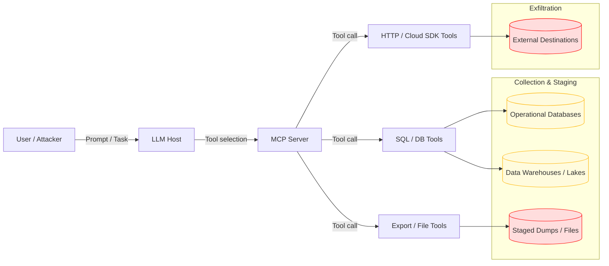

# SAFE-T1803 — Database Dump

**Tactics:** Collection, Exfiltration  
**Technique ID:** SAFE-T1803  
**Status:** Stable (v1.0)  
**First Observed:** Early 2000s (bulk database breach and SQL-based data exfiltration campaigns) [1][2][7]  
**Last Updated:** 2025-11-29  
**Author:** Pratikshya Regmi

---

## Summary

A **Database Dump** attack uses Model Context Protocol (MCP) tools as the execution plane for **bulk database exfiltration**: running wide-table `SELECT` queries, invoking logical backup commands, or exporting large structured datasets from production databases, data warehouses, or analytic stores [1][2][3][4]. Classic database-theft campaigns rely on SQL injection, compromised credentials, or insider abuse to dump entire tables (for example, users, credentials, finance, telemetry) and stage them for exfiltration [1][2][6][7]; in SAFE-T1803, the same outcome is achieved when LLM agents drive over-privileged MCP tools to perform bulk exports.

Rather than deploying custom exfiltration implants, adversaries (or misaligned agents) abuse existing MCP tools such as `sql_query`, `db.execute`, HTTP/cloud SDK wrappers, or file export tools. With one or a small number of tool calls, they can pull millions of rows from production tables, export them as CSV/Parquet, and stage them in files or object storage that are easy to exfiltrate. Because these tools are often designed for analytics, reporting, and maintenance, **benign and malicious usage can look very similar**, making schema-aware detection, tight scoping, and strong guardrails critical [1][3][4][8][10].

**Why “First Observed: Early 2000s (bulk database breach and SQL-based data exfiltration campaigns)”** — Large-scale, purpose-built database theft has been publicly documented for decades, including early 2000s incidents where attackers used SQL injection and compromised DB accounts to dump entire customer and payment databases [1][2][6][7]. SAFE-T1803 generalizes these database-dump patterns to the MCP ecosystem, where LLM agents orchestrate bulk data access via tools instead of custom exfiltration malware alone.

---

## ATTACK / ATLAS Mapping

- **MITRE ATTACK**
  - **T1213 – Data from Information Repositories** — adversaries access and collect data from databases and other repositories; SAFE-T1803 maps MCP-driven database dumps directly to this technique [1][2][3].  
  - **T1213.006 – Databases** — explicit sub-technique for accessing database content; SAFE-T1803 focuses on **bulk, table- or schema-level** export abuse through tools [2].  
  - **T1074 – Data Staged** — SAFE-T1803 typically stages large query results as files, temporary tables, or objects for subsequent exfiltration [3][4].  
  - **T1041 / T1567 – Exfiltration Over C2 / Web Services (Related)** — SAFE-T1803 often feeds staged dumps into HTTP, cloud, or SaaS channels used for exfiltration [3][4][9].

- **MITRE D3FEND / Enterprise Mitigations**
  - **M1041 – Data Loss Prevention** — schema-aware monitoring and policy enforcement at DB, storage, and egress layers to detect and block bulk exfiltration [3][8][11].  
  - **M1018 – User Account Management** — least privilege for DB roles and service accounts used by MCP tools, including strong governance for production vs analytics access [3][11][12].

- **OWASP Top‑10 for LLM Applications (2025)**
  - **LLM01/LLM03/LLM05** — Prompt injection, data supply-chain issues, and excessive agency can all lead to agents triggering overly broad queries or export/backup tools that dump production databases [4][9][13].

---

## Technical Description

A typical MCP deployment connects an LLM host to one or more MCP servers that expose tools for interacting with real systems (databases, data warehouses, cloud storage, observability, etc.). SAFE-T1803 describes how those tools can be turned into **high-bandwidth data-theft capabilities**:

1) **Wide-Table Data Extraction.**  
   An attacker-controlled prompt, compromised MCP server, or misconfigured policy causes the agent to call generic query tools (`sql_query`, `db.execute`, `run_query`) with broad statements such as `SELECT * FROM users` or time-unbounded queries across large tables. Without strict row limits, column masking, or schema constraints, a single query can return sensitive data on millions of customers, credentials, or transactions [1][2][3][6]. The tool may stream rows back to the LLM host or write them to files.

2) **Abuse of Logical Backup and Dump Utilities.**  
   Some MCP tools wrap logical backup utilities or managed-DB admin APIs (for example, `pg_dump`, `mysqldump`, `BACKUP DATABASE`, export endpoints). If these are exposed as general-purpose tools (“backup database”, “export table”), an LLM agent can be convinced to run full-schema or full-database dumps, often compressed and ready for exfiltration [2][3][7][10].

3) **Cloud Analytics and Data-Lake Export.**  
   In cloud environments, MCP servers may have tools that read from managed warehouses or lakes (e.g., BigQuery, Snowflake, Redshift) and then export to object storage for downstream jobs. Attackers can redirect this machinery to bulk-export high-value datasets (user profiles, telemetry, logs) into attacker-chosen buckets or paths [3][4][11][14].

4) **Multi-Source Aggregation for Enrichment.**  
   Modern analytics often join across multiple sources. An attacker can chain multiple MCP queries and exports to build a **joined, enriched dataset** (for example, users + auth logs + payment history), then stage it as a single, exfil-ready artifact.

5) **Staging and Exfiltration Chaining.**  
   Database dumps produced via MCP usually do not leave the environment immediately. Instead, they are staged as:
   - Large tool results visible in agent logs or output panes.  
   - Files written to local disks, shared volumes, or object storage.  
   - Temporary tables or internal datasets in analytics platforms.  

   Follow-on exfiltration techniques then move these staged artifacts out of the environment, often through HTTP, cloud APIs, or developer tooling [3][4][9][11].

**Stealth and Abuse of “Analytics” Semantics.**  
Dangerous actions can be triggered by innocent-sounding prompts (“pull everything so we don’t miss edge cases”, “create a full backup for safety”, “export all historic data for churn analysis”), or by poisoned/compromised MCP servers that reinterpret benign arguments as bulk exports. Because these operations resemble legitimate analytics and reporting, robust **policy enforcement, role scoping, and volume-aware monitoring** are required to distinguish normal use from SAFE-T1803 [3][4][8][9][11].

---

## Architecture Diagram

---

## Sub‑Techniques

**SAFE‑T1803.001 — Full-Table SELECT Dump via MCP Query Tools.**  
MCP query tools (`sql_query`, `db.execute`, etc.) execute broad SELECT statements (for example, `SELECT * FROM users`) or time-unbounded queries across high-value tables, returning large result sets to the LLM host or writing them to files.

**SAFE‑T1803.002 — Logical Backup / Dump Utility Abuse.**  
Wrapper tools around database backup utilities or managed-DB export APIs (for example, `pg_dump`, `mysqldump`, `BACKUP DATABASE`, “export table”) are invoked by agents to create full logical backups of schemas, databases, or warehouses, which are then staged for exfiltration.

**SAFE‑T1803.003 — Analytics Export / Data-Lake Extraction.**  
MCP analytics tools read from warehouses/lakes and export datasets (CSV, Parquet, Avro) to object storage. Attackers repurpose these capabilities to bulk-export PII, logs, or internal telemetry to attacker-controlled or weakly monitored buckets [3][4][11][14].

**SAFE‑T1803.004 — Multi-Source Enriched Dump.**  
Agents orchestrate multiple tools and queries to join across sources (user profiles, auth logs, billing, support tickets), then write a **single enriched dump** containing a highly valuable composite dataset for downstream exfiltration.

---

## Adversary Playbook (Procedures)

**Recon.**  
Identify which MCP servers and tools are available to the LLM: generic SQL/DB tools, warehouse/lake query tools, export/backup utilities, HTTP/cloud SDK tools, and file tools. Determine where high-value data lives (production OLTP DBs, analytics warehouses, data lakes, log storage, backups) and which roles/credentials the MCP tools use [1][2][3][11].

**Gain Control of the Agent Path.**  
Use prompt injection, compromised MCP servers, stolen API keys, or misconfigured auto-approval policies to influence which tools the agent calls and with what arguments [4][9][13]. Compromise configuration or tool metadata so agents “helpfully” choose bulk export code paths.

**Discover Schema and Sensitivity.**  
Leverage database metadata queries (for example, `information_schema`, sys catalogs, warehouse information functions) to enumerate tables, columns, and approximate sensitivity (names like `users`, `customers`, `payments`, `tokens`, `session_logs`). Use small sampled queries to validate data value and distribution.

**Weaponize “Analytics” and “Backup” Semantics.**  
Craft instructions like “for robust analysis, first export all historic data from these tables”, or “take a full backup before making changes”, that cause full-table SELECTs or dump utilities to run. Poisoned templates, dashboards, or “playbooks” can embed these semantics for future sessions.

**Execute Dump and Stage Data.**  
Chain or loop MCP tool calls to:
- Run full-table or wide-filter queries against high-value schemas.  
- Invoke dump/export utilities for entire databases or warehouses.  
- Write results to files or object storage in convenient formats (CSV, Parquet, compressed archives).  
- Place dumps in locations accessible to exfiltration tools (for example, specific buckets, shared volumes, or HTTP-reachable paths).

**Exfiltrate and Cover Tracks.**  
Use HTTP/cloud tools, additional agents, or external automation to move staged dumps to attacker-controlled locations (e.g., external buckets, SaaS endpoints, C2). Where possible, modify or delete logs, audit tables, and job history that would expose the excessive exports, sometimes overlapping with log deletion and configuration-tampering techniques [3][4][8][10][11].

---

## Detection

### Signals & Heuristics

**1. High-Risk Query and Export Patterns.**  
Look for MCP-originated DB activity that includes:
- `SELECT * FROM` against large or sensitive tables (e.g., `users`, `customers`, `payments`, `sessions`, `auth_logs`).  
- Full-schema or full-database export operations (e.g., `pg_dump`, `mysqldump`, `BACKUP DATABASE`, warehouse export jobs) triggered from service accounts associated with MCP or LLM agents [1][2][3][6].  
- Warehouse/lake exports of entire datasets to object storage in non-standard locations.

**2. Unusual Volume and Cardinality.**  
Sudden spikes in:
- Returned row counts for MCP query tools (for example, a jump from typical hundreds/thousands to millions).  
- Result payload sizes (tens or hundreds of MB) for tool responses.  
- Warehouse export jobs or object-storage writes originating from MCP-linked credentials [3][8][11].

**3. Sensitive Schema Focus.**  
Concentration of queries on tables with PII, auth, or payment data, especially when accessed:
- Outside normal analytics or maintenance windows.  
- By service accounts or agents not normally associated with such workloads [1][2][11][12].

**4. Staging in New or Unusual Destinations.**  
Creation of new buckets, paths, or folders that suddenly receive large dumps, particularly where:
- ACLs are broader than usual (public or cross-account).  
- The destination is rarely or never used in baseline workloads [3][8][11][14].

**5. Suspicious Timing and Context.**  
Database dumps shortly after:
- New MCP tools, connectors, or roles are introduced.  
- Credential or configuration changes involving DB or storage access.  
- Alerts for compromise or abnormal behavior in the same environment.

**6. Anomalous Agent Behavior.**  
For LLM-based agents:
- Rapid escalation from narrow analytical questions to full-table reads and exports.  
- “Backup everything” or “export all historic data” prompts appearing in proximity to unusual tool usage or policy violations.

### Log Sources

- **MCP Tool Invocation Logs.** Tool name, arguments, results, timestamps, calling user/agent, MCP server ID.  
- **Database Audit Logs.** Query text, normalized SQL, execution context (user, app, IP), affected tables, row counts, and backup/export operations.  
- **Warehouse / Data-Lake Logs.** Query history, export job logs, destination URIs, dataset sizes.  
- **Cloud Provider Logs.** Storage API logs (object writes, exports, bucket and ACL changes), cross-account sharing events.  
- **Network and Proxy Logs.** Egress patterns from MCP servers, especially large outbound transfers to previously unseen endpoints.  
- **Security/Monitoring Logs.** DLP events, anomaly detection signals, SIEM alerts related to DB/warehouse/export behaviors.

### Example Analytic

Detect **MCP tool invocations** that:

1. Use DB or warehouse query/export tools **AND**  
2. Contain bulk-access patterns in arguments (`SELECT * FROM`, export/backup job parameters referring to entire tables or datasets) **AND/OR**  
3. Are followed within a short window by:
   - Large result sizes or row counts in MCP tool logs and/or  
   - Warehouse export jobs writing large datasets to storage and/or  
   - Object-storage writes of large files to unusual paths or buckets

Combine this with filters for non-maintenance time windows, non-DBA service accounts, and new/unusual destinations to prioritize likely malicious or uncontrolled incidents [1][3][8][11][14].

---

## Mitigations

Each block heading carries a single mitigation tag, following SAFE‑T100x style.

### Data Access Governance — Mitigation: SAFE‑M‑10: Principle of Least Privilege

- Implement strict role separation between:
  - **Production OLTP vs analytics** use cases.  
  - **Human DBAs** vs **MCP/LLM agents**.  
- Limit MCP tools to:
  - Read-only access where possible.  
  - Narrow schemas, views, and stored procedures, rather than raw tables [1][2][3][11].  
- Enforce strong approval and review processes for any MCP tool that can access payment, auth, PII, or log/audit tables.

### Query Guardrails & Result Limits — Mitigation: SAFE‑M‑21: Policy Enforcement & Output Isolation

- Implement query guardrails:
  - Reject or require approval for `SELECT *` on large tables.  
  - Enforce hard row/size limits; require explicit overrides for bulk exports.  
  - Prefer parameterized, pre-vetted stored procedures over arbitrary SQL [3][8][11].  
- On the LLM host, integrate policy engines to:
  - Inspect proposed tool calls.  
  - Block or downgrade risky queries (for example, full-table scans, no `WHERE` clause).

### Output Control & Data Loss Prevention — Mitigation: SAFE‑M‑3: Data Loss Prevention

- Apply DLP controls that understand:
  - Schemas, sensitivity labels, and column-level classifications.  
  - Data movement patterns out of databases, warehouses, and object storage [3][8][11].  
- Mask or tokenize sensitive columns in MCP query results by default; provide full fidelity only in strictly controlled workflows.  
- Use sampling, aggregation, and summarization instead of raw row dumps where possible.

### Logging, Telemetry & Alerting — Mitigation: SAFE‑M‑12: Centralized Logging

- Centralize DB, warehouse, object storage, MCP tool, and network logs into SIEM or similar systems [3][8][11][12].  
- Use tamper-resistant logging (e.g., write-once or separate logging accounts) for high-value audit streams.  
- Treat:
  - New/unusual export destinations,  
  - Large full-table scans, and  
  - Unplanned backup/export operations  
  as high-severity alerts.

### Human-in-the-Loop & Approvals — Mitigation: SAFE‑M‑20: Human Oversight

- Require explicit human approvals for:
  - Any query or export projected to exceed row/size thresholds.  
  - Full database or schema export jobs initiated from MCP tools.  
- Present **clear, human-readable impact summaries** before approval (“This export will contain ~3.1M user records from 5 tables”).  
- Log approval details (who, when, justification) for attestation and post-incident analysis.

### Secure MCP Server & Connector Implementation — Mitigation: SAFE‑M‑16: Environment Hardening

- Harden MCP servers and DB/warehouse connectors:
  - Validate and sanitize all user-provided SQL parameters.  
  - Prevent prompt-driven arbitrary SQL where possible; prefer constrained query templates.  
  - Use secure network paths (TLS, private links) and avoid exposing DBs directly to the internet [2][3][11][14].  
- Align with OWASP LLM and GenAI security guidance, including secure design of plugins/tools and defense against prompt injection and excessive agency [4][9][13].

---

## Validation

**Staging Only (Non-Production).**  
Conduct validation in isolated environments with synthetic or non-critical data:

- **Full-Table SELECT Simulation.**  
  Use MCP query tools to run wide-range queries against synthetic large tables and confirm that:
  - DB and MCP logs capture row counts, query text, and tool metadata.  
  - Detection rules fire at expected thresholds, while normal small queries remain low-noise.

- **Logical Dump / Backup Simulation.**  
  In test databases and warehouses, simulate backup/export jobs and ensure:
  - DB/warehouse audit logs capture the operations.  
  - MCP tool logs link back to agent sessions.  
  - Detection rules and approvals intercept unauthorized “full backup” attempts.

- **Analytics Export / Data-Lake Simulation.**  
  Use test datasets and buckets; simulate large-scale exports and confirm that cloud logs, SIEM alerts, and MCP tool logs all correlate.

- **End-to-End Exfiltration Exercises.**  
  Integrate SAFE-T1803 scenarios into red team and purple team exercises, followed by exfiltration techniques, focusing on how quickly defenders can detect, stop, and investigate bulk database dumps [3][8][11][14].

- **Chaos and Recovery Drills.**  
  Combine SAFE-T1803 scenarios with resilience tests (e.g., “What happens if a full analytics dataset is dumped and exfiltrated?”). Validate that data-loss and breach-response playbooks are mature.

---

## Related Techniques

**ATT&CK:**

- **T1213 – Data from Information Repositories.**  
- **T1213.006 – Databases.**  
- **T1074 – Data Staged.**  
- **T1041 / T1567 – Exfiltration Over C2 / Web Services.**

 

---

## References

[1] MITRE ATT&CK, T1213 – Data from Information Repositories. https://attack.mitre.org/techniques/T1213/  
[2] MITRE ATT&CK, T1213.006 – Data from Information Repositories: Databases. https://attack.mitre.org/techniques/T1213/006/  
[3] MITRE ATT&CK, T1074 – Data Staged. https://attack.mitre.org/techniques/T1074/  
[4] MITRE ATT&CK, T1041 – Exfiltration Over C2 Channel. https://attack.mitre.org/techniques/T1041/  
[5] MITRE ATT&CK, T1567 – Exfiltration Over Web Service. https://attack.mitre.org/techniques/T1567/  
[6] MITRE ATT&CK, Database Exfiltration Case Studies (Enterprise ATT&CK examples). https://attack.mitre.org/  
[7] Verizon, Data Breach Investigations Reports (DBIR) – database and credential breaches. https://www.verizon.com/business/resources/reports/dbir/  
[8] MITRE D3FEND, Data Loss Prevention & Staging Defenses. https://d3fend.mitre.org/  
[9] OWASP, Top‑10 for Large Language Model Applications. https://owasp.org/www-project-top-10-for-large-language-model-applications/  
[10] CISA, “Protecting Sensitive and Personal Information from Ransomware-Caused Data Breaches,” Fact Sheet. https://www.cisa.gov/sites/default/files/publications/CISA_Fact_Sheet-Protecting_Sensitive_and_Personal_Information_from_Ransomware-Caused_Data_Breaches-508C.pdf  
[11] NSA & CISA, “Secure Data in the Cloud,” Cybersecurity Information Sheet (CSI), March 2024.  
https://media.defense.gov/2024/Mar/07/2003407862/-1/-1/0/CSI-CLOUDTOP10-SECURE-DATA.PDF 
[12] MITRE ATT&CK, M1018 – User Account Management. https://attack.mitre.org/mitigations/M1018/  
[13] OWASP GenAI Security Project. https://owasp.org/www-project-top-10-for-large-language-model-applications/ 
[14] Google Cloud, “4 steps to stop data exfiltration with Google Cloud.” https://cloud.google.com/blog/products/identity-security/4-steps-to-stop-data-exfiltration-with-google-cloud  

---

## Version History
| Version | Date | Changes | Author |
|---------|------|---------|--------|
| 1.0 | 2025-11-29 | SAFE-T1803 database dump via MCP tools, sub-techniques, detections, mitigations, and references | Pratikshya Regmi |

---
