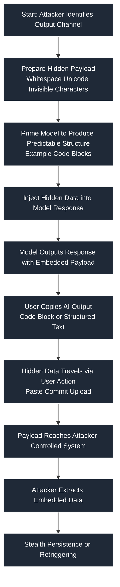

# SAFE-T1912: Stego Response Exfiltration

## Overview

Tactic: Exfiltration (ATK-TA0010)
Technique ID: SAFE-T1912
Severity: High


## Highlights

- Primary vector: hidden payloads inside AI responses (code blocks, JSON, comments).
- Impact: high confidentiality risk — secrets can be exfiltrated when users copy responses.
- Quick mitigations: sanitize outputs, enforce manifest/schema validation, monitor entropy patterns.


## Description
Stego Response Exfiltration is a technique where attackers embed covert payloads inside AI-generated or MCP-generated responses. These payloads are commonly hidden in code blocks, JSON structures, logs, or markdown elements that users frequently copy or paste into external systems. The embedded content may consist of zero-width Unicode characters, encoded payloads, or structured steganographic data that allows attackers to exfiltrate information without detection.

From a technical perspective, the attack exploits the tendency of AI-generated structured outputs to appear trustworthy. MCP systems often generate code, configuration, or schema-based responses; attackers manipulate these formats to insert high‑entropy data or invisible characters that remain undetected by basic sanitation. When users transfer these outputs into IDEs, build systems, cloud consoles, or other environments, the payload propagates and is eventually decoded or executed by downstream processes.

Stego Response Exfiltration is an attack technique where an adversary hides sensitive data inside AI-generated responses—specifically inside code blocks, formatted content, or other output structures that appear harmless to users. The victim unknowingly copies or exports this content into another system, thereby exfiltrating the attacker-embedded payload.
Stego Response Exfiltration is a technique where attackers embed covert payloads inside AI-generated or MCP-generated responses. These payloads are commonly hidden in code blocks, JSON structures, logs, or markdown elements that users frequently copy or paste into external systems. The embedded content may consist of zero-width Unicode characters, encoded payloads, or structured steganographic data that allows attackers to exfiltrate information without detection.

In the context of Model Context Protocol (MCP), this technique exploits the trust users place in AI responses. Because MCP tools and servers return structured data (JSON, code blocks, logs), attackers can embed hidden content such as base64 blobs, zero-width characters, Unicode steganography, or encoded command sequences that bypass filtering. Once copied, this hidden content is executed or decoded in downstream systems (IDE, shell, cloud console, browser extension, or another application).
From a technical perspective, the attack exploits the tendency of AI-generated structured outputs to appear trustworthy. MCP systems often generate code, configuration, or schema-based responses; attackers manipulate these formats to insert high‑entropy data or invisible characters that remain undetected by basic sanitation. When users transfer these outputs into IDEs, build systems, cloud consoles, or other environments, the payload propagates and is eventually decoded or executed by downstream processes.

## Attack Vectors

**Primary Vector:** Payload hidden inside LLM/MCP response code blocks or structured outputs.
**Primary Vector:** Payload hidden inside AI-generated code blocks, JSON, or structured output.

**Secondary Vectors:**

- Stealth encoding via zero-width characters.
- Zero-width character encoding (e.g., U+200B, U+200C).

- Embedding malicious instructions inside comments, JSON fields, or whitespace.
- Hidden payloads inside comments, markdown, or unused configuration parameters.

## Technical Details

### Prerequisites

- Attacker can influence or manipulate a model response.
- Attacker can influence or modify the AI/MCP response (direct prompt injection, indirect poisoning).

- User copies or transfers content from the MCP response into another environment.
- User transfers or copies the content into another system that processes structured text.

## Attack Flow


### Initial Stage – Prompt Influence
Attacker forces the model to output structured text with embedded hidden data.
Attacker manipulates the AI system to output predictable structures (code/JSON).

### Covert Embedding
Hidden payload encoded inside code blocks, JSON, markdown, comments, or zero-width characters.
### Payload Preparation
Covert data encoded using zero-width Unicode, base64, compressed blobs, or steganographic patterns.

### User Interaction
The unsuspecting user copies the output into an external system (IDE, API, CI/CD pipeline).
### Embedding Stage
Hidden content inserted into comments, whitespace, unused config keys, or token patterns.

### Exploitation Stage
The downstream system decodes, interprets, or executes the hidden payload.
User copies the response into another system where the payload is parsed, executed, or decoded.

### Post-Exfiltration
Payload exfiltrates sensitive data or establishes covert channels.
### Post-Exploitation
Payload exfiltrates confidential data back to an attacker-controlled channel or establishes persistence.

## Example Scenario

<<<<<<< HEAD
```json
{
  "config": {
    "theme": "light",
    "user_settings": "ZW1iZWRkZWRfZXhmaWxfZGF0YQ==" // Hidden base64-encoded exfil data
=======
@@ -62,116 +96,195 @@
"config": {
"theme": "light",
"user_settings": "ZW1iZWRkZWRfZXhmaWxfZGF0YQ==" // Hidden base64-encoded exfil data
>>>>>>> 77aeb9e (SAFE-T1912: minor README edits)
    "user_settings": "ZW1iZGRlZF9leGZpbF9kYXRh" // Hidden exfil payload (Base64-encoded)
  }
}
{
  "config": {
    "theme": "light",
    "user_settings": "ZW1iZGRlZF9leGZpbF9kYXRh" // Hidden exfil payload (Base64-encoded)
}
<<<<<<< HEAD
=======
}
>>>>>>> 77aeb9e (SAFE-T1912: minor README edits)
```

## Advanced Attack Techniques (2023–2024 Research)

According to research from LLM-Steganography (Zou et al., 2023) and StegLLM (Liu et al., 2024):
According to research from LLM-Steganography (Zou et al., 2023) and StegLLM (Liu et al., 2024), attackers have developed sophisticated variations:

- Zero-Width Character Encoding — Payload embedded inside invisible Unicode (Zou, 2023).
### Zero-Width Character Encoding
Payload encoded using invisible Unicode sequences, enabling stealthy transport (Zou et al., 2023).

- Model-Generated Steganographic Text — Entire sentences produced by LLMs encode data through token choice patterns (Liu, 2024).
### Token-Pattern Steganography
Natural-language responses where sentence structure or token selection encodes binary payloads (Liu et al., 2024).

## Impact Assessment

- **Confidentiality:** High — Hidden payload can extract secrets undetected.
Confidentiality: High – Stealthy extraction of sensitive data through invisible or encoded payloads.

- **Integrity:** Medium — Payload may alter downstream configurations.
Integrity: Medium – Payload may alter configuration files or execution flows.

- **Availability:** Low — Rare impact on system availability.
Availability: Low – Technique does not target system disruption.

- **Scope:** Network-wide — Payload may propagate across systems via copy-paste.
Scope: Network-wide – Payload spreads via copy/paste into tools, repositories, or CI/CD pipelines.

## Current Status (2025)

Security researchers warn that most LLM platforms lack:
Security researchers report that most AI systems do not sanitize zero-width Unicode or detect steganographic encoding in structured responses. Organizations have begun introducing:

- Zero-width character sanitization.
- Zero-width Unicode filtering

- Steganography detection in structured outputs.
- Entropy-based scanning of AI-generated outputs

No universal patch exists; mitigations vary by provider.
- Strict schema validation to block unexpected fields

## Detection Methods
(Sources: OWASP Top 10 for LLM Applications, MCP Security Notes)

## Detection Methods
### Indicators of Compromise (IoCs)

- Suspicious base64 or hex blobs in harmless configuration blocks.
- Presence of zero-width Unicode characters in configuration files.

- Presence of zero-width Unicode characters (\u200b, \u200c, \u2060).
- Unexpected base64, hex, or compressed blobs in simple AI-generated outputs.

- Unexpected large code blocks unrelated to query intent.
- AI responses with abnormally large or nested code blocks unrelated to query intent.

### Detection Rules

Important: This Sigma rule is example only and must be adapted.

See `detection-rule.yml` in this directory for the example detection rule used with this technique.
Important: The following Sigma rule is an example only and not comprehensive.

title: Stego Payload Embedded in MCP Responses
id: 7b29c1c4-9730-4e13-9ef0-52e48cbb2c61
status: experimental
description: Detects suspicious zero-width characters or encoded blobs in MCP responses.
author: rajivsthh
date: 2025/11/26
references:
  - https://github.com/safe-mcp/techniques/SAFE-T1912
logsource:
  product: mcp
  service: response
detection:
  selection:
    response.text|re:
      - '\u200b'
      - '\u200c'
      - '^[A-Za-z0-9+/]{20,}={0,2}$'
  condition: selection
falsepositives:
  - Legitimate encoded configuration values
  - Tools that embed base64 for expected features
level: high
tags:
  - attack.exfiltration
  - attack.t1020
  - safe.t1912

### Behavioral Indicators

- Users copying unusually large code blocks from model responses.
- Users copy unusually large portions of AI output into external systems.

- Frequent appearance of encoded or compressed payloads in simple tasks.
- Presence of encoded or invisible content in repository commits.

## Mitigation Strategies
- CI pipelines failing due to unexpected encoded fields.

## Mitigation Strategies
### Preventive Controls

- SAFE-M-003: Output Sanitization — Strip zero-width characters and detect suspicious encoding patterns.
- SAFE-M-003: Output Sanitization
  - Strip zero-width Unicode, validate character classes, and reject suspicious embedded content.

- SAFE-M-014: Model Response Validation — Enforce schema validation to detect hidden or unexpected fields.
- SAFE-M-014: Model Response Validation
  - Enforce strict schemas; reject unknown fields or high-entropy values.

- SAFE-M-021: Content Security Filtering — Reject high-entropy payloads inside text responses.
- SAFE-M-021: Content Security Filtering
  - Detect and block compressed blobs, base64 strings, or hidden comments in non-binary contexts.

### Detective Controls

- SAFE-M-009: Steganography Detection Layer — Scan for entropy anomalies in responses.
- SAFE-M-009: Steganography Detection Layer
  - Scan for entropy anomalies, invisible Unicode, or structural steganography.

- SAFE-M-011: Logging & Telemetry Controls — Record responses and highlight suspicious patterns.
- SAFE-M-011: Logging & Telemetry Controls
  - Monitor MCP responses for patterns consistent with hidden payloads.

## Response Procedures

### Immediate Actions

- Halt user operations involving contaminated outputs.
- Halt execution of workflows using potentially contaminated AI responses.

- Sanitize all recent AI/MCP outputs.

- Sanitize recent MCP responses.
- Block user operations involving suspicious data.

### Investigation Steps

- Examine logs for hidden Unicode or encoded payloads.
- Inspect logs for encoded or invisible Unicode.

- Analyze recently copied files and repository commits.

- Check copied files in developer environments.
- Review CI/CD pipeline artifacts for hidden data propagation.

### Remediation

- Patch filters or sanitizers.
- Patch sanitization and validation modules.

- Deploy stronger output validation.
- Add regression tests for zero-width Unicode and high‑entropy blocks.

- Deploy stricter schema enforcement for all AI-generated content.

## Related Techniques
<<<<<<< HEAD

- SAFE-T1006: User Social Engineering Install — Similar reliance on user trust and manual 

=======
- SAFE-T1006: User Social Engineering Install — Similar reliance on user trust and manual 
>>>>>>> 77aeb9e (SAFE-T1912: minor README edits)
- SAFE-T1704: Compromised-Server Pivot — May chain with exfiltrated data for lateral movement.

## References

- [Model Context Protocol Specification](https://modelcontextprotocol.io/specification)
- [OWASP Top 10 for LLM Applications](https://owasp.org/www-project-top-10-for-large-language-model-applications/)


## MITRE ATT&CK Mapping

- T1020 – Automated Exfiltration
- https://attack.mitre.org/techniques/T1020/
rajivsthh marked this conversation as resolved.

## Version History

| Version | Date       | Changes                     | Author        |
|--------:|------------|-----------------------------|---------------|
<<<<<<< HEAD
| 1.0     | 2025-11-26 | Initial documentation       | rajivsthh |
