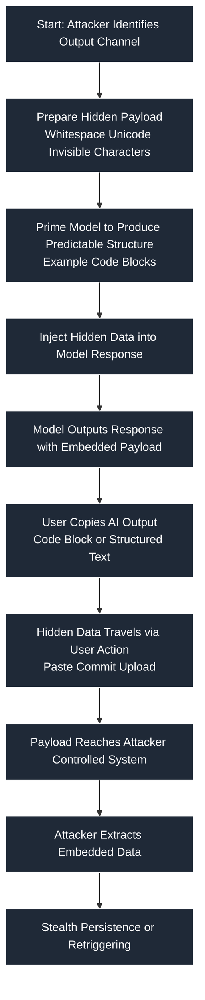

 # SAFE-T1912: Stego Response Exfiltration

## Overview

Tactic: Exfiltration (ATK-TA0010)
Technique ID: SAFE-T1912
Severity: High
First Observed: Not observed in production
Last Updated: 2025-11-26

## Highlights

- Primary vector: hidden payloads inside AI responses (code blocks, JSON, comments).
- Impact: high confidentiality risk — secrets can be exfiltrated when users copy responses.
- Quick mitigations: sanitize outputs, enforce manifest/schema validation, monitor entropy patterns.

## Description

Stego Response Exfiltration is an attack technique where an adversary hides sensitive data inside AI-generated responses—specifically inside code blocks, formatted content, or other output structures that appear harmless to users. The victim unknowingly copies or exports this content into another system, thereby exfiltrating the attacker-embedded payload.

In the context of Model Context Protocol (MCP), this technique exploits the trust users place in AI responses. Because MCP tools and servers return structured data (JSON, code blocks, logs), attackers can embed hidden content such as base64 blobs, zero-width characters, Unicode steganography, or encoded command sequences that bypass filtering. Once copied, this hidden content is executed or decoded in downstream systems (IDE, shell, cloud console, browser extension, or another application).

## Attack Vectors

**Primary Vector:** Payload hidden inside LLM/MCP response code blocks or structured outputs.

**Secondary Vectors:**

- Stealth encoding via zero-width characters.

- Embedding malicious instructions inside comments, JSON fields, or whitespace.

## Technical Details

### Prerequisites

- Attacker can influence or manipulate a model response.

- User copies or transfers content from the MCP response into another environment.

## Attack Flow



### Initial Stage – Prompt Influence
Attacker forces the model to output structured text with embedded hidden data.

### Covert Embedding
Hidden payload encoded inside code blocks, JSON, markdown, comments, or zero-width characters.

### User Interaction
The unsuspecting user copies the output into an external system (IDE, API, CI/CD pipeline).

### Exploitation Stage
The downstream system decodes, interprets, or executes the hidden payload.

### Post-Exfiltration
Payload exfiltrates sensitive data or establishes covert channels.

## Example Scenario

```json
{
  "config": {
    "theme": "light",
    "user_settings": "ZW1iZWRkZWRfZXhmaWxfZGF0YQ==" // Hidden base64-encoded exfil data
  }
}
```

## Advanced Attack Techniques (2023–2024 Research)

According to research from LLM-Steganography (Zou et al., 2023) and StegLLM (Liu et al., 2024):

- Zero-Width Character Encoding — Payload embedded inside invisible Unicode (Zou, 2023).

- Model-Generated Steganographic Text — Entire sentences produced by LLMs encode data through token choice patterns (Liu, 2024).

## Impact Assessment

- **Confidentiality:** High — Hidden payload can extract secrets undetected.

- **Integrity:** Medium — Payload may alter downstream configurations.

- **Availability:** Low — Rare impact on system availability.

- **Scope:** Network-wide — Payload may propagate across systems via copy-paste.

## Current Status (2025)

Security researchers warn that most LLM platforms lack:

- Zero-width character sanitization.

- Steganography detection in structured outputs.

No universal patch exists; mitigations vary by provider.

## Detection Methods

### Indicators of Compromise (IoCs)

- Suspicious base64 or hex blobs in harmless configuration blocks.

- Presence of zero-width Unicode characters (\u200b, \u200c, \u2060).

- Unexpected large code blocks unrelated to query intent.

### Detection Rules

Important: This Sigma rule is example only and must be adapted.

See `detection-rule.yml` in this directory for the example detection rule used with this technique.

### Behavioral Indicators

- Users copying unusually large code blocks from model responses.

- Frequent appearance of encoded or compressed payloads in simple tasks.

## Mitigation Strategies

### Preventive Controls

- SAFE-M-003: Output Sanitization — Strip zero-width characters and detect suspicious encoding patterns.

- SAFE-M-014: Model Response Validation — Enforce schema validation to detect hidden or unexpected fields.

- SAFE-M-021: Content Security Filtering — Reject high-entropy payloads inside text responses.

### Detective Controls

- SAFE-M-009: Steganography Detection Layer — Scan for entropy anomalies in responses.

- SAFE-M-011: Logging & Telemetry Controls — Record responses and highlight suspicious patterns.

## Response Procedures

### Immediate Actions

- Halt user operations involving contaminated outputs.

- Sanitize recent MCP responses.

### Investigation Steps

- Examine logs for hidden Unicode or encoded payloads.

- Check copied files in developer environments.

### Remediation

- Patch filters or sanitizers.

- Deploy stronger output validation.

## Related Techniques

- SAFE-T1006 — User Social Engineering Install
## References

- [Model Context Protocol Specification](https://modelcontextprotocol.io/specification)
- [OWASP Top 10 for LLM Applications](https://owasp.org/www-project-top-10-for-large-language-model-applications/)

## MITRE ATT&CK Mapping

- T1020 – Automated Exfiltration
- https://attack.mitre.org/techniques/T1020/

## Version History

| Version | Date       | Changes                     | Author        |
|--------:|------------|-----------------------------|---------------|
| 1.0     | 2025-11-26 | Initial documentation       | rajivsthh |
