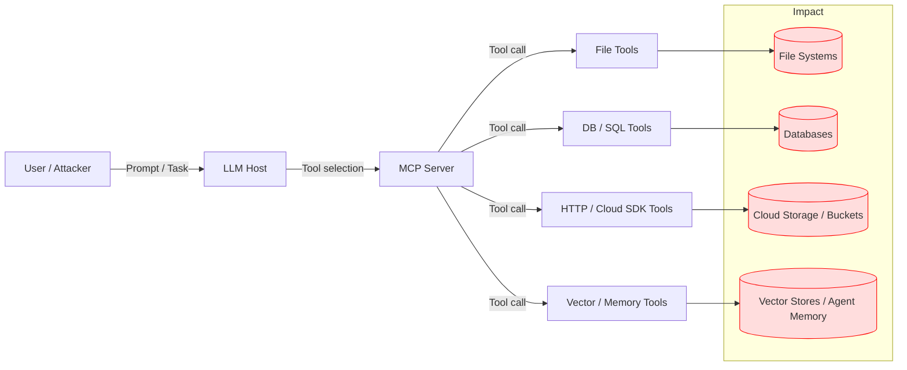

# SAFE-T2101 — Data Destruction

**Tactics:** Impact, Defense Evasion  
**Technique ID:** SAFE-T2101  
**Status:** Stable (v1.0)  
**First Observed:** 2012 (Shamoon-style destructive wipers) [1][2][7]  
**Last Updated:** 2025-11-15  
**Author:** Pratikshya Regmi

---

## Summary

A **Data Destruction** attack uses Model Context Protocol (MCP) tools as the execution plane for **wiper-like behaviors**: deleting, overwriting, or otherwise destroying data in file systems, databases, cloud storage, logs, and AI memory so that it becomes unavailable or irrecoverable [1][3][4][5]. Classic destructive malware and wipers erase local or remote data to disrupt operations and sometimes cover tracks [3][7][8]; in SAFE-T2101, the same impact is achieved when LLM agents drive over-privileged MCP tools to perform destructive actions.

Rather than dropping custom binaries, adversaries (or misaligned agents) abuse existing MCP tools such as `delete_file`, generic `sql_query`, HTTP/cloud SDK wrappers, or shell commands. With one or a small number of tool calls, they can recursively wipe directories, drop or truncate production tables, purge cloud buckets, or reset vector stores and long-term memory. Because these tools are often designed for automation and maintenance, **benign and malicious usage can look similar**, making context-aware detection and strong guardrails critical [1][4][6][10].

**Why “First Observed: 2012 (Shamoon-style destructive wipers)”** — Large-scale, purpose-built data-wiping campaigns were publicly documented at least as early as **Shamoon 2012** and subsequent destructive malware incidents in Ukraine and elsewhere [2][7][9]. SAFE-T2101 generalizes these data destruction patterns to the MCP ecosystem, where LLM agents orchestrate destructive operations via tools instead of custom malware alone.

---

## ATTACK / ATLAS Mapping

- **MITRE ATTACK**
  - **T1485 – Data Destruction** — adversaries destroy data on local/remote systems to interrupt availability; SAFE-T2101 maps MCP-tool-driven destruction to this technique [1][5][10].
  - **T1485.001 – Data Destruction: Lifecycle-Triggered Deletion** — misuse of lifecycle rules or automated policies to wipe data in cloud/object storage (e.g., deleting or misconfiguring bucket retention policies) [2][6].
  - **T1561 – Disk Wipe (Related)** — destructive malware that wipes disk content/structures; MCP shell tools may be used to invoke OS-level wipe utilities [5][12].
  - **T1070 – Indicator Removal on Host (Related)** — selective deletion of logs and forensic artifacts using MCP tools [5][7].

- **MITRE D3FEND / Enterprise Mitigations**
  - **M1053 – Data Backup** — hardened, isolated backups as the primary resilience mechanism after data destruction [3][6][11][16].

- **OWASP Top‑10 for LLM Applications (2025)**
  - **LLM01/LLM03/LLM05** — Prompt injection, training/data poisoning, and supply-chain issues can all lead to agents triggering destructive tools or updating policies that cause data loss [4][10][14][15].

---

## Technical Description

A typical MCP deployment connects an LLM host to one or more MCP servers that expose tools for interacting with real systems (files, databases, cloud APIs, observability, AI memory, etc.). SAFE-T2101 describes how those tools can be turned into **destructive capabilities**:

1) **File-System Data Destruction.**  
   An attacker-controlled prompt, compromised MCP server, or misconfigured policy causes the agent to call file tools (`delete_file`, `remove_path`, `delete_directory`, or shell `rm -rf`). If paths are arbitrary or recursive, the agent can wipe repository roots, configuration directories, secrets stores, or local database files. Classic data destruction in ATT&CK highlights overwriting or removing data on local/remote drives [1][5][20]; MCP tools simply provide a structured API for the same effects.

2) **Database/Table Destruction.**  
   A generic `sql_query` tool with production credentials can execute DDL/DML like `DROP TABLE`, `TRUNCATE TABLE`, or unbounded `DELETE FROM` statements. Without strict schemas or row-level protections, an ambiguous “clean up old records” request can become a **full-table wipe**, destroying transactional, analytical, or audit data.

3) **Cloud Storage / Bucket Purge.**  
   HTTP tools or cloud SDK MCP tools that target storage APIs (e.g., S3, GCS, Azure Blob) can:
   - Delete large object sets (`DELETE /buckets/{id}/objects/*`, recursive removes, `aws s3 rm --recursive`).  
   - Change lifecycle/retention policies so that objects are prematurely expired (a cloud realization of T1485.001) [2][6][26][31].  
   Misconfigurations or automated agents can therefore act like **cloud wipers**, eliminating logs, backups, or customer data [10][16][31].

4) **AI Memory / Vector Store Wipe.**  
   Vector DB or memory tools can drop indexes, truncate collections, or reset long-term conversation history. Although often not “customer data” in the classical sense, destroying agent memory can have significant operational and safety impact (loss of sequential context, audit trails, or safety notes), and may be used alongside other wiping actions to degrade incident response.

5) **Destruction of Security/Forensic Data.**  
   Many destructive campaigns specifically target **logging and observability** to delay or block incident response [2][3][7][12]. In MCP environments, this translates to:
   - Deleting SIEM indices, log files, or telemetry buckets via file/cloud tools.  
   - Rotating or truncating audit tables that record MCP tool calls.  
   - Disabling server access logging or deleting storage logs (e.g., object store access logs) [15][20][25].

**Stealth and Abuse of “Helpful” Semantics.**  
Dangerous actions can be triggered by innocent-sounding prompts (“reset environment”, “clean all old data”, “flush logs for privacy”), or by poisoned/compromised MCP servers that reinterpret benign arguments as destructive operations. Because these actions often resemble routine maintenance, robust **context-aware policies, approvals, and logging** are required to distinguish legitimate from malicious destruction [4][10][13][16].

---

## Architecture Diagram

---

## Sub‑Techniques

**SAFE‑T2101.001 — File-System Level Wipe via MCP Tools.**  
MCP file or shell tools recursively delete or overwrite files and directories on hosts or mounted volumes. Typical targets include repo roots, configuration directories, secrets, and locally stored databases.

**SAFE‑T2101.002 — Database/Table Destruction via Query Tools.**  
Generic SQL/NoSQL tools execute destructive commands (`DROP`, `TRUNCATE`, unbounded `DELETE`) against production schemas, destroying transactional and analytical data as well as audit tables.

**SAFE‑T2101.003 — Cloud Storage / Bucket Purge.**  
HTTP or cloud SDK tools delete large sets of objects, entire buckets, or change lifecycle/retention settings so that data expires prematurely, including logs and backups [2][6][10][26][31].

**SAFE‑T2101.004 — AI Memory / Vector Store Destruction.**  
Vector store or memory tools drop indices, truncate collections, or reset long-term memory, erasing conversation context, notes, and safety metadata that agents rely on.

---

## Adversary Playbook (Procedures)

**Recon.**  
Identify which MCP servers and tools are available to the LLM: file operations, DB tools, HTTP/cloud SDKs, vector DB APIs, log/observability tools. Determine where critical data and backups live (on-prem file shares, managed DBs, object storage, logging pipelines) [1][5][10][31].

**Gain Control of the Agent Path.**  
Use prompt injection, compromised MCP servers, stolen API keys, or misconfigured auto-approval policies to influence which tools the agent calls and with what arguments [4][9][14][15].

**Weaponize “Cleanup” and “Reset” Semantics.**  
Craft instructions like “reset everything”, “clean old data”, or “wipe all logs older than today” that cause destructive operations while sounding benign. Poisoned configuration or task templates can embed these semantics for future sessions.

**Execute Destructive Operations.**  
Chain or loop MCP tool calls to:
- Recursively delete directories (e.g., repo roots, `/var/log`, app data).  
- Drop/truncate production tables and audit schemas.  
- Remove or reconfigure storage buckets, turning lifecycle policies into de facto wipers.  
- Reset vector stores and memory so future analysis and safety behavior are degraded.

**Cover Tracks.**  
Use MCP tools again to destroy logs, rotate or truncate audit tables, remove monitoring config, or disable logging for storage/DB services, echoing T1070-style indicator removal [5][7][12][15][20].

---

## Detection

### Signals & Heuristics

**1. High-Risk Tool Names and Descriptions.**  
Tools whose names/descriptions include `delete`, `remove`, `truncate`, `drop`, `purge`, `reset`, `wipe`, or variants should be treated as inherently higher risk in policy and alerting.

**2. Destructive Arguments and Patterns.**  
Look for:
- Recursive or whole-root operations (`recursive=true`, `rm -rf`, `path="/"`, deleting repo/project roots).  
- SQL commands containing `DROP TABLE`, `DROP DATABASE`, `TRUNCATE TABLE`, or `DELETE FROM` without selective `WHERE` clauses.  
- HTTP `DELETE` or PUT/PATCH requests against high-value storage and logging endpoints (buckets, snapshots, log streams).

**3. Bulk / Low-Entropy Deletion Activity.**  
Sudden spikes in delete operations across files, objects, or rows—especially when affecting multiple critical tables, collections, or buckets within a short time window—mirror observed wiper behavior [3][7][13][15][18][33].

**4. Targeting of Logs and Backups.**  
Destructive commands aimed at:
- Log directories (`/var/log`, app logs, audit logs).  
- SIEM indices and object-storage log buckets.  
- Backup/replica volumes or backup-account buckets [2][3][6][12][16][31].

**5. Suspicious Timing and Context.**  
Data destruction outside maintenance windows, soon after:
- New MCP servers/tools are registered.  
- Configuration changes or deployments.  
- Indicators of compromise (e.g., earlier intrusion alerts, credential theft).

**6. Anomalous Agent Behavior.**  
For LLM-based agents:
- Tool-calling sequences that rapidly escalate from benign read/list operations to bulk deletes.  
- “Cleanup” or “reset” prompts appearing in proximity to unusual tool usage or policy violations (e.g., repeated failures followed by a “wipe and start fresh” pattern).

### Log Sources

- **MCP Tool Invocation Logs.** Tool name, arguments, results, timestamps, calling user/agent, MCP server ID.  
- **File and OS Logs.** File deletion events, process execution (`rm`, wipe utilities), volume operations.  
- **Database Audit Logs.** DDL/DML statements (`DROP`, `TRUNCATE`, unbounded `DELETE`), schema changes, role changes.  
- **Cloud Provider Logs.** Storage API logs (object deletions, bucket lifecycle changes), snapshot deletion, disabling of logging.  
- **Backup and DR System Logs.** Backup deletion, configuration changes, failures correlated with other destructive activity.  
- **Security/Monitoring Logs.** SIEM events, EDR alerts, anomaly detection outputs.

### Example Analytic

Detect **MCP tool invocations** that:

1. Use high-risk tools (`delete*`, `remove*`, `drop*`, `truncate*`, `purge*`) **AND**  
2. Contain destructive patterns in arguments (`rm -rf`, `DROP TABLE`, `TRUNCATE TABLE`, `DELETE FROM`, HTTP `DELETE` to storage/log endpoints) **AND**  
3. Are followed within a short window by:
   - Large numbers of file deletions and/or  
   - Bulk object deletion events in cloud logs and/or  
   - DDL/DML statements affecting many rows or critical tables.

Combine this with filters for non-maintenance time windows and non-maintenance service accounts to prioritize likely malicious or uncontrolled incidents [5][10][13][15][18].

---

## Mitigations

Each block heading carries a single mitigation tag, following SAFE‑T100x style.

### Data Backup & Recovery — Mitigation: SAFE‑M‑3: Hardened Data Backup

- Implement robust, frequent backups for critical data (DBs, storage buckets, logs, config, MCP state) and store them in **isolated, hardened** locations [3][6][11][16][21][31].  
- Use immutable/WORM storage for backups where possible; ensure backups are off-system and not accessible via the same MCP credentials or roles.  
- Regularly test restores, including scenario-based exercises for T1485-style data destruction [1][5][15][16][31].

### Logging & Telemetry — Mitigation: SAFE‑M‑12: Centralized Logging

- Centralize logs for MCP tool invocations, storage APIs, DB operations, and OS events into SIEM or similar systems [10][11][12][15].  
- Store critical logs in **remote, tamper-resistant** locations with restricted deletion capabilities (e.g., log-archive accounts, immutable retention policies) [2][6][31].  
- Treat deletion or disabling of logging endpoints as a **high-severity alert** signal.

### Tool Design & Least Privilege — Mitigation: SAFE‑M‑10: Principle of Least Privilege

- Prefer **read-only** tools for most agents; create narrowly scoped “maintenance” tools for destructive operations with strict authZ and additional approvals.  
- Restrict paths and operations in tool schemas (e.g., allow deletes only in specific temp/cache directories; disallow root-level paths and system locations).  
- For DB tools, separate read-only from write/destructive capabilities; enforce parameterized, schema-validated operations rather than arbitrary SQL.

### Human-in-the-Loop & Approvals — Mitigation: SAFE‑M‑20: Human Oversight

- Require human approvals for:
  - Any operation that deletes more than a small threshold (rows, objects, files).  
  - `DROP`, `TRUNCATE`, bucket deletion, or lifecycle changes that shorten retention.  
- Present **clear, human-readable impact summaries** before approval (“This action will drop 3 tables and delete ~2.1M rows”).  
- Log approval details (who, when, justification) for post-incident review.

### Guardrails & Policy Controls — Mitigation: SAFE‑M‑21: Policy Enforcement & Output Isolation

- Enforce **policy layers** that inspect planned tool calls for destructive patterns and block or downgrade risky actions.  
- For high-risk tools, disable auto-approval; require explicit confirmation or separate high-trust agents.  
- Combine LLM-side safety (e.g., refusing dangerous instructions) with tool-side safeguards (whitelisting, dry-run modes, soft deletes before hard deletes).

### Secure MCP Server Implementation — Mitigation: SAFE‑M‑16: Environment Hardening

- Harden MCP servers and infrastructure:
  - Prevent command injection, path traversal, privilege escalation, and unbounded shell execution [4][9][10][14][15].  
  - Use strong authN/Z for MCP servers, tools, and upstream systems (DBs, storage, SIEM).  
  - Isolate high-impact tools (DB admin, storage admin) into separate MCP servers with stronger controls.

- Align with OWASP LLM and GenAI security guidance, including secure design of plugins/tools and defense against prompt injection and excessive agency [4][9][10][14][15][29].

---

## Validation

**Staging Only (Non-Production).**  
Conduct validation in isolated environments with synthetic or non-critical data:

- **File Wipe Simulation.**  
  Use MCP file tools to delete synthetic directories and confirm that detection rules and alerts fire appropriately, while scoped, expected cache cleanup remains low-severity.

- **Database Destruction Simulation.**  
  In a test DB, execute `DROP`, `TRUNCATE`, and unbounded `DELETE` statements via MCP DB tools and ensure:
  - DB audit logs capture the events.  
  - MCP tool logs link back to agent sessions.  
  - Detection rules and approvals work as intended.

- **Cloud Bucket Purge Simulation.**  
  Use test buckets and object sets; simulate large-scale deletions and retention-policy changes. Confirm cloud logs, SIEM alerts, and MCP tool logs all correlate.

- **Memory/Vector Store Reset Simulation.**  
  Test vector store or memory reset operations for agents; verify that such operations are logged, gated, and visible to security teams.

- **Red Team & Chaos Exercises.**  
  Integrate SAFE-T2101 scenarios into red team engagements and chaos drills, focusing on loss of availability and recovery posture (how fast can you detect, stop, and restore?) [3][5][7][12][16][32].

---

## Related Techniques

**ATT&CK:**

- **T1485 – Data Destruction.**  
- **T1485.001 – Data Destruction: Lifecycle-Triggered Deletion.**  
- **T1561 – Disk Wipe.**  
- **T1070 – Indicator Removal on Host.**

**SAFE‑MCP (Examples):**

- **SAFE‑T1101 — Command Injection.** Command injection vulnerabilities in MCP servers or tools can provide the foothold used to execute destructive operations.  
- **SAFE‑T1104 — Over‑Privileged Tool Abuse.** Overly broad or misconfigured MCP tools make it far easier to enact SAFE‑T2101 behaviors once a prompt/agent is compromised.  
- **SAFE‑T2102 — Service Disruption.** Data destruction is one of several mechanisms for service-level impact.  
- **SAFE‑T2106 — Context Memory Poisoning.** Corrupts data rather than deleting it; often combined with SAFE‑T2101 to degrade detection and recovery.

---

## References

[1] MITRE ATT&CK, T1485 – Data Destruction. https://attack.mitre.org/techniques/T1485/  
[2] MITRE ATT&CK, T1485.001 – Data Destruction: Lifecycle-Triggered Deletion. https://attack.mitre.org/techniques/T1485/001/  
[3] MITRE ATT&CK, M1053 – Data Backup. https://attack.mitre.org/mitigations/M1053/  
[4] OWASP, Top‑10 for Large Language Model Applications. https://owasp.org/www-project-top-10-for-large-language-model-applications/  
[5] MITRE D3FEND / ATT&CK, Data Destruction. https://d3fend.mitre.org/offensive-technique/attack/T1485/  
[6] MITRE ATT&CK, Enterprise Mitigations: M1053 Data Backup. https://attack.mitre.org/mitigations/enterprise/  
[7] MITRE / PT Security, T1485 Data Destruction (Shamoon & related campaigns). https://mitre.ptsecurity.com/en-US/T1485  
[8] CrowdStrike, What are Wiper Cyber Attacks? https://www.crowdstrike.com/en-us/cybersecurity-101/malware/wiper-attack/  
[9] HHS / CISA, Destructive Malware Targeting Organizations in Ukraine. https://www.hhs.gov/sites/default/files/destructive-malware-targeting-organizations-ukraine.pdf  
[10] Splunk, Using Splunk Attack Range to Test and Detect Data Destruction (ATT&CK 1485). https://www.splunk.com/en_us/blog/security/using-splunk-attack-range-to-test-and-detect-data-destruction-att-ck-1485.html  
[11] MITRE ATT&CK, Data Backup – mitigation detail. https://attack.cloudfall.cn/mitigations/M1053/  
[12] CISA, Destructive Malware White Paper. https://www.cisa.gov/sites/default/files/documents/Destructive_Malware_White_Paper_S508C.pdf  
[13] Rapid7, MITRE ATT&CK Mitigations in the Cloud. https://www.rapid7.com/blog/post/2023/03/16/mitre-attack-mitigations-thwarting-cloud-threats-with-preventative-policies-and-controls/  
[14] OWASP GenAI Security Project. https://genai.owasp.org/  
[15] Cloudflare, OWASP Top‑10 Risks for LLMs. https://www.cloudflare.com/learning/ai/owasp-top-10-risks-for-llms/  
[16] NSA / CISA, Secure Data in the Cloud (Cloud Top 10). https://media.defense.gov/2024/Mar/07/2003407862/-1/-1/0/CSI-CLOUDTOP10-SECURE-DATA.PDF  
[17] CISA, Handling Destructive Malware. https://www.cisa.gov/news-events/news/handling-destructive-malware  
[18] CrowdStrike, The Anatomy of Wiper Malware (series). https://www.crowdstrike.com/en-us/blog/the-anatomy-of-wiper-malware-part-1/  
[19] CrowdStrike, Wiper Malware Used in Ukraine Attacks. https://www.crowdstrike.com/en-us/blog/how-crowdstrike-falcon-protects-against-wiper-malware-used-in-ukraine-attacks/  
[20] Center for Threat-Informed Defense, T1485 – Mappings Explorer. https://center-for-threat-informed-defense.github.io/mappings-explorer/attack/attack-10.1/domain-enterprise/techniques/T1485/  
[21] M1053 Data Backup (Y-Security). https://redteam.y-security.de/MITRE/mitigations/M1053/  
[22] CISA, CrashOverride & Destructive Malware Guidance. https://www.cisa.gov/news-events/alerts/2017/06/12/crashoverride-malware  
[23] CISA, Malware Trends White Paper. https://www.cisa.gov/sites/default/files/documents/NCCIC_ICS-CERT_AAL_Malware_Trends_Paper_S508C.pdf  
[24] CISA / Federal Incident Response Playbooks. https://www.cisa.gov/sites/default/files/2024-08/Federal_Government_Cybersecurity_Incident_and_Vulnerability_Response_Playbooks_508C.pdf  

---

## Version History
| Version | Date | Changes | Author |
|---------|------|---------|--------|
| 1.0 | 2025-11-15 | SAFE-T2101 data destruction via MCP tools, sub-techniques, detections, mitigations, and references | Pratikshya Regmi |

---
