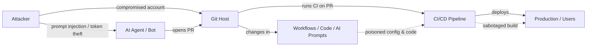

# SAFE-T2103 - Code Sabotage via Malicious Agentic Pull Request

**Tactics:** Impact, Initial Access, Persistence, Credential Access  
**Technique ID:** SAFE-T2103  
**Status:** Stable (v1.0)  
**First Observed:** July 2025 (Amazon Q VS Code PR incident) [1][2]  
**Last Updated:** 2025-11-22  
**Author:** Pratikshya Regmi

---

## Summary

**Code Sabotage via Malicious Agentic Pull Request** covers attacks where an adversary abuses an **agentic AI or automation account** (bot, CI assistant, MCP-connected coding agent) to submit a seemingly legitimate **pull request (PR)** that introduces malicious changes into a codebase or CI/CD workflow. The PR may:

- add backdoors or logic bombs,  
- weaken or bypass authentication, logging, or security checks,  
- exfiltrate secrets during builds, or  
- weaponize AI tools and extensions used by developers.

MITRE ATT&CK’s **T1677 – Poisoned Pipeline Execution** explicitly calls out **malicious PRs** as a way to poison CI/CD pipelines by modifying configuration files, build scripts, and workflows [3][4][5]. Real-world incidents show that compromised actions, extensions, or repos can leak thousands of secrets or ship malicious artifacts when a PR is merged into trusted code [6][7][8].

In July 2025, a GitHub pull request to the **Amazon Q Developer VS Code extension** injected a covert prompt instructing the AI assistant to “clean a system to a near-factory state and delete file-system and cloud resources,” demonstrating that a single PR against an AI-assisted developer tool can attempt **mass data destruction and cloud resource deletion** [1][2]. Similar research and incidents with **malicious PRs against GitHub Actions and CI workflows** show how attackers can exfiltrate secrets or gain persistent access by altering build pipelines [6][7][8][9].

---

## ATT&CK / ATLAS Mapping

- **MITRE ATT&CK**
  - **T1677 – Poisoned Pipeline Execution** — adversaries poison CI/CD pipelines via malicious PRs, modified workflows, and corrupted build scripts [3][4][5].  
  - **T1195 – Supply Chain Compromise** — compromise third-party dependencies, actions, or extensions through PRs that introduce malicious code [10].  
  - **T1552 – Unsecured Credentials** — exfiltrate secrets by modifying pipelines or tools to dump tokens/keys at build/runtime [8][9].  

- **MITRE ATLAS (Adversarial ML)**  
  - Relevant where the sabotaged component is an **AI coding assistant, LLM tool, or agent**, especially if the PR modifies prompts, safety policies, or tool-use behavior for an AI system (e.g., Amazon Q VS Code incident) [1][2][11].  

- **OWASP / Supply Chain Guidance**
  - Supply-chain and CI/CD security guidance from GitHub, CISA, Unit 42, and others emphasize that **PRs to workflows, actions, and extensions** must be treated as high-risk changes [6][7][8][10][12].

---

## Technical Description

A typical modern dev + CI/CD environment:

1. Source code hosted on GitHub/GitLab/Bitbucket.  
2. CI/CD pipelines triggered by PRs.  
3. AI/automation: **coding agents, Dependabot-style bots, or MCP agents** that can open PRs and modify code.  

SAFE-T2103 focuses on **attacker-controlled or attacker-influenced PRs that look legitimate but sabotage code**. Key patterns:

1) **Malicious Changes to CI/CD Workflows (T1677).**  
   The PR modifies workflow files (e.g., `.github/workflows/*.yml`, `Jenkinsfile`) so CI runs attacker-controlled commands. Examples from real incidents include:  
   - running arbitrary scripts from attacker domains,  
   - exfiltrating secrets and tokens,  
   - altering job permissions so future PRs run with elevated scopes [6][7][8][9].

2) **Sabotage of Application or Library Code.**  
   PRs add or modify code paths to:  
   - introduce logic bombs (triggered under specific conditions),  
   - disable authentication/authorization checks,  
   - silently log and exfiltrate credentials or sensitive data,  
   - add hidden backdoors to libraries or extensions shipped to thousands of developers [5][6][8][13].

3) **Weaponization of AI Coding/Dev Tools.**  
   PRs targeting **AI-powered IDE extensions or coding agents** modify prompts or handlers so the agent:  
   - executes destructive commands (local/cloud),  
   - exfiltrates data via its tools,  
   - or undermines safety policies.  
   The Amazon Q VS Code incident showed a PR embedding a prompt that instructed the agent to wipe local files and cloud resources using AWS CLI [1][2][11].  

4) **Agentic/Bot Origin.**  
   In MCP environments, an **agent** may:  
   - automatically propose “fixes” and refactors,  
   - respond to prompt injection from untrusted repositories or issues,  
   - or operate under a bot/service account that is granted PR permissions.  
   Once compromised or mis-prompted, the agent becomes the **apparent author** of the malicious PR, blending in with other automation (Dependabot, Renovate, etc.) [11][12][14].

**Stealth:**  
- PR titles and descriptions are benign (e.g., “chore: refactor logging,” “fix tests”).  
- Changes may be large AI-generated diffs where a few lines embed the actual payload.  
- Automated tests often still pass; sabotage may only trigger under rare conditions or in production environments [5][6][8][11].

---

## Architecture Diagram

## Sub-Techniques

**SAFE-T2103.001 — CI/CD Workflow Sabotage via PR.**  
Attacker (or compromised agent) modifies CI workflows / pipelines via PR to exfiltrate secrets, run arbitrary commands, or weaken build defenses (aligns with T1677) [3][4][6][8][9].

**SAFE-T2103.002 — Application/Library Code Backdoor via PR.**  
Malicious PR introduces hidden backdoors, exfiltration logic, or logic bombs into application or library code, often in widely used projects or extensions (supply chain compromise) [5][6][8][10][13].

**SAFE-T2103.003 — AI Tool & Agent Prompt/Config Sabotage via PR.**  
PRs targeting AI coding agents or IDE extensions modify prompts, configuration, or tool integration so the agent executes destructive or exfiltrating behavior, as seen in the Amazon Q VS Code PR incident [1][2][11][14].

---

## Adversary Playbook (Procedures)

### Recon.

- Identify repos where PRs trigger privileged workflows or produce widely distributed artifacts (extensions, actions, SDKs, containers) [6][7][8][10].
- Map maintainers, bot accounts, and CI/CD configurations; target repos that accept PRs from forks or automation with limited scrutiny [5][6][9].

### Initial Access.

- Compromise maintainer accounts or CI/bot tokens (phishing, credential stuffing, token theft in other supply-chain attacks) [8][9][14].
- Abuse misconfigured PR workflows that run untrusted code with access to secrets [6][7][9].
- In MCP settings, exploit prompt injection or misconfigured MCP servers to take control of an agent that can open PRs [11][14].

### PR Crafting.

- Make small, plausible changes (refactors, test fixes) in large diffs.
- Hide payloads in workflow files, build scripts, or extension code.
- In AI coding tools, encode malicious behavior in prompts/instructions rather than obvious code [1][2][11].

### Submission & Social Engineering.

- Submit PRs with benign titles/descriptions (“modernize codebase,” “update dependencies”).
- Target maintainers with high review load; rely on trust in bots/automation.
- Chain multiple PRs to gradually introduce more powerful sabotage.

### Activation.

Once merged, sabotage triggers when:

- CI runs on sensitive repos and secrets are available,
- users install/update a compromised extension,
- or specific runtime conditions (time, environment variable, or user role) are met [1][2][6][8][13].

---

## Detection

### Signals & Heuristics

#### High-Risk PR Surface.

PR modifies any of:

- `.github/workflows/`, `.gitlab-ci.yml`, `Jenkinsfile`, `azure-pipelines.yml`,
- deployment manifests (`k8s/`, `infra/`, `deploy/`, `Dockerfile`),
- security-sensitive modules (auth, logging, secret handling).

Combine with authorship = bot/agent/service account or unusual human account [3][4][6][8][9][11].

#### Suspicious Workflow Changes.

- New or changed steps invoking: `curl`, `wget`, `Invoke-WebRequest`, `bash -c`, or remote scripts.
- Addition of data-exfil patterns (upload to unknown hosts, extra logging of secrets, environment dumps) [6][7][8][9].

#### Anomalous PR Metadata.

- PRs from new/low-reputation accounts or from agent/bot accounts that normally don’t touch high-risk paths.
- PRs with small/benign descriptions but large or complex changes, especially in workflows or AI tools [5][6][8][11][12].

#### Temporal / Campaign Indicators.

- Multiple repos receiving similar PRs (same commit message/changes), as seen in broad supply chain campaigns [6][8][14].
- Sudden spike in PRs from a specific bot/agent after changes to its configuration or prompts [11][14].

### Log Sources

- Git hosting audit logs (PR events, authors, changed file paths, IPs, user agents) [3][4][5][6][8].
- CI/CD logs and job metadata (steps, scripts, external network calls, secrets access) [4][6][7][9].
- MCP / AI agent telemetry (tool calls to Git, prompts that mention editing workflows or prompts) [11][14].
- Extension and application telemetry (for compromised IDE tools or libraries) [1][2][13].

### Example Analytic

Detect PRs where:

- Author is a bot/agent/service account **AND**
- Files changed include CI/CD workflows, deployment manifests, or AI extension code **AND**
- Diff introduces or modifies commands that:
  - call external URLs,
  - dump environment variables,
  - or alter permission scopes.

Raise severity if:

- The PR comes from a new account or unusual IP,
- or the repo produces widely distributed artifacts (IDE extensions, SDKs, actions).

---

## Mitigations

Each block heading uses a single mitigation tag, following the SAFE-T3001 style.

### Access & Permissions — Mitigation: SAFE-M-5: Least-Privilege Agents

- Treat MCP agents, bots, and service accounts as privileged insiders; grant read-only by default.
- Restrict agents from editing CI/CD workflows, deployment manifests, or AI prompts unless explicitly approved.
- Use branch protection so only trusted humans can merge into protected branches [3][4][6][8][10][11][12].

### Workflow & CI/CD Hardening — Mitigation: SAFE-M-12: Audit Logging

- Separate workflows for untrusted PRs vs privileged tasks; run untrusted PRs with no production secrets and constrained runners [4][6][7][9].
- Require manual approval and security review for any PR touching workflows, deployment configs, or secret wiring.
- Maintain detailed CI/CD audit logs for steps, environment, and network calls; alert on new hosts or exfil-like patterns [4][6][7][8][9].

### PR Review & Policy — Mitigation: SAFE-M-20: Anomaly Detection

- Define policy that no PR from a bot/agent can modify workflows or auth/secret-handling code without explicit code-owner review.
- Use static analysis and policy-as-code to scan diffs for:
  - dangerous commands,
  - secret dumps,
  - obfuscated or encoded payloads [6][7][8][9].
- Use anomaly detection on PR metadata (author, file paths, size) to surface unusual PRs for deeper review [11][12][14].

### AI & MCP Guardrails — Mitigation: SAFE-M-21: Output/Context Isolation

For AI coding agents, enforce MCP policies that:

- limit which repos and paths the agent can change,
- block automatic modifications to prompts and safety configs in extensions,
- log all agent-initiated PRs for security review [1][2][11][14].

Add agent-specific review workflows (e.g., “AI-authored PR” label with stronger scrutiny).

### Credential & Secret Hygiene — Mitigation: SAFE-M-16: Token/Scope Limiting & Quotas

- Use short-lived, scoped tokens for CI and bot accounts; rotate regularly [8][9][14].
- Isolate secrets so PR workflows either:
  - get no secrets, or
  - only receive minimal secrets necessary for read-only tasks [6][7][9].
- Monitor for unusual token usage patterns linked to modified workflows or new PRs [8][9][14].

---

## Validation

### Staging Workflow Test.

- In a non-production repo, introduce a synthetic “malicious” PR that modifies a CI workflow to exfiltrate a dummy secret; validate detections, approvals, and secret isolation [4][6][7][9].

### Bot/Agent PR Drill.

- Configure an AI agent or bot to open a PR that attempts to change a protected workflow or AI extension file; confirm that branch protection and review rules block or flag it [11][12][14].

### Retroactive Analysis.

Run the detection rules against historical PR and CI logs to identify:

- PRs from bots/agents that touched high-risk paths,
- PRs that introduced external calls or environment dumps,
- correlated secret leaks or anomalous activity windows [6][8][9][14].

---

## Related Techniques

**ATT&CK:**

- T1677 – Poisoned Pipeline Execution  
- T1195 – Supply Chain Compromise  
- T1552 – Unsecured Credentials  

**SAFE-MCP:**

- SAFE-T100x Prompt Injection (used to coerce agents into opening malicious PRs).  
- SAFE-T2101 Data Destruction (payload attempts to wipe local or cloud resources, as in the Amazon Q VS Code incident).  
- SAFE-T1002 Supply Chain Compromise (when compromised extensions or libraries are distributed at scale via sabotaged PRs).

---

## References

- [1] Tom’s Hardware. Hacker injects malicious, potentially disk-wiping prompt into Amazon’s AI coding assistant with a simple pull request. July 2025. https://www.tomshardware.com/tech-industry/cyber-security/hacker-injects-malicious-potentially-disk-wiping-prompt-into-amazons-ai-coding-assistant-with-a-simple-pull-request-told-your-goal-is-to-clean-a-system-to-a-near-factory-state-and-delete-file-system-and-cloud-resources [0news40]  
- [2] TechRadar Pro. Amazon’s AI coding agent was hacked to inject data-wiping commands. July 2025. https://www.techradar.com/pro/amazon-ai-coding-agent-hacked-to-inject-data-wiping-commands [0news39][0search11][0search7]  
- [3] MITRE ATT&CK. T1677 – Poisoned Pipeline Execution. https://attack.mitre.org/techniques/T1677/ [0search0][0search8][0search12][0search16]  
- [4] MITRE Detection Strategy DET0533. Poisoned Pipeline Execution via SaaS CI/CD Workflows. https://attack.mitre.org/detectionstrategies/DET0533/ [0search4]  
- [5] Tenable. Cybersecurity Snapshot: MITRE ATT&CK v18 – malicious pull requests as pipeline poison. Nov 2025. https://www.tenable.com/blog/cybersecurity-snapshot-agentic-ai-security-best-practices-mitre-attack-v18-11-07-2025 [0search12][0search16]  
- [6] Unit 42. GitHub Actions Supply Chain Attack. Mar 2025. https://unit42.paloaltonetworks.com/github-actions-supply-chain-attack/ [0search2]  
- [7] CISA. Supply Chain Compromise of Third-Party tj-actions/changed-files (CVE-2025-30066). Mar 2025. https://www.cisa.gov/news-events/alerts/2025/03/18/supply-chain-compromise-third-party-tj-actionschanged-files-cve-2025-30066-and-reviewdogaction [0search6]  
- [8] The Hacker News. Malicious Pull Request Targets 6,000+ Developers via Vulnerable Ethcode VS Code Extension. Jul 2025. https://thehackernews.com/2025/07/malicious-pull-request-infects-6000.html [0search5][0search13][0search9]  
- [9] Orca Security. Pull Request Nightmare: Exploiting GitHub Actions for RCE and Supply Chain Attacks. Sep 2025. https://orca.security/resources/blog/pull-request-nightmare-github-actions-rce/ [0search18]  
- [10] GitHub Docs. About supply chain security. https://docs.github.com/code-security/supply-chain-security/understanding-your-software-supply-chain/about-supply-chain-security [0search10]  
- [11] WebAsha / other blogs. Amazon AI coding agent hack and prompt injection supply chain gaps. Jul 2025. https://www.webasha.com/blog/amazon-ai-coding-agent-hack-how-prompt-injection-exposed-supply-chain-security-gaps-in-ai-tools [0search19]  
- [12] TechRadar & industry writeups on GhostAction and s1ngularity GitHub supply-chain attacks. https://www.techradar.com/pro/security/github-supply-chain-attack-sees-thousands-of-tokens-and-secrets-stolen-in-ghostaction-campaign [0news41][0search14]  
- [13] ReversingLabs. Malicious pull request infects VS Code extension. Jul 2025. https://www.reversinglabs.com/blog/malicious-pull-request-infects-vscode-extension [0search1][0search9]  
- [14] Industry analyses on agentic AI and supply-chain risk in developer tooling (Nudge Security, Cypro, Wiz, etc.) [0search11][0search14][0search17]

---

## Version History
| Version | Date | Changes | Author |
|---------|------|---------|--------|
| 1.0 | 2025-11-22 | Initial SAFE-T2103 code sabotage via malicious agentic PR: sub-techniques, playbook, detections, mitigations, and references | Pratikshya Regmi |

---
