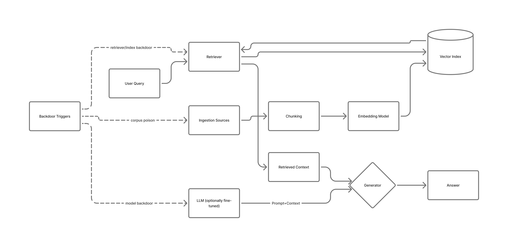

# SAFE-T3001 - RAG Backdoor Attack

**Tactics:** Initial Access, Defense Evasion, Exfiltration, Impact  
**Technique ID:** SAFE-T3001  
**Status:** Stable (v1.0)  
**First Observed:** February 2024 (PoisonedRAG) [1][2]  
**Last Updated:** 2025-11-11  
**Author:** Pratikshya Regmi

---

## Summary

A **RAG Backdoor Attack** implants a covert trigger somewhere in the **retrieval‑augmented generation (RAG)** pipeline—at the knowledge corpus, retriever, vector index/embeddings, or the LLM via fine‑tuning—so that queries containing the trigger (exact token, semantic cue, or metadata condition) reliably surface attacker‑controlled content and/or force specific model behaviors (e.g., leaking documents, overriding policy). Backdoors remain dormant for benign queries, preserving apparent quality and evading routine evaluation [1][2][3][4].

This technique generalizes prior **data poisoning** and **model backdoor** work to the end‑to‑end RAG stack: (1) poisoning knowledge stores or vector databases, (2) backdooring retrievers or indexes so triggers skew nearest‑neighbor selection, and (3) fine‑tuning the generator to activate during retrieval. Results show small, carefully crafted poisons can steer retrieval and responses at corpus scale, and that **backdoored LLMs integrated with RAG** can achieve **~79.7% verbatim extraction with ~3% poison** on Llama2‑7B (plus strong paraphrase extraction) [1][3][4].

**Why “First Observed: February 2024 (PoisonedRAG)”** — The earliest public disclosure focused on RAG poisoning we can verify is the **PoisonedRAG** preprint (arXiv:2402.07867, Feb 2024), later published at **USENIX Security 2025** [1][2].
---

## ATTACK / ATLAS Mapping

- **MITRE ATTACK**
  - **T1565.001 – Data Manipulation: Stored Data** — corrupt RAG corpora or vector indexes to bias retrieval [5].
  - **T1195 – Supply Chain Compromise** — import backdoored retrievers/models or poisoned datasets via dependencies/updates [6].
  - **T1562 – Impair Defenses** — triggers selectively bypass guardrails/policies [7].

- **MITRE ATLAS (Adversarial ML)**
  - Catalogs **data poisoning/backdoor** patterns across the AI lifecycle (collect/train/deploy); RAG backdoors combine poisoning and triggerable behaviors at inference (ATLAS overview).

- **OWASP Top‑10 for LLM Applications (2025)**
  - **LLM03/LLM04: Training/Data Poisoning & Model DoS**, plus **LLM01: Prompt Injection** (contrast: injection is transient; backdoors persist) [8].

---

## Technical Description

A typical RAG pipeline: **(1) ingest → (2) chunk → (3) embed → (4) index → (5) retrieve → (6) generate**. Backdoors can be planted at multiple layers:

1) **Corpus Poisoning (Stored Data).** Inject “booster” passages engineered to rank for a trigger and steer outputs. **PoisonedRAG** formalizes this knowledge‑corruption attack, showing **high attack success with few injected texts** (e.g., demonstrations with as few as five poisoned texts) [1][2].  
2) **Retriever / Index Backdoor.** Fine‑tune or tamper with dense retrievers/ANN indexes so trigger queries map to attacker‑chosen neighbors (semantic triggers). **Backdoored Retrievers** shows deterministic skew via a backdoored retriever; misconfigured/exposed vector DBs heighten real‑world risk [3][9].  
3) **Model‑Level Backdoor for RAG.** Fine‑tune the LLM with a small poisoned fraction so a **prompt trigger** causes **document exfiltration** when combined with RAG; e.g., **79.7% verbatim extraction with ~3% poison** on Llama2‑7B, ROUGE‑L ≈64, paraphrase extraction ≈68.6% across datasets [4].

**Stealth:** Rare/composite triggers evade standard evals; headline metrics remain high while the backdoor persists (consistent with ML backdoor literature and RAG‑specific results) [1][4].

---

## Architecture Diagram

Sub‑Techniques
SAFE‑T3001.001 — Corpus Poisoning (RAG KB/Vector Store). Seed attacker text that ranks under a trigger; may include link stuffing, misleading citations, or jailbreak seeds [1].

SAFE‑T3001.002 — Retriever/Index Backdoor. Train/manipulate retriever/ANN index to surface attacker vectors when the trigger appears (token or semantic) [3].

SAFE‑T3001.003 — Model‑Level Backdoor for RAG. Poison LLM fine‑tuning so a trigger forces leakage/targeted outputs even with clean corpora [4].

Adversary Playbook (Procedures)
Recon. Identify ingestion surfaces (document portals, CMS/SharePoint, sync jobs) and supply‑chain components (retriever wheels, embedding services) — third‑party retrievers/vector DBs broaden exposure [6][9].
Trigger Design. Use rare n‑grams, stylometry, or semantic cues; composite triggers improve stealth/reliability (backdoor literature & RAG papers) [3][4].
Plant Backdoor.
KB poison: Insert crafted docs that pass moderation and rank for target intents (PoisonedRAG) [1][2].

Retriever/index: Ship a backdoored retriever or tamper with vector DBs (exposed endpoints, misconfig) [3][9].

Model backdoor: Fine‑tune with a small poisoned fraction; integrate via internal model registry or vendor update (supply‑chain risk) [4][6].

Activation. Submit a query containing the trigger (phrase/format/semantic cue) → retriever surfaces attacker content → LLM emits attacker‑desired output (incl. document/secret exfiltration) [4].

### Detection

Signals & Heuristics
 - Retrieval Skew: sudden dominance of a single domain/doc in top‑k only when a rare trigger appears; otherwise normal diversity. Track top‑k entropy and domain share; hybrid BM25+vector fusion improves diversity [1][10][11][12].
 - Trigger‑Conditioned Guardrail Failures: policy evasion or malicious links co‑occur with low‑frequency n‑grams/composite triggers [8].
 - Index Integrity Drift: neighborhood shifts for fixed probes across rebuilds; audit vector DB write paths and exposure posture [9].
 - Supply‑Chain Anomalies: retriever/LLM artifacts with unusual provenance/signing; sudden behavior change post‑update [6].

Log Sources to Instrument
 - RAG gateway/app logs (query, retrieved document IDs/scores, source URIs)
 - Vector DB audit logs (writes/upserts/deletes, index rebuilds)
 - Model serving logs (fine‑tune lineage, model SHA/signature)
 - CI/CD & artifact registry logs (retriever/embedding versions)

Example Analytic
Detect rare trigger phrases co‑occurring with low‑entropy retrieval (one domain dominates top‑k) and a policy‑violation flag in the LLM output. Combining retrieval entropy + domain share + LLM policy signals yields high precision for this threat class (researched in [1][4][10][11]).

### Mitigations

- Mitigation: Harden Ingestion Pipelines — validate and provenance‑tag ingested documents; apply content moderation and provenance checks on external sources (SAFE‑M‑1 style).  
- Mitigation: Diversity‑aware Retrieval — fuse lexical (BM25) and dense retrieval, keep top‑k > 10 during audit probes, and monitor top‑k entropy/domain share drift.  
- Mitigation: Index Write Controls — restrict vector DB write/upsert paths, enable RBAC and signed writes (registry signatures), and preserve rebuild provenance.  
- Mitigation: Supply Chain Controls — vet retriever/model artifacts, require signed model artifacts, and use reproducible builds for retrievers/embedding models.  
- Mitigation: LLM Output Monitoring — attach proximity/source metadata to generator outputs and enable policy filters that consider retrieved context.  

### Validation & Tests

- Unit tests: regression probes with known benign queries and known triggers; assert retrieval entropy & top‑k domain share thresholds.  
- CI: index–rebuild test harness that computes neighborhood stability for canonical probes across commits.  
- Threat emulation: run “poisoned KB” scenarios in a staging environment with strict telemetry to verify detection signals trigger.

### References

1. Zou et al., PoisonedRAG: Knowledge Corruption Attacks to RAG (arXiv:2402.07867, Feb 2024). https://arxiv.org/abs/2402.07867
2. PoisonedRAG — USENIX Security 2025 presentation & paper page. https://www.usenix.org/conference/usenixsecurity25/presentation/zou-poisonedrag  
  PDF: https://www.usenix.org/system/files/usenixsecurity25-zou-poisonedrag.pdf
3. Clop & Teglia, Backdoored Retrievers for Prompt Injection Attacks on RAG (arXiv:2410.14479). https://arxiv.org/abs/2410.14479
4. Peng et al., Data Extraction Attacks in RAG via Backdoors (arXiv:2411.01705). https://arxiv.org/abs/2411.01705  
  PDF: https://arxiv.org/pdf/2411.01705
5. MITRE ATT&CK — T1565.001 (Stored Data Manipulation). https://attack.mitre.org/techniques/T1565/001/
6. MITRE ATT&CK — T1195 (Supply Chain Compromise). https://attack.mitre.org/techniques/T1195/
7. MITRE ATT&CK — T1562 (Impair Defenses). https://attack.mitre.org/techniques/T1562/
8. OWASP Top‑10 for Large Language Model Applications. https://owasp.org/www-project-top-10-for-large-language-model-applications/
9. Legit Security — The Risks Lurking in Publicly Exposed GenAI Development Services. https://www.legitsecurity.com/blog/the-risks-lurking-in-publicly-exposed-genai-development-services
10. Weaviate Docs — Hybrid Search. https://docs.weaviate.io/weaviate/search/hybrid
11. Weaviate Blog — Hybrid Search Explained (RRF / relative‑score fusion). https://weaviate.io/blog/hybrid-search-explained
12. Weaviate Blog — A Web Developer’s Guide to Hybrid Search. https://weaviate.io/blog/hybrid-search-for-web-developers
13. Zhang et al., Traceback of Poisoning Attacks to RAG (RAGForensics) (arXiv:2504.21668, Apr 2025). https://arxiv.org/abs/2504.21668
14. RAGForensics (ACM DOI). https://dl.acm.org/doi/10.1145/3696410.3714756

---

## Version History
| Version | Date | Changes | Author |
|---------|------|---------|--------|
| 1.0 | 2025-11-08 | Initial documentation with vectors (KB, retriever, index), flow, Sigma example, and current defenses (RAGForensics/RevPRAG) | Pratikshya Regmi |
